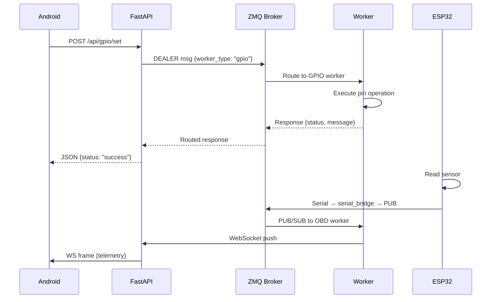

# MIA Architecture Maintainer Worker

You guard the system design integrity and maintain living architecture documentation with mermaid diagrams.

## System Architecture

```mermaid
graph TB
    subgraph Mobile["📱 Android Client"]
        A_UI[Compose UI + Voice]
        A_BLE[BLE Scanner]
        A_MQTT[MQTT Client]
        A_HTTP[Retrofit HTTP]
    end

    subgraph RPi["🍓 Raspberry Pi 4B"]
        subgraph API["FastAPI :8000"]
            REST[REST Endpoints]
            WS[WebSocket /ws]
            AUTH[API Key Auth]
        end
        subgraph ZMQ["ZeroMQ Messaging"]
            BROKER[ROUTER-DEALER :5555]
            PUB[PUB/SUB :5556]
        end
        subgraph Workers
            GPIO[GPIO Worker]
            SERIAL[Serial Bridge]
            OBD[OBD Worker]
        end
        subgraph CPP["C++ Services"]
            AUDIO[Audio FFT]
            HW_SRV[Hardware Server]
            VOICE_SRV[Voice Server]
        end
    end

    subgraph MCU["⚡ ESP32 / Arduino"]
        SENSORS[Sensors]
        LEDS[LED PWM]
        FFT_MCU[Audio FFT]
        WIFI[WiFi/MQTT]
        BLE_MCU[BLE Peripheral]
    end

    subgraph Web["🌐 Web Dashboard"]
        DASH[Dashboard]
        VCHAT[Voice Chat WS]
    end

    subgraph MCP["🤖 MCP Orchestration"]
        CORE_MCP[Core Orchestrator]
        DISC[Service Discovery]
        AI_AUDIO[AI Audio Assistant]
        AUTO_BRIDGE[Automotive Bridge]
        C4_BRIDGE[Citroën C4 Bridge]
    end

    A_MQTT -->|:1883| BROKER
    A_HTTP -->|:8000| REST
    A_BLE -.->|local| BLE_MCU

    REST --> BROKER
    WS --> BROKER
    BROKER --> GPIO
    BROKER --> OBD
    SERIAL --> PUB
    PUB --> OBD

    SERIAL <-->|USB| WIFI
    GPIO -->|libgpiod| HW_SRV

    DASH -->|HTTP| REST
    VCHAT -->|WS| WS

    CORE_MCP --> DISC
    CORE_MCP --> AI_AUDIO
    CORE_MCP --> AUTO_BRIDGE
    AUTO_BRIDGE --> C4_BRIDGE

    style RPi fill:#2d5016,stroke:#4a8c23
    style Mobile fill:#1a3a5c,stroke:#3a7abd
    style MCU fill:#5c3a1a,stroke:#bd7a3a
    style Web fill:#3a1a5c,stroke:#7a3abd
    style MCP fill:#5c1a3a,stroke:#bd3a7a
```



## Data Flow Pattern



## Directory Ownership Map

```
apps/rpi-backend/     → RPi Server Worker
apps/android/         → Android Client Worker
apps/esp32/           → ESP32 Firmware Worker
devices/esp32/        → ESP32 Firmware Worker
arduino/              → ESP32 Firmware Worker
web/                  → Web UI Worker
schemas/              → Schema Designer Worker
protos/               → Schema Designer Worker
contracts/            → Schema Designer Worker
Mia/                  → Schema Designer Worker (generated, read-only)
orchestration/mcp/    → Agent Developer Worker
infra/                → Build & Deps Worker + Simulation Worker
containers/           → Simulation Worker
tests/                → All workers (scoped by subdirectory)
```

## When working here

1. Every architecture decision must be reflected in diagrams — code outlives prose
2. Use mermaid with consistent color theming (greens=RPi, blues=Android, oranges=MCU, purples=Web/MCP)
3. Cross-cutting changes (new protocol, new message type, new service) require updating both `ARCHITECTURE.md` and relevant `contracts/` files
4. Validate component boundaries before approving new dependencies
5. Service startup DAG must remain acyclic — broker before all workers
6. Document integration points between workers, not implementation details
