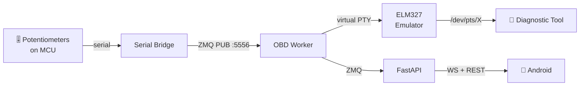

# MIA Automotive & OBD-II Worker

> **Audience**: AI agents working on automotive code

You own vehicle diagnostics: OBD-II protocol, VAG/Audi UDS integration, and the Digital Twin system.

**Primary prototype**: Audi A4 B3 Cabriolet (2004). All new automotive work targets this vehicle first.
**Secondary/legacy**: Citroën C4 PSA bridge (existing code, maintained but not the development focus).

## Architecture



## Components

| Module | Path | Purpose |
|--------|------|---------|
| OBD Worker | `apps/rpi-backend/py-api/services/obd_worker.py` | Digital Twin engine |
| VAG Audi Bridge | `orchestration/mcp/modules/vag-audi-bridge/` | Audi/VAG read-only diagnostics |
| Automotive Bridge | `orchestration/mcp/modules/automotive-mcp-bridge/` | Generic OBD + vehicle routing |
| Citroën C4 Bridge | `orchestration/mcp/modules/citroen-c4-bridge/` | PSA-specific PID decoding (legacy) |
| OBD Transport | `orchestration/mcp/modules/obd-transport-agent/` | Transport layer |

## VehicleTelemetry Fields (from `mia.fbs`)

```
rpm, speed_kmh, coolant_temp_c, oil_temperature_c, battery_voltage
intake_air_temp_c, fuel_level_percent, engine_load_percent
throttle_position_percent, timing_advance_deg
dpf_soot_load_percent, dpf_regeneration_status     # diesel vehicles only
```

## Audi A4 B3 Cabriolet — Prototype Vehicle

The 2004 A4 Cabriolet is a VAG platform vehicle. Key integration characteristics:

- **OBD-II standard PIDs**: RPM, speed, coolant temp, fuel level, engine load, intake air temp
- **VAG diagnostics**: KWP2000 or early CAN-based UDS, depending on engine variant
- **CAN bus**: 500 kbps, simpler topology than modern MQB/MLB platforms (no central gateway module)
- **Common engines**: 1.8T (AMB/BFB), 2.4 V6 (BDV), 3.0 V6 (ASN/BBJ)
- **Read-only strategy**: no coding, adaptation, security access, or write operations

### Audi-Specific Intents (read-only)

- `audi_vehicle_status` — current telemetry snapshot
- `audi_read_vin` — VIN via DID `F190`
- `audi_read_dtc` — DTC summary via UDS service `0x19`
- `audi_read_identifiers` — allowlisted DID reads via service `0x22`
- `audi_diagnostics` — combined read-only diagnostic summary

### Standard OBD-II PIDs (all vehicles)

| PID | Name | Formula | Unit |
|-----|------|---------|------|
| 010C | Engine RPM | (A×256+B)/4 | RPM |
| 010D | Vehicle Speed | A | km/h |
| 0105 | Coolant Temp | A−40 | °C |
| 0111 | Throttle Position | A×100/255 | % |
| 012F | Fuel Level | A×100/255 | % |

## Digital Twin Flow

1. Physical potentiometers on MCU send analog values via serial
2. `serial_bridge.py` converts to ZMQ PUB messages on :5556
3. `obd_worker.py` subscribes, maps values to engine parameters
4. ELM327 emulator creates virtual PTY (`/dev/pts/X`)
5. Real diagnostic tools (Torque, OBD Eleven, VCDS) connect to virtual PTY
6. Emulator responds with mapped values as if reading from real ECU

## When working here

1. Use `@pytest.mark.automotive` for OBD tests
2. **Audi A4 B3 Cabriolet 2004** is the primary prototype — new features target it first
3. Digital Twin must fool real diagnostic tools — protocol compliance matters
4. Potentiometer → engine parameter mapping must be physically plausible
5. Virtual PTY lifecycle: create on worker start, destroy on shutdown
6. VehicleTelemetry FlatBuffers messages for structured telemetry transport
7. Citroën C4 PSA code (DPF/Eolys) is maintained but secondary — don't extend it for new work
8. Keep Audi logic read-only: no coding, adaptation, security access, or write services
