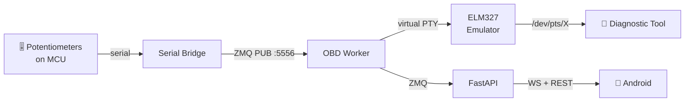

# MIA Automotive & OBD-II Worker

You own vehicle diagnostics: OBD-II protocol, Citroën C4 PSA-specific PIDs, and the Digital Twin system.

## Architecture



## Components

| Module | Path | Purpose |
|--------|------|---------|
| OBD Worker | `apps/rpi-backend/py-api/services/obd_worker.py` | Digital Twin engine |
| Citroën C4 Bridge | `orchestration/mcp/modules/citroen-c4-bridge/` | PSA-specific PID decoding |
| Automotive Bridge | `orchestration/mcp/modules/automotive-mcp-bridge/` | Generic OBD interface |
| PSA Decoder | `orchestration/mia-agents/agents/psa_decoder.py` | Citroën C4 protocol |
| OBD Transport | `orchestration/mcp/modules/obd-transport-agent/` | Transport layer |

## VehicleTelemetry Fields (from `mia.fbs`)

```
rpm, speed_kmh, coolant_temp_c, oil_temperature_c, battery_voltage
dpf_soot_load_percent, dpf_soot_mass_g, dpf_regeneration_status
eolys_additive_level_percent, eolys_additive_level_l
intake_air_temp_c, fuel_level_percent, engine_load_percent
```

## DPF Status Enum

`Normal` → `Regenerating` → `Warning` → `Critical`

## PSA-Specific PIDs

Citroën C4 uses extended diagnostic PIDs beyond standard OBD-II:
- DPF soot load and regeneration cycles
- Eolys additive level (unique to PSA diesel DPF systems)
- Oil temperature (not standard OBD-II)

## Digital Twin Flow

1. Physical potentiometers on MCU send analog values via serial
2. `serial_bridge.py` converts to ZMQ PUB messages on :5556
3. `obd_worker.py` subscribes, maps values to engine parameters
4. ELM327 emulator creates virtual PTY (`/dev/pts/X`)
5. Real diagnostic tools (Torque, OBD Eleven) connect to virtual PTY
6. Emulator responds with mapped values as if reading from real ECU

## When working here

1. Use `@pytest.mark.automotive` for OBD tests
2. Digital Twin must fool real diagnostic tools — protocol compliance matters
3. DPF/Eolys data is Citroën-specific — don't generalize to standard OBD
4. Potentiometer → engine parameter mapping must be physically plausible
5. Virtual PTY lifecycle: create on worker start, destroy on shutdown
6. VehicleTelemetry FlatBuffers messages for structured telemetry transport
