# MIA Autonomous Dev Pipeline Worker

Adapted from OpenClaw's triangle development loop. Runs a continuous improvement cycle across MIA's worker fleet.

## Pipeline Phases

```mermaid
graph LR
    TC["🔍 Task Creator<br/>daily 08:00"] --> EX["⚡ Executor<br/>daily 09:00"]
    EX --> EV["📊 Evaluator<br/>daily 13:00"]
    EV --> HW["📋 Homework Digest<br/>daily 18:00"]
    HW -.->|human decisions| TC
    EV -.->|score < 3 → URGENT| TC
    EV -.->|score ≥ 4 → archive| DONE["✅ Done"]

    style TC fill:#2d5016,stroke:#4a8c23
    style EX fill:#1a3a5c,stroke:#3a7abd
    style EV fill:#5c3a1a,stroke:#bd7a3a
    style HW fill:#3a1a5c,stroke:#7a3abd
```



## Backlog Location

`orchestration/mia-agents/backlog.md` — single source of truth for all MIA dev tasks.

## Phase 1: Task Creator (daily)

Discover tasks from:

```bash
# TODOs across MIA codebase
grep -rn "TODO\|FIXME\|HACK" apps/ orchestration/ modules/ --include="*.py" --include="*.kt" --include="*.cpp" | head -30

# Test gaps
pytest tests/ --co -q 2>&1 | wc -l

# FlatBuffers schema drift
diff <(python3 schemas/generate.py --dry-run 2>&1) <(ls Mia/) 2>/dev/null

# Worker prompt coverage (all 11 workers should have tests)
ls .github/prompts/mia-*.prompt.md | wc -l

# Simulation gap check
grep -rL "simulation\|fallback\|mock" apps/rpi-backend/py-api/hardware/ 2>/dev/null
```

Priority tiers: **URGENT** (blocks work) → **HIGH** (current sprint) → **MEDIUM** → **LOW** → **HOMEWORK** (needs human)

## Phase 2: Executor

Route tasks to the appropriate MIA worker:

| Task Tag | Worker | Example |
|----------|--------|---------|
| `[FIX]` | Owning worker | Fix GPIO fallback in rpi-server |
| `[WIRE]` | Schema + platform workers | New MQTT topic wiring |
| `[TEST]` | Simulation worker | Add mock for serial bridge |
| `[BUILD]` | Build worker + platform | New MCP module |
| `[PROMPT]` | Agent developer | New voice command prompt |
| `[SCHEMA]` | Schema designer | New FlatBuffers message |
| `[REFACTOR]` | Architecture + owning worker | Consolidate mcp_framework.py |
| `[DOC]` | Architecture worker | Update mermaid diagrams |

## Phase 3: Evaluator

Score each completed task on 4 dimensions (0-5):

| Dimension | What to check |
|-----------|---------------|
| **Code quality** | Conventions, lint, type hints, error handling |
| **Test coverage** | New tests exist, existing tests pass, markers correct |
| **Integration** | Cross-platform contracts still aligned, builds pass |
| **Architecture** | Worker boundaries respected, no circular deps, diagrams updated |

**Score < 3** → create URGENT fix task in backlog
**Score ≥ 4** → archive to evaluations log

## Phase 4: Homework Digest

Surface decisions that need human input:
- Provider routing (Haiku vs Kimi vs hybrid)
- Schema breaking changes
- New hardware support decisions
- Deployment target changes

Delivery: kdeconnect notification + Telegram message to user.

## Integration with OpenClaw

This pipeline can be driven by OpenClaw cron jobs targeting the `claude-code` agent:

```bash
# From OpenClaw, trigger MIA pipeline phases
openclaw agent --agent claude-code -m "Run MIA task creator: scan codebase, refresh backlog"
openclaw agent --agent claude-code -m "Run MIA executor: pick top task, implement, test"
openclaw agent --agent claude-code -m "Run MIA evaluator: score last execution, update backlog"
```

Or standalone via pytest markers:
```bash
pytest tests/ -m "not hardware and not slow"  # quick validation after executor
```

## Backlog Format

```markdown
## URGENT
- [ ] **[FIX]** description — source: where discovered

## HIGH
- [ ] **[WIRE]** description — source: cross-worker need

## MEDIUM
- [ ] **[BUILD]** description — source: feature request
- [x] ~~**[TEST]** completed item~~ — DONE 2026-04-06

## HOMEWORK
- [ ] **[DECIDE]** question — options: A/B/C, recommendation: B
```

## Evaluation Format

```markdown
## Evaluation: YYYY-MM-DD
**Task**: [TAG] description
**Worker**: which worker executed
**Files changed**: list

| Dimension | Score | Notes |
|-----------|-------|-------|
| Code quality | 4 | ... |
| Test coverage | 3 | ... |
| Integration | 5 | ... |
| Architecture | 4 | ... |

**Overall**: 4.0/5
**Action needed**: ...
```
