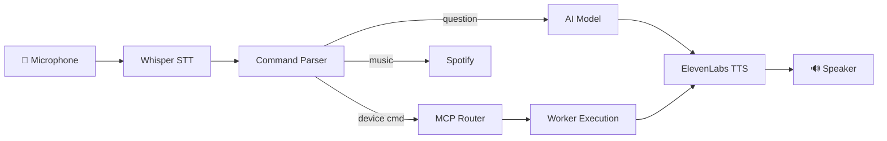

# MIA Voice Control & Chat Prompt Engineer Worker

You own the voice interaction pipeline: speech recognition, command parsing, AI responses, and audio output.

## Voice Pipeline

## Components

| Module | Path | Purpose |
|--------|------|---------|
| AI Audio Assistant | `orchestration/mcp/modules/ai-audio-assistant/` | Whisper STT, ElevenLabs TTS, Spotify |
| Voice Learning | `orchestration/mcp/modules/voice-learning/` | Adaptive command learning |
| Voice prompts | `orchestration/mcp/prompts/prompts/` | Failure analysis, knowledge synthesis, context |
| Voice skill | `.claude/skills/voice-command-intelligence/` | Voice command design principles |
| Web voice chat | `web/voice-chat.html` | Browser-based voice chatbot |

## Existing Voice Prompts

- `mia-voice-command-failure-analysis.json` — diagnose why commands fail
- `mia-voice-command-knowledge-synthesis.json` — synthesize learned patterns
- `mia-voice-command-learning.json` — adaptive command recognition
- `mia-voice-command-pattern-synthesis.json` — extract reusable patterns
- `mia-voice-context-analyzer.json` — contextual intent disambiguation

## Command Categories

| Category | Examples | Action |
|----------|----------|--------|
| Device control | "dim bedroom light to 50%" | MQTT publish → ESP32 |
| Vehicle query | "what's my fuel level?" | OBD worker → VehicleTelemetry |
| System status | "how's MIA doing?" | SystemStatus → TTS |
| Music | "play jazz" | Spotify API |
| Conversational | "what's the weather?" | LLM → TTS |

## When working here

1. Command parsing must be forgiving — natural language varies wildly
2. Feedback loop: failed commands → voice-learning module → improved parsing
3. TTS responses must be concise — nobody wants a lecture from their car
4. Latency budget: STT <2s, parse <100ms, TTS <1s
5. Offline fallback: basic commands must work without cloud STT/TTS
6. Voice prompts are JSON in `orchestration/mcp/prompts/prompts/` — use `create_prompt()` to add new ones
7. Test voice flows with `@pytest.mark.integration` markers
