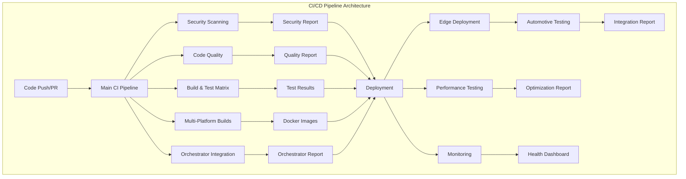
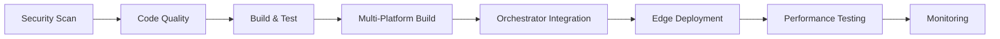

# AI-SERVIS Universal CI/CD Pipeline Documentation

## 🚀 Overview

This directory contains comprehensive CI/CD workflows for the AI-SERVIS Universal automotive AI voice-controlled car-upgrade system. The pipelines implement modern DevOps practices with advanced orchestration, security, monitoring, and automotive-specific testing.

## 📋 Workflow Files

### Core CI/CD Workflows

| Workflow | Description | Triggers |
|----------|-------------|----------|
| `ci.yml` | Main CI/CD pipeline integrating all components | Push, PR, Schedule |
| `security.yml` | Comprehensive security scanning and compliance | Push, PR, Daily |
| `monitoring.yml` | Monitoring, observability, and health checks | Push, PR, Every 6h |
| `automotive-testing.yml` | Automotive-specific testing framework | Push, PR, Manual |
| `docker-multiplatform.yml` | Multi-platform Docker builds and deployment | Push, PR, Manual |
| `edge-deployment.yml` | Edge device deployment (Raspberry Pi, automotive) | Push, PR, Manual |
| `performance-optimization.yml` | Performance testing and optimization | Push, PR, Every 12h |
| `orchestrator-integration.yml` | Build orchestrator integration and testing | Push, PR, Manual |

### Legacy Workflows

| Workflow | Description | Status |
|----------|-------------|--------|
| `android-build.yml` | Android APK build and testing | ✅ Active |
| `cpp-build.yml` | C++ cross-platform builds | ✅ Active |
| `esp32-build.yml` | ESP32 firmware builds | ✅ Active |

## 🏗️ Architecture



## 🔧 Configuration

### Environment Variables

| Variable | Description | Required |
|----------|-------------|----------|
| `REGISTRY` | Container registry URL | Yes |
| `IMAGE_NAME` | Base image name | Yes |
| `PYTHON_VERSION` | Python version for builds | Yes |
| `NODE_VERSION` | Node.js version for builds | Yes |
| `JAVA_VERSION` | Java version for Android builds | Yes |

### GitHub Secrets

| Secret | Description | Required |
|--------|-------------|----------|
| `SNYK_TOKEN` | Snyk security scanning token | Yes |
| `SLACK_WEBHOOK_URL` | Slack notification webhook | Yes |
| `ANDROID_KEYSTORE_BASE64` | Android signing keystore | Yes |
| `PLAY_STORE_CONFIG_JSON` | Google Play Store config | Yes |
| `ESP32_PRIVATE_KEY` | ESP32 firmware signing key | Yes |
| `RASPBERRY_PI_HOST` | Raspberry Pi deployment host | Yes |
| `AUTOMOTIVE_HOST` | Automotive hardware host | Yes |
| `EDGE_GATEWAY_HOST` | Edge gateway host | Yes |

## 🚀 Usage

### Manual Workflow Dispatch

All workflows support manual triggering with custom parameters:

```bash
# Trigger main CI pipeline
gh workflow run ci.yml

# Trigger security scan
gh workflow run security.yml

# Trigger automotive testing
gh workflow run automotive-testing.yml -f test_type=voice-control

# Trigger edge deployment
gh workflow run edge-deployment.yml -f target_device=raspberry-pi -f deployment_type=staging

# Trigger performance optimization
gh workflow run performance-optimization.yml -f optimization_type=memory
```

### Branch Protection Rules

Configure branch protection rules to require:

- ✅ Status checks from main CI pipeline
- ✅ Security scanning to pass
- ✅ Code quality checks to pass
- ✅ At least 1 reviewer approval
- ✅ Up-to-date branches

### Workflow Dependencies



## 📊 Monitoring & Reporting

### Built-in Dashboards

- **Security Dashboard**: Vulnerability reports and compliance status
- **Performance Dashboard**: Response times, resource usage, optimization recommendations
- **Deployment Dashboard**: Deployment status across all environments
- **Automotive Testing Dashboard**: Voice control, car integration, hardware simulation results

### Notifications

- **Slack Integration**: Real-time notifications for all pipeline events
- **Email Alerts**: Critical failures and security issues
- **GitHub Issues**: Automatic issue creation for failed builds
- **PR Comments**: Detailed test results and recommendations

## 🔒 Security Features

### Vulnerability Scanning

- **CodeQL**: Static analysis for Python, C++, JavaScript
- **Trivy**: Container and filesystem vulnerability scanning
- **Snyk**: Dependency vulnerability detection
- **OWASP Dependency Check**: Known vulnerability database
- **Bandit**: Python security linting
- **Safety**: Python dependency security check

### Compliance

- **SARIF Reporting**: Security findings in standardized format
- **GDPR Compliance**: Data protection and privacy measures
- **Automotive Security**: Vehicle-specific security requirements
- **Secret Detection**: Prevent credential leaks

## 🚗 Automotive-Specific Features

### Voice Control Testing

- Natural language command recognition
- TTS/STT functionality validation
- Audio quality assessment
- Response time optimization

### Car Integration Testing

- OBD-II protocol testing
- CAN bus communication validation
- GPIO control simulation
- Hardware interface testing

### Edge Device Support

- Raspberry Pi deployment
- Automotive hardware integration
- Edge gateway orchestration
- Real-time performance monitoring

## 📈 Performance Optimization

### Automated Optimization

- **Memory Profiling**: Identify memory leaks and optimization opportunities
- **CPU Analysis**: Performance bottleneck detection
- **Network Optimization**: Latency and throughput improvements
- **Storage Analysis**: Disk usage optimization and cleanup

### Benchmarking

- Response time baselines
- Resource usage monitoring
- Scalability testing
- Load testing with Locust

## 🛠️ Troubleshooting

### Common Issues

#### Build Failures

```bash
# Check build logs
gh run view --log

# Restart failed workflow
gh run rerun <run-id>

# Check artifact downloads
gh run download <run-id>
```

#### Security Scan Failures

```bash
# Review security report
gh run download <run-id> -n security-reports

# Check SARIF results
gh run download <run-id> -n trivy-results
```

#### Deployment Issues

```bash
# Check deployment logs
gh run view --log -f edge-deployment.yml

# Verify edge device connectivity
ssh pi@<raspberry-pi-host> systemctl status ai-servis
```

### Debug Mode

Enable debug logging by setting:

```yaml
env:
  ACTIONS_STEP_DEBUG: true
  ACTIONS_RUNNER_DEBUG: true
```

## 📚 Additional Resources

- [GitHub Actions Documentation](https://docs.github.com/en/actions)
- [Docker Multi-Platform Builds](https://docs.docker.com/buildx/working-with-buildx/)
- [Conan Package Manager](https://docs.conan.io/)
- [Automotive Security Standards](https://www.iso.org/standard/70939.html)
- [Edge Computing Best Practices](https://www.edgecomputing.org/)

## 🤝 Contributing

### Adding New Workflows

1. Create workflow file in `.github/workflows/`
2. Follow naming convention: `kebab-case.yml`
3. Include comprehensive documentation
4. Add appropriate triggers and permissions
5. Test with manual dispatch first

### Modifying Existing Workflows

1. Test changes in feature branch
2. Use workflow dispatch for testing
3. Update documentation
4. Ensure backward compatibility
5. Notify team of breaking changes

## 📞 Support

For CI/CD pipeline issues:

- Create GitHub Issue with `ci-cd` label
- Include workflow run URL and error logs
- Tag @ai-servis/devops team
- Check troubleshooting section first

---

**Built with ❤️ by the AI-SERVIS Team**

*Last updated: $(date)*