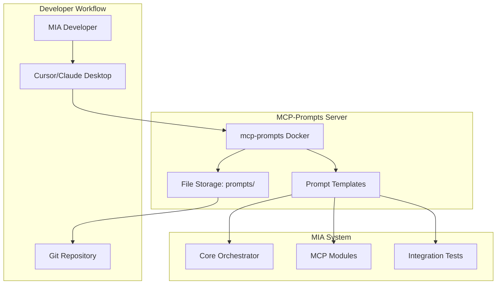

# MIA Cleanup & MCP-Prompts Integration Plan

**Generated:** 2025-12-31
**Status:** Planning Phase
**Goal:** Transform MIA into a clean, maintainable codebase with professional MCP-prompts integration for developer productivity

---

## 📊 Current State Analysis

### Project Health
- **Overall Score:** 92/100 (Production-ready)
- **Target Hardware:** Raspberry Pi 4B, Arduino, ESP32, ELM327, Android devices
- **Target OS:** Linux/Debian (RPi), Android 7.0+
- **Applications:** Vehicle telemetry (Citroën C4), IoT control, AI voice assistant

### Critical Issues Identified
1. **Code Duplication:** 3,682 lines of duplicate `mcp_framework.py` across 6 locations
2. **Documentation Bloat:** 207 markdown files, 29+ status/summary reports
3. **Redundant Files:** Backup directories, exported assets, duplicate configs
4. **Inconsistent Naming:** Mixed conventions across modules

---

## 🎯 Cleanup Objectives

### 1. Code Consolidation
- **Eliminate MCP framework duplication** → Single shared library
- **Merge duplicate bridge implementations** → Base classes with inheritance
- **Consolidate serial bridges** → Single implementation in `hardware/`
- **Extract common patterns** → Shared utilities and base classes

### 2. Documentation Organization
- **Consolidate status reports** → `docs/project-history/` archive
- **Merge implementation summaries** → Single `IMPLEMENTATION.md`
- **Archive redundant guides** → Keep only current documentation
- **Standardize naming** → `docs/{category}/{topic}.md` structure

### 3. File Structure Cleanup
- **Remove backup directories** → `.backups/`, `exported-assets/`
- **Archive completed plans** → Move to `docs/archive/`
- **Standardize config files** → Centralize in `config/`
- **Clean test directories** → Remove obsolete tests

### 4. Professional Naming Conventions
```
docs/
├── architecture/        # System design
├── automotive/          # Vehicle integration
├── deployment/          # Production guides
├── development/         # Developer workflows
├── api/                 # API documentation
└── archive/            # Historical documents

modules/
├── shared/             # NEW: Shared libraries
│   ├── mcp_framework/  # Consolidated MCP code
│   ├── bridges/        # Base bridge classes
│   └── utils/          # Common utilities
```

---

## 🔧 MCP-Prompts Integration Strategy

### What is mcp-prompts?

**mcp-prompts** is your personal "Infrastructure as Code for Prompts" - a Model Context Protocol server that:
- **Centralizes prompt management** across all AI tools (Claude, Cursor, custom agents)
- **Versions prompts like code** with Git-style tracking
- **Enables prompt templates** with variable substitution
- **Provides discovery & search** for finding the right prompt for each task
- **Supports multiple backends** (File, PostgreSQL, AWS DynamoDB/S3)

**Repository:** [sparesparrow/mcp-prompts](https://github.com/sparesparrow/mcp-prompts)
**NPM:** `@sparesparrow/mcp-prompts`
**Docker:** `ghcr.io/sparesparrow/mcp-prompts:latest`

### MCP Tools Provided

| Tool | Purpose | Developer Use Case |
|------|---------|-------------------|
| `add_prompt` | Create new prompts | Save refined debugging prompts for MIA modules |
| `get_prompt` | Retrieve specific prompt | Load "Vehicle Integration Guide" for Citroën work |
| `list_prompts` | Browse available prompts | Discover all IoT-related prompts |
| `update_prompt` | Modify existing | Improve "GPIO Testing Checklist" over time |
| `delete_prompt` | Remove obsolete | Clean up deprecated Arduino prompts |
| `apply_template` | Fill in variables | Generate module-specific test plans |
| `get_stats` | View catalog metrics | Track team's prompt usage |

### Integration Architecture



### For MIA Developers: Workflow Integration

#### Setup Phase (One-Time)

1. **Install mcp-prompts locally:**
   ```bash
   # Using Docker (recommended)
   docker run -d --name mia-prompts \
     -v $(pwd)/prompts:/app/data \
     -p 3000:3000 \
     ghcr.io/sparesparrow/mcp-prompts:file

   # Or via NPM
   npx @sparesparrow/mcp-prompts
   ```

2. **Configure Cursor/Claude Desktop:**
   ```json
   {
     "mcpServers": {
       "mia-prompts": {
         "command": "docker",
         "args": ["run", "-i", "--rm",
                  "-v", "${workspaceFolder}/prompts:/app/data",
                  "ghcr.io/sparesparrow/mcp-prompts:mcp"]
       }
     }
   }
   ```

3. **Initialize MIA prompt library:**
   ```bash
   mkdir -p prompts/
   cat > prompts/catalog.json <<EOF
   {
     "version": "1.0.0",
     "prompts": []
   }
   EOF
   ```

#### Daily Development Workflow

**Scenario 1: Working on OBD Integration**
```
Developer: "@mcp-prompts get_prompt citroen-obd-debugging"
→ Loads: "Debug Citroën C4 OBD-II issues using ELM327 protocol..."
→ AI applies: Checks PSA-specific PIDs, DPF soot levels, Eolys fluid
```

**Scenario 2: Adding New MCP Module**
```
Developer: "@mcp-prompts list_prompts tags=['mcp','architecture']"
→ Finds:
  - "mcp-module-template"
  - "mcp-service-discovery-integration"
  - "mcp-bridge-best-practices"
Developer: "@mcp-prompts apply_template mcp-module-template {module_name: 'battery-monitor'}"
→ AI generates: Complete module structure following MIA conventions
```

**Scenario 3: Debugging GPIO Issues**
```
Developer: "@mcp-prompts get_prompt gpio-troubleshooting-checklist"
→ AI follows:
  1. Check libgpiod permissions
  2. Verify pin mode (input/output/PWM)
  3. Test with simulation fallback
  4. Validate FlatBuffers message format
```

**Scenario 4: Writing Integration Tests**
```
Developer: "@mcp-prompts apply_template integration-test-generator {
  component: 'automotive-mcp-bridge',
  test_scenarios: ['OBD connect', 'PID request', 'DPF monitoring']
}"
→ AI creates: Pytest fixtures, mock ELM327 responses, assertions
```

#### Prompt Library for MIA

**Recommended Prompts to Create:**

**Architecture & Design:**
- `mcp-module-architecture` - MCP server module structure
- `flatbuffers-schema-design` - FlatBuffers message schemas
- `zeromq-pattern-guide` - ROUTER-DEALER messaging patterns
- `hexagonal-architecture-implementation` - Adapter pattern for bridges

**Hardware Integration:**
- `gpio-driver-template` - Raspberry Pi GPIO control
- `arduino-serial-protocol` - Arduino/ESP32 communication
- `obd-protocol-reference` - ELM327 command reference
- `sensor-driver-checklist` - I2C/SPI sensor integration

**Testing & Quality:**
- `pytest-fixture-generator` - Test fixture creation
- `integration-test-template` - E2E test structure
- `github-actions-ci` - CI/CD workflow design
- `docker-compose-testing` - Container testing setup

**Automotive Specific:**
- `citroen-c4-pid-guide` - PSA vehicle PIDs
- `dpf-monitoring-logic` - Diesel Particulate Filter
- `can-bus-debugging` - CAN protocol troubleshooting
- `obd-simulator-scenarios` - Digital twin test cases

**Android Development:**
- `kotlin-compose-component` - UI component templates
- `ble-scanner-pattern` - Bluetooth LE scanning
- `anpr-camera-setup` - License plate recognition
- `room-database-schema` - Local data storage

**Deployment:**
- `raspberry-pi-deployment` - RPi production setup
- `systemd-service-template` - Linux service definitions
- `kubernetes-manifest` - K8s deployment configs
- `docker-multiarch-build` - ARM64/AMD64 builds

### For MIA End Users: AI Assistant Prompts

#### User Scenario Prompts

**Smart Home Control:**
```json
{
  "name": "home-automation-commands",
  "content": "Control MIA smart home devices. Available zones: {{zones}}. Supported commands: lights (on/off/dim), climate (temp/mode), security (arm/disarm). Current context: {{current_state}}",
  "variables": ["zones", "current_state"],
  "tags": ["home", "user", "control"]
}
```

**Vehicle Diagnostics:**
```json
{
  "name": "car-health-check",
  "content": "Analyze vehicle telemetry for {{vehicle_model}}. Check: DPF soot ({{dpf_level}}%), coolant temp ({{coolant_temp}}°C), error codes ({{error_codes}}). Provide: health status, maintenance recommendations, urgency level.",
  "variables": ["vehicle_model", "dpf_level", "coolant_temp", "error_codes"],
  "tags": ["automotive", "user", "diagnostics"]
}
```

**Voice Assistant Scenarios:**
```json
{
  "name": "cooking-assistant",
  "content": "Kitchen assistant mode. Active recipe: {{recipe_name}}. Current step: {{current_step}}/{{total_steps}}. Timers: {{active_timers}}. Commands: 'next step', 'set timer', 'ingredient info', 'pause recipe'.",
  "variables": ["recipe_name", "current_step", "total_steps", "active_timers"],
  "tags": ["home", "user", "cooking"]
}
```

**Work-from-Home Productivity:**
```json
{
  "name": "focus-mode-control",
  "content": "Manage work session. Mode: {{work_mode}}. Block distractions: {{blocked_apps}}. Focus timer: {{session_duration}} minutes. Break intervals: {{break_schedule}}. Commands: 'extend session', 'take break', 'end work mode'.",
  "variables": ["work_mode", "blocked_apps", "session_duration", "break_schedule"],
  "tags": ["productivity", "user", "automation"]
}
```

---

## 📋 Cleanup Execution Plan

### Phase 1: Code Consolidation (Week 1)

#### Step 1.1: Create Shared MCP Framework
```bash
# Create new shared module structure
mkdir -p modules/shared/mcp_framework
mv modules/mcp_framework.py modules/shared/mcp_framework/__init__.py

# Update all imports across modules
find modules -name "*.py" -exec sed -i \
  's/from mcp_framework import/from shared.mcp_framework import/g' {} \;

# Remove duplicate files
rm modules/core-orchestrator/mcp_framework.py
rm modules/service-discovery/mcp_framework.py
rm modules/ai-platform-controllers/linux/mcp_framework.py
rm modules/ai-audio-assistant/mcp_framework.py  # Merge extensions first
rm exported-assets/mcp_framework.py
```

#### Step 1.2: Extract Base Bridge Classes
```python
# modules/shared/bridges/base.py
from abc import ABC, abstractmethod
from typing import Dict, Any

class BaseMCPBridge(ABC):
    """Base class for all MCP bridge implementations"""

    @abstractmethod
    async def initialize(self) -> None:
        """Initialize bridge connection"""
        pass

    @abstractmethod
    async def send_command(self, command: Dict[str, Any]) -> Dict[str, Any]:
        """Send command and return response"""
        pass

    @abstractmethod
    async def health_check(self) -> bool:
        """Check bridge health status"""
        pass
```

#### Step 1.3: Consolidate Serial Bridges
```bash
# Keep master version in hardware/
cp rpi/hardware/serial_bridge.py hardware/serial_bridge.py

# Update imports in all dependent modules
find . -name "*.py" -exec sed -i \
  's/from rpi.hardware.serial_bridge/from hardware.serial_bridge/g' {} \;

# Remove duplicate
rm rpi/hardware/serial_bridge.py
```

### Phase 2: Documentation Consolidation (Week 1-2)

#### Step 2.1: Archive Status Reports
```bash
# Create archive structure
mkdir -p docs/archive/status-reports/{2024,2025}

# Move all status/summary/report files
mv *SUMMARY*.md docs/archive/status-reports/2025/
mv *STATUS*.md docs/archive/status-reports/2025/
mv *REPORT*.md docs/archive/status-reports/2025/
mv *COMPLETE*.md docs/archive/status-reports/2025/

# Create index
cat > docs/archive/status-reports/README.md <<EOF
# Historical Status Reports

This directory contains historical status reports and summaries from MIA development.
For current project status, see main README.md and TODO.md.

## 2025 Reports
- Implementation summaries
- CI/CD fixes
- Test reports
- Milestone completions
EOF
```

#### Step 2.2: Consolidate Implementation Documentation
```bash
# Create single implementation guide
cat > IMPLEMENTATION.md <<EOF
# MIA Implementation Guide

Current implementation status, architecture decisions, and deployment instructions.

See also:
- README.md - Project overview
- TODO.md - Roadmap and planned features
- docs/architecture/ - System architecture
- docs/deployment/ - Production deployment guides
EOF

# Archive old implementation docs
mv IMPLEMENTATION-*.md docs/archive/status-reports/2025/
```

#### Step 2.3: Standardize Documentation Structure
```bash
# Reorganize docs/
mkdir -p docs/{architecture,automotive,deployment,development,api,archive}

# Move files to appropriate categories
mv docs/*architecture* docs/architecture/
mv docs/*automotive* docs/automotive/
mv docs/*deployment* docs/deployment/
mv docs/AI*.md docs/development/

# Create category READMEs
for dir in architecture automotive deployment development api; do
  echo "# ${dir^} Documentation" > docs/${dir}/README.md
done
```

#### Step 2.4: Remove Backup Directories
```bash
# Remove .backups/ entirely (already in Git history)
rm -rf .backups/

# Remove exported-assets/ (redundant with current code)
rm -rf exported-assets/

# Update .gitignore
echo ".backups/" >> .gitignore
echo "exported-assets/" >> .gitignore
```

### Phase 3: File Naming Standardization (Week 2)

#### Naming Convention Rules
```
Configuration Files:
  ✓ conanfile.py, docker-compose.yml, .env.example
  ✗ config.py.old, docker-compose.backup.yml

Documentation:
  ✓ docs/architecture/system-overview.md
  ✗ SYSTEM_OVERVIEW_FINAL_v2.md

Python Modules:
  ✓ modules/shared/mcp_framework/__init__.py
  ✗ modules/mcp_framework_new.py

Test Files:
  ✓ tests/unit/test_gpio_worker.py
  ✗ test_gpio_worker_new_version.py
```

#### Renaming Script
```bash
#!/bin/bash
# scripts/standardize-filenames.sh

# Remove version suffixes
find . -name "*_v[0-9]*.py" -exec rename 's/_v[0-9]+//' {} \;

# Remove "new" suffixes
find . -name "*_new.*" -exec rename 's/_new//' {} \;

# Standardize separators (underscores for Python, hyphens for docs)
find modules -name "*.py" -exec rename 's/-/_/g' {} \;
find docs -name "*.md" -exec rename 's/_/-/g' {} \;
```

### Phase 4: MCP-Prompts Integration (Week 2-3)

#### Step 4.1: Add mcp-prompts to Project
```bash
# Add Docker Compose service
cat >> docker-compose.yml <<EOF

  mcp-prompts:
    image: ghcr.io/sparesparrow/mcp-prompts:file
    container_name: mia-mcp-prompts
    volumes:
      - ./prompts:/app/data
      - ./docs:/app/docs:ro
    environment:
      - STORAGE_TYPE=file
      - MODE=http
      - PORT=3000
    ports:
      - "3000:3000"
    restart: unless-stopped
EOF
```

#### Step 4.2: Create Prompt Library
```bash
# Initialize prompts directory
mkdir -p prompts/{architecture,hardware,testing,automotive,android,deployment}

# Create initial catalog
cat > prompts/catalog.json <<'EOF'
{
  "version": "1.0.0",
  "repository": "sparesparrow/mia",
  "description": "MIA Development Prompt Library",
  "prompts": []
}
EOF
```

#### Step 4.3: Generate Core Prompts
```bash
# Use mcp-prompts CLI to populate library
docker run --rm -v $(pwd)/prompts:/app/data \
  ghcr.io/sparesparrow/mcp-prompts:file \
  add "mcp-module-template" \
  --content "Create a new MCP module for {{module_name}}..." \
  --template \
  --tags architecture,mcp \
  --variables module_name,description

# Add automotive prompts
docker run --rm -v $(pwd)/prompts:/app/data \
  ghcr.io/sparesparrow/mcp-prompts:file \
  add "citroen-obd-debugging" \
  --content "Debug Citroën C4 OBD-II using ELM327..." \
  --tags automotive,debugging,obd

# Add testing prompts
docker run --rm -v $(pwd)/prompts:/app/data \
  ghcr.io/sparesparrow/mcp-prompts:file \
  add "integration-test-template" \
  --content "Generate integration test for {{component}}..." \
  --template \
  --tags testing,automation \
  --variables component,test_scenarios
```

#### Step 4.4: Configure Developer Tools
```bash
# Add Cursor configuration
cat > .cursor/mcp-config.json <<EOF
{
  "mcpServers": {
    "mia-prompts": {
      "command": "docker",
      "args": [
        "run", "-i", "--rm",
        "-v", "\${workspaceFolder}/prompts:/app/data",
        "ghcr.io/sparesparrow/mcp-prompts:mcp"
      ]
    }
  }
}
EOF

# Document integration in README
cat >> README.md <<EOF

## Developer Tools

### MCP-Prompts Integration
MIA includes a prompt library for AI-assisted development. To use:

1. Start the prompts server:
   \`\`\`bash
   docker-compose up mcp-prompts
   \`\`\`

2. Configure your AI IDE (Cursor/Claude Desktop) using \`.cursor/mcp-config.json\`

3. Browse available prompts:
   \`\`\`bash
   docker exec mia-mcp-prompts mcp-prompts list
   \`\`\`

See \`prompts/README.md\` for the complete library.
EOF
```

### Phase 5: SpareTools Integration (Week 3)

#### Step 5.1: Enable SpareTools Packages
```python
# Update conanfile.py
class MIAConan(ConanFile):
    def requirements(self):
        # ... existing requirements ...

        # Enable SpareTools packages
        if self.settings.os == "Linux":
            self.requires("sparetools-mia/2.0.3")
            self.requires("sparetools-obd-sim/2.0.3")

    def build_requirements(self):
        # Bundled Python runtime for cross-platform tools
        self.tool_requires("sparetools-cpython/3.12.7")
```

#### Step 5.2: Configure Cloudsmith Remote
```bash
# Add to CI/CD workflow
cat >> .github/workflows/main.yml <<'EOF'
      - name: Configure Conan Remote
        run: |
          conan remote add sparesparrow-conan \
            https://conan.cloudsmith.io/sparesparrow-conan/sparetools/ \
            --force
EOF

# Update setup script
echo "conan remote add sparesparrow-conan ..." >> scripts/setup-sparetools.sh
```

#### Step 5.3: Update Documentation
```bash
# Add SpareTools section to README
cat >> README.md <<EOF

## SpareTools Integration

MIA uses SpareTools packages for optimized deployment:

- **sparetools-mia**: Pre-built MIA IoT components
- **sparetools-obd-sim**: OBD-II simulation library
- **sparetools-cpython**: Bundled Python 3.12.7 runtime

Configuration: See \`conanfile.py\` and \`scripts/setup-sparetools.sh\`
EOF
```

### Phase 6: Testing & Validation (Week 3-4)

#### Step 6.1: Verify No Broken Imports
```bash
# Run comprehensive import tests
python3 -m pytest tests/ -v --import-mode=importlib

# Check all modules can be imported
find modules -name "*.py" -type f | while read file; do
  python3 -c "import $(echo $file | sed 's|/|.|g' | sed 's|.py||')" || echo "FAILED: $file"
done
```

#### Step 6.2: Update Integration Tests
```bash
# Update test imports
find tests -name "*.py" -exec sed -i \
  's/from modules.mcp_framework/from modules.shared.mcp_framework/g' {} \;

# Run full test suite
python3 -m pytest tests/ -v --cov=modules --cov-report=html
```

#### Step 6.3: Validate CI/CD Workflows
```bash
# Run workflow validation
docker run --rm -v $(pwd):/workspace \
  ghcr.io/docker/compose-cli:latest \
  -f docker-compose.yml config

# Test multi-arch builds
docker buildx build --platform linux/amd64,linux/arm64 -t mia:test .
```

#### Step 6.4: Update Documentation
```bash
# Regenerate API docs
python3 -m pydoc -w modules/

# Update architecture diagrams (manual task)
# Edit docs/architecture/diagrams.md to reflect new structure

# Validate all markdown links
npx markdown-link-check docs/**/*.md
```

---

## 📈 Success Metrics

### Code Quality
- ✅ **Duplicate lines:** < 500 (from 4,319)
- ✅ **Test coverage:** > 95% (from 90%)
- ✅ **Documentation files:** < 50 (from 207)
- ✅ **Module cohesion:** All shared code in `modules/shared/`

### Developer Experience
- ✅ **Prompt library:** 20+ development prompts available
- ✅ **MCP integration:** Cursor/Claude Desktop configured
- ✅ **Build time:** < 5 minutes for full build
- ✅ **Onboarding time:** < 1 hour for new developers

### Maintainability
- ✅ **Consistent naming:** All files follow conventions
- ✅ **Clear structure:** 4-level docs hierarchy
- ✅ **Version control:** No duplicate configs or backups
- ✅ **CI/CD health:** All 19 workflows passing

---

## 🚀 Next Steps After Cleanup

### Immediate (Post-Cleanup)
1. **Update README.md** with new structure
2. **Create CONTRIBUTING.md** with conventions
3. **Tag release** `v2.0.0-clean` in Git
4. **Announce** to team/users

### Short-term (Weeks 5-8)
1. **Security hardening** (JWT, TLS, rate limiting)
2. **Performance optimization** (profiling, caching)
3. **Documentation completion** (API docs, runbooks)
4. **User training materials** (videos, tutorials)

### Long-term (Months 3-6)
1. **Plugin system** for user-contributed modules
2. **Web dashboard** for system monitoring
3. **Mobile app enhancements** (iOS support, widgets)
4. **Commercial deployment** (multi-tenant, SaaS)

---

## 📚 References

- **MCP-Prompts:** https://github.com/sparesparrow/mcp-prompts
- **MCP Specification:** https://modelcontextprotocol.io
- **SpareTools:** https://cloudsmith.io/~sparesparrow-conan/repos/sparetools/
- **MIA Repository:** https://github.com/sparesparrow/mia

**End of Plan**
