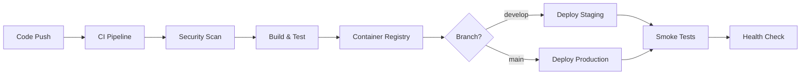

# 🚀 AI-Servis CI/CD & Development Environment

**Complete DevOps setup for the AI-Servis universal IoT platform**

[](https://github.com/ai-servis/ai-servis/actions/workflows/ci.yml)
[](https://github.com/ai-servis/ai-servis/actions/workflows/security.yml)
[](https://github.com/ai-servis/ai-servis/pkgs/container/ai-servis)

## ⚡ Quick Start

### 1. Development Environment

```bash
# Clone the repository
git clone https://github.com/ai-servis/ai-servis.git
cd mia

# Start development environment
./scripts/dev-environment.sh up dev

# Access services
open http://localhost:8080  # Core Orchestrator
open http://localhost:3000  # Grafana Dashboard
open http://localhost:8000  # Documentation
```

### 2. VS Code Dev Container

```bash
# Install VS Code Dev Containers extension
code --install-extension ms-vscode-remote.remote-containers

# Open in container
code .
# Press Ctrl+Shift+P -> "Dev Containers: Reopen in Container"
```

### 3. Full Environment with Monitoring

```bash
# Start everything (dev + monitoring + pi simulation)
./scripts/dev-environment.sh up full

# Check status
./scripts/dev-environment.sh status full

# Run system tests
./scripts/system-tests.sh
```

## 🏗️ Architecture Overview

```mermaid
graph TB
    subgraph "CI/CD Pipeline"
        A[GitHub Actions] --> B[Multi-Platform Builds]
        B --> C[Security Scanning]
        C --> D[Testing Suite]
        D --> E[Container Registry]
        E --> F[Deployment]
    end
    
    subgraph "Development Environment"
        G[VS Code Dev Container] --> H[Docker Compose]
        H --> I[Service Mesh]
        I --> J[Monitoring Stack]
    end
    
    subgraph "Multi-Platform Support"
        K[AMD64] --> L[ARM64]
        L --> M[Windows]
        M --> N[macOS]
    end
```



## 🎯 Features

### ✅ CI/CD Pipeline
- **Multi-platform builds** (AMD64, ARM64, Windows, macOS)
- **Comprehensive security scanning** (CodeQL, Trivy, Snyk, OWASP)
- **Automated testing** (Unit, Integration, System, Performance)
- **Container registry** with vulnerability scanning
- **Deployment automation** (Staging, Production)

### ✅ Development Environment
- **VS Code Dev Container** with full toolchain
- **Hot reloading** for all services
- **Debug ports** for remote debugging  
- **Docker Compose** environments (dev, prod, monitoring, pi-sim)
- **Pre-commit hooks** for code quality

### ✅ Monitoring & Observability
- **Prometheus** metrics collection
- **Grafana** dashboards and visualization
- **AlertManager** intelligent alerting
- **Jaeger** distributed tracing
- **Loki** log aggregation
- **Uptime Kuma** service monitoring

### ✅ Raspberry Pi Simulation
- **GPIO simulation** with web interface
- **ESP32 device simulators** (OBD, I/O, Camera)
- **Vehicle data generation** with realistic scenarios
- **Hardware monitoring** simulation
- **MQTT integration** for real-time data

### ✅ Security & Compliance
- **Vulnerability scanning** for containers and dependencies
- **Static code analysis** with multiple tools
- **Secret management** via GitHub Secrets
- **SARIF reporting** for security findings
- **Compliance monitoring** and audit trails

## 📊 Service Endpoints

| Service | URL | Description |
|---------|-----|-------------|
| Core Orchestrator | http://localhost:8080 | Main MCP host and API gateway |
| Service Discovery | http://localhost:8090 | Service registration and discovery |
| AI Audio Assistant | http://localhost:8082 | Voice interaction and TTS/STT |
| Platform Controller | http://localhost:8083 | System control and automation |
| Grafana Dashboard | http://localhost:3000 | Monitoring and visualization |
| Prometheus Metrics | http://localhost:9090 | Metrics collection and queries |
| Jaeger Tracing | http://localhost:16686 | Distributed request tracing |
| Documentation | http://localhost:8000 | MkDocs project documentation |

## 🔧 Environment Management

### Available Environments

```bash
# Development environment (hot reloading, debug ports)
./scripts/dev-environment.sh up dev

# Production-like environment
./scripts/dev-environment.sh up prod  

# Raspberry Pi simulation environment
./scripts/dev-environment.sh up pi-sim

# Monitoring and observability stack
./scripts/dev-environment.sh up monitoring

# Everything combined
./scripts/dev-environment.sh up full
```

### Environment Commands

```bash
# Start environment
./scripts/dev-environment.sh up <env> [--build] [--pull]

# Stop environment  
./scripts/dev-environment.sh down <env>

# Restart environment
./scripts/dev-environment.sh restart <env>

# Show status
./scripts/dev-environment.sh status <env>

# View logs
./scripts/dev-environment.sh logs <env> [service] [--follow]

# Open shell in service
./scripts/dev-environment.sh shell <env> <service>

# Run tests
./scripts/dev-environment.sh test <env>

# Health check
./scripts/dev-environment.sh health <env>

# Clean up
./scripts/dev-environment.sh clean <env>
```

## 🧪 Testing Strategy

### Test Types

| Test Type | Script | Description |
|-----------|--------|-------------|
| Unit Tests | `pytest` | Individual component testing |
| Integration Tests | `scripts/system-tests.sh` | Service-to-service communication |
| Performance Tests | `scripts/performance-tests.sh` | Load testing and benchmarking |
| Smoke Tests | `scripts/smoke-tests.sh` | Quick deployment validation |
| Security Tests | GitHub Actions | Vulnerability and compliance scanning |

### Running Tests

```bash
# Run all tests locally
./scripts/dev-environment.sh test dev

# Run specific test types
./scripts/system-tests.sh          # Integration tests
./scripts/performance-tests.sh     # Performance tests  
./scripts/smoke-tests.sh local     # Smoke tests

# Run tests in CI
git push origin feature-branch     # Triggers full test suite
```

## 🔍 Monitoring & Alerting

### Monitoring Stack

```bash
# Start monitoring
./scripts/dev-environment.sh up monitoring

# Access dashboards
open http://localhost:3000   # Grafana (admin/admin)
open http://localhost:9090   # Prometheus
open http://localhost:9093   # AlertManager
open http://localhost:16686  # Jaeger
open http://localhost:3001   # Uptime Kuma
```

### Key Metrics

- **Service Health** - Endpoint availability and response times
- **Resource Usage** - CPU, memory, disk utilization  
- **Container Metrics** - Docker container performance
- **Custom Metrics** - MQTT messages, MCP connections, ESP32 devices
- **Security Events** - Failed logins, unauthorized access

### Alert Channels

- **Email** - Critical and warning alerts
- **Slack** - Real-time notifications  
- **Webhook** - Custom integrations
- **PagerDuty** - On-call escalation (production)

## 🌐 Multi-Platform Support

### Container Images

All services built for multiple architectures:

```yaml
platforms:
  - linux/amd64    # x86_64 systems
  - linux/arm64    # Raspberry Pi 4, Apple Silicon
```

### C++ Builds

Cross-platform C++ compilation:

```bash
# Linux (GCC 13)
conan install . --profile profiles/linux-release

# Linux ARM64 (GCC 11)  
conan install . --profile profiles/linux-arm64

# macOS (Clang 14)
conan install . --profile profiles/macos-release

# Windows (MSVC 2022)
conan install . --profile profiles/windows-release
```

### Build Scripts

```bash
# Multi-platform Docker builds
./scripts/docker-build-multiplatform.sh --push

# C++ cross-compilation
./scripts/build-hardware-server.sh --platform arm64
```

## 🔐 Security

### Security Scanning

The CI pipeline includes comprehensive security scanning:

- **CodeQL** - Static analysis for Python, C++, JavaScript
- **Trivy** - Container and filesystem vulnerability scanning
- **Snyk** - Dependency vulnerability detection
- **OWASP Dependency Check** - Known vulnerability database
- **Bandit** - Python security linting

### Security Configuration

```bash
# Required GitHub Secrets
SNYK_TOKEN                 # Snyk API token
NVD_API_KEY               # NIST NVD API key  
SLACK_WEBHOOK_URL         # Alert notifications
ANDROID_KEYSTORE_BASE64   # Android app signing
PLAY_STORE_CONFIG_JSON    # Play Store deployment
ESP32_PRIVATE_KEY         # ESP32 firmware signing
```

### Security Reports

Security findings are reported in SARIF format and integrated with GitHub Security tab:

- **Vulnerability Alerts** - Automated dependency updates
- **Code Scanning** - Pull request security checks  
- **Secret Scanning** - Prevent credential leaks
- **Compliance Reports** - Security posture tracking

## 🚀 Deployment

### Deployment Environments

| Environment | Trigger | Description |
|-------------|---------|-------------|
| Development | Feature branches | Developer testing |
| Staging | `develop` branch | Pre-production validation |
| Production | `main` branch | Live system deployment |

### Deployment Process



### Deployment Commands

```bash
# Manual deployment (staging)
./scripts/deploy.sh staging

# Manual deployment (production)  
./scripts/deploy.sh production

# Rollback deployment
./scripts/rollback.sh production v1.2.3

# Health check deployment
./scripts/smoke-tests.sh production
```

## 🛠️ Development Workflow

### 1. Setup Development Environment

```bash
# Clone repository
git clone https://github.com/ai-servis/ai-servis.git
cd mia

# Start development environment
./scripts/dev-environment.sh up dev

# Open in VS Code
code .
```

### 2. Make Changes

```bash
# Create feature branch
git checkout -b feature/new-feature

# Make code changes
# ... edit files ...

# Run pre-commit checks
pre-commit run --all-files

# Run tests
./scripts/dev-environment.sh test dev
```

### 3. Submit Changes

```bash
# Commit changes
git add .
git commit -m "feat: add new feature"

# Push to GitHub
git push origin feature/new-feature

# Create pull request
# CI pipeline runs automatically
```

### 4. Monitor Deployment

```bash
# Check CI status
gh workflow view ci

# Monitor deployment
./scripts/smoke-tests.sh staging

# View logs
kubectl logs -f deployment/ai-servis-core
```

## 📚 Documentation

### Available Documentation

- **[CI/CD Setup](docs/ci-cd-setup.md)** - Detailed pipeline documentation
- **[Development Guide](docs/development.md)** - Developer onboarding  
- **[API Documentation](docs/api/)** - Service API specifications
- **[Architecture](docs/architecture/)** - System design documentation
- **[Troubleshooting](docs/troubleshooting.md)** - Common issues and solutions

### Documentation Tools

- **MkDocs** - Documentation site generation
- **OpenAPI** - API specification and testing
- **Mermaid** - Architecture diagrams
- **Grafana** - Monitoring documentation

## 🔧 Configuration

### Environment Variables

```bash
# Core Configuration
MQTT_BROKER=mqtt-broker:1883
LOG_LEVEL=INFO
PYTHONPATH=/app

# Database Configuration  
POSTGRES_PASSWORD=your-secure-password
REDIS_URL=redis://localhost:6379

# External API Keys
ELEVENLABS_API_KEY=your-elevenlabs-key
SPOTIFY_CLIENT_ID=your-spotify-id
SPOTIFY_CLIENT_SECRET=your-spotify-secret

# Monitoring Configuration
GRAFANA_PASSWORD=admin
PROMETHEUS_RETENTION=30d
ALERT_WEBHOOK_URL=your-webhook-url
```

### Configuration Files

- **`.env`** - Environment-specific variables
- **`docker-compose.*.yml`** - Service definitions
- **`prometheus.yml`** - Metrics configuration  
- **`alertmanager.yml`** - Alert routing rules
- **`.devcontainer/devcontainer.json`** - VS Code container setup

## 🚨 Troubleshooting

### Common Issues

#### Container Won't Start

```bash
# Check container logs
./scripts/dev-environment.sh logs dev service-name

# Rebuild container
./scripts/dev-environment.sh build dev

# Check resource usage
docker system df
docker system prune
```

#### Port Conflicts

```bash
# Check port usage
netstat -tulpn | grep :8080

# Stop conflicting services
./scripts/dev-environment.sh down dev
pkill -f "process-name"
```

#### Permission Issues

```bash
# Fix volume permissions
sudo chown -R $(id -u):$(id -g) volumes/ logs/

# Reset Docker permissions
docker-compose down -v
./scripts/dev-environment.sh up dev
```

#### Database Connection Issues

```bash
# Reset database
docker-compose down -v postgres
./scripts/dev-environment.sh up dev

# Check database logs
docker logs ai-servis-postgres-dev
```

### Performance Issues

```bash
# Run performance tests
./scripts/performance-tests.sh

# Check resource usage
docker stats

# Monitor services
open http://localhost:3000  # Grafana dashboard
```

### Getting Help

1. **Check the logs**: `./scripts/dev-environment.sh logs dev --follow`
2. **Run health checks**: `./scripts/dev-environment.sh health dev`  
3. **Review documentation**: Browse `docs/` directory
4. **Search issues**: Check GitHub Issues tab
5. **Ask for help**: Create new GitHub Issue

## 🎯 Performance Metrics

### CI/CD Performance

- **Build Time**: < 5 minutes for full pipeline
- **Test Coverage**: > 80% for all components
- **Security Scan**: < 2 minutes for all tools
- **Deployment Time**: < 10 minutes for full stack

### Runtime Performance  

- **Response Time**: < 100ms for health endpoints
- **Throughput**: > 100 requests/second per service
- **Resource Usage**: < 80% CPU, < 85% memory
- **Uptime**: > 99.9% availability target

## 🤝 Contributing

### Development Process

1. **Fork the repository**
2. **Create feature branch**: `git checkout -b feature/amazing-feature`
3. **Make changes** and add tests
4. **Run quality checks**: `pre-commit run --all-files`  
5. **Submit pull request** with detailed description

### Code Quality Standards

- **Test Coverage**: Minimum 80% for new code
- **Documentation**: All public APIs documented
- **Security**: No high/critical vulnerabilities
- **Performance**: No regression in key metrics

### Review Process

- **Automated Checks**: CI pipeline must pass
- **Security Review**: Security team approval for sensitive changes
- **Performance Review**: Performance impact assessment
- **Code Review**: At least one team member approval

## 📈 Roadmap

### Phase 1: Foundation ✅
- [x] CI/CD pipeline setup
- [x] Development environment
- [x] Multi-platform builds
- [x] Security scanning
- [x] Monitoring stack

### Phase 2: Enhancement 🚧
- [ ] Kubernetes deployment
- [ ] Advanced monitoring dashboards  
- [ ] Performance optimization
- [ ] Security hardening
- [ ] Documentation improvements

### Phase 3: Scale 📋
- [ ] Multi-region deployment
- [ ] Auto-scaling configuration
- [ ] Disaster recovery
- [ ] Advanced security features
- [ ] Performance benchmarking

## 📄 License

This project is licensed under the MIT License - see the [LICENSE](LICENSE) file for details.

## 🙏 Acknowledgments

- **Docker** for containerization platform
- **GitHub Actions** for CI/CD automation
- **Prometheus/Grafana** for monitoring stack
- **Conan** for C++ dependency management
- **VS Code** for development environment

---

**Built with ❤️ by the AI-Servis Team**

For more information, visit our [documentation site](https://ai-servis.github.io/ai-servis/) or check out the [GitHub repository](https://github.com/ai-servis/ai-servis).