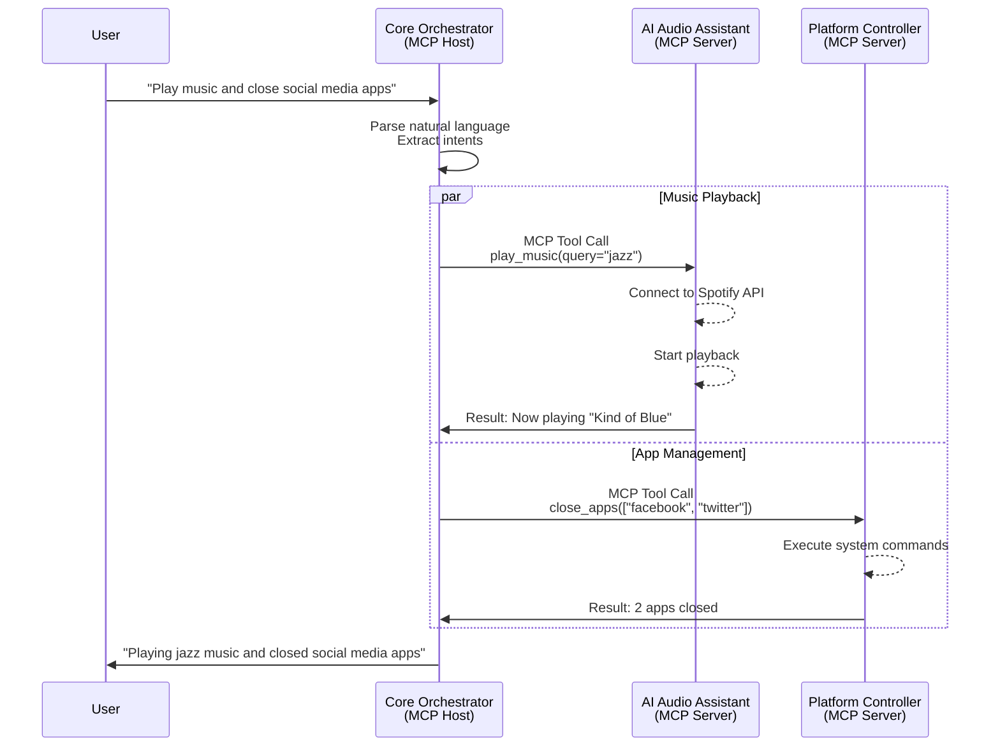
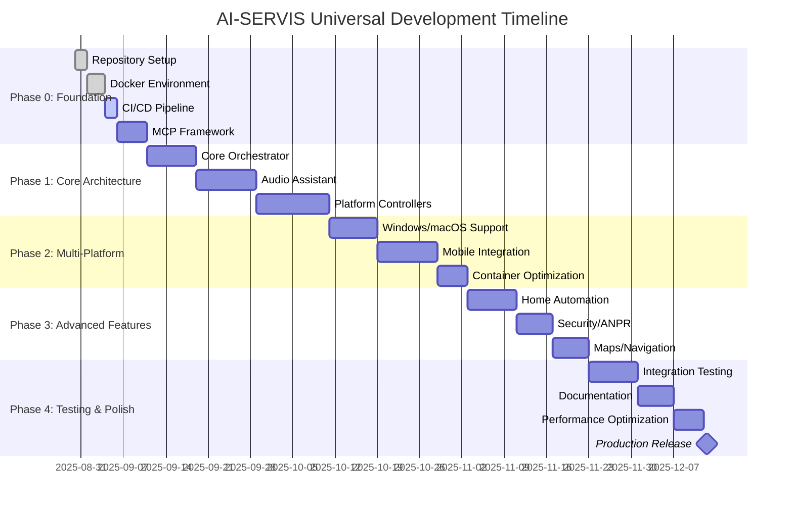

# AI-SERVIS: Modulární Car AI Server → Universal AI Assistant Ecosystem

**🚗→🏠 From automotive-only to everywhere you are**

Kompletní řešení pro autoservisy kombinující ANPR, OBD diagnostiku, hlasového AI asistenta a fleet management v jednom modulárním systému, nyní rozšířené o domácí a cross-platform podporu.

[](https://opensource.org/licenses/MIT)
[](https://hub.docker.com/u/aiservices)
[](https://github.com/sparesparrow/ai-servis)
[](https://modelcontextprotocol.io)
[](https://conan.io)

## 🎯 **Vize Projektu**

> *"Jeden AI asistent, který vás zná všude - od vašeho auta po kuchyni, od telefonu po desktop - přitom vaše data zůstávají soukromá a pod vaší kontrolou."*

**AI-SERVIS Universal** představuje evoluci našeho automotive AI asistenta do komplexního, modulárního ekosystému, který bezproblémově funguje napříč vozidly, domovy a všemi výpočetními platformami.

## 🌩️ **AWS Deployment Preview**

Volitelná AWS pipeline nyní žije ve větvi `feature/aws-deployment`. Najdete v ní workflow `.github/workflows/deploy-variants.yml`, skript `scripts/check_and_update_certificates.py` a podpůrné soubory `aws-setup-commands.sh` a `bucket-policy.json`. Pokud budete chtít web nasadit na S3/CloudFront místo GitHub Pages, přepněte se do této větve a postupujte podle popsaných kroků.

## 🏗️ **Architektura Systému**

```mermaid
graph TB
    subgraph "🎤 User Interfaces"
        UI1[Car Dashboard]
        UI2[Home Kitchen Display]
        UI3[Mobile App]
        UI4[Desktop App]
        UI5[Voice-Only Interface]
    end

    subgraph "🧠 AI-SERVIS Universal Core"
        CORE[Core Orchestrator<br/>MCP Host]
        AUTH[Authentication & Context]
        AUDIO[Audio Management Hub]
        DISC[Service Discovery]
    end

    subgraph "🔧 MCP Server Modules"
        MOD1[🎵 AI Audio Assistant]
        MOD2[🗺️ AI Maps & Navigation]
        MOD3[💬 AI Calls & Messages]
        MOD4[🤖 AI Android Controller]
        MOD5[📱 AI iOS Controller]
        MOD6[🐧 AI Linux Controller]
        MOD7[🪟 AI Windows Controller]
        MOD8[🍎 AI macOS Controller]
        MOD9[⚡ AI RTOS Controller]
        MOD10[🏠 AI Home Automation]
        MOD11[🔒 AI Security & ANPR]
    end

    subgraph "🌐 Transport Layer"
        MQTT[MQTT Broker<br/>Cross-Process]
        MQP[MQP<br/>In-Process]
        HTTP[HTTP/REST APIs]
        BLE[Bluetooth LE]
        WIFI[Wi-Fi Direct]
    end

    subgraph "⚙️ C++ Platform Components"
        CPP1[Hardware Server<br/>GPIO Control]
        CPP2[MCP Server<br/>C++ Tools]
        CPP3[WebGrab Core<br/>Download Engine]
    end

    subgraph "💻 Hardware Platforms"
        HW1[AMD64 Desktop]
        HW2[ARM64 Raspberry Pi]
        HW3[ESP32 Microcontroller]
        HW4[Mobile Devices]
    end

    UI1 --> CORE
    UI2 --> CORE
    UI3 --> CORE
    UI4 --> CORE
    UI5 --> CORE

    CORE --> AUTH
    CORE --> AUDIO
    CORE --> DISC

    CORE <--> MOD1
    CORE <--> MOD2
    CORE <--> MOD3
    CORE <--> MOD4
    CORE <--> MOD5
    CORE <--> MOD6
    CORE <--> MOD7
    CORE <--> MOD8
    CORE <--> MOD9
    CORE <--> MOD10
    CORE <--> MOD11

    CORE --> MQTT
    MQTT --> CPP1
    MQTT --> CPP2
    CPP1 --> MQP
    CPP2 --> MQP
    MQP --> CPP3

    MOD1 <--> MQTT
    MOD2 <--> HTTP
    MOD3 <--> MQTT
    MOD4 <--> BLE
    MOD5 <--> WIFI

    MQTT --> HW1
    HTTP --> HW2
    BLE --> HW3
    WIFI --> HW4
    CPP1 --> HW2

    classDef moduleClass fill:#e1f5fe,stroke:#0277bd,stroke-width:2px
    classDef coreClass fill:#f3e5f5,stroke:#7b1fa2,stroke-width:2px
    classDef transportClass fill:#e8f5e8,stroke:#388e3c,stroke-width:2px
    classDef cppClass fill:#ffebee,stroke:#d32f2f,stroke-width:2px
    classDef hardwareClass fill:#fff3e0,stroke:#f57c00,stroke-width:2px

    class MOD1,MOD2,MOD3,MOD4,MOD5,MOD6,MOD7,MOD8,MOD9,MOD10,MOD11 moduleClass
    class CORE,AUTH,AUDIO,DISC coreClass
    class MQTT,MQP,HTTP,BLE,WIFI transportClass
    class CPP1,CPP2,CPP3 cppClass
    class HW1,HW2,HW3,HW4 hardwareClass
```



## 📚 **Dokumentace Modulů**

### 🎵 **Core Audio Assistant**
**Univerzální hlasová interakce a správa audio**
- 📖 [Dokumentace](./docs/modules/ai-audio-assistant.md)
- 🔧 [MCP API Reference](./docs/api/audio-assistant.md)
- 🎯 **Hlavní funkce**: Voice control, multi-zone audio, cross-platform output switching
- 🏠 **Home Use Case**: Kitchen voice control, bluetooth switching while cooking
- 🚗 **Car Use Case**: Hands-free entertainment and navigation prompts

### 🗺️ **Maps & Navigation**
**Inteligentní navigace a lokalizace**
- 📖 [Dokumentace](./docs/modules/ai-maps-navigation.md)
- 🔧 [MCP API Reference](./docs/api/maps-navigation.md)
- 🎯 **Hlavní funkce**: Real-time directions, POI search, traffic updates
- 🏠 **Home Use Case**: "Where's the nearest grocery store?"
- 🚗 **Car Use Case**: Turn-by-turn navigation with voice prompts

### 💬 **Communications Hub**  
**Univerzální komunikace napříč platformami**
- 📖 [Dokumentace](./docs/modules/ai-communications.md)
- 🔧 [MCP API Reference](./docs/api/communications.md)
- 🎯 **Hlavní funkce**: WhatsApp, Signal, Telegram, Twitter/X, Instagram, Facebook
- 🏠 **Home Use Case**: "Send message to family that dinner is ready"
- 🚗 **Car Use Case**: Hands-free messaging while driving

### 🤖 **Platform Controllers**
**Cross-platform systémové ovládání**

#### 🐧 Linux Controller
- 📖 [Dokumentace](./docs/modules/ai-linux-controller.md)
- 🎯 **Funkce**: Process management, file operations, service control

#### 🪟 Windows Controller  
- 📖 [Dokumentace](./docs/modules/ai-windows-controller.md)
- 🎯 **Funkce**: PowerShell integration, application management, registry access

#### 🍎 macOS Controller
- 📖 [Dokumentace](./docs/modules/ai-macos-controller.md) 
- 🎯 **Funkce**: AppleScript integration, system preferences, Finder operations

#### 📱 Mobile Controllers (Android/iOS)
- 📖 [Android Documentation](./docs/modules/ai-android-controller.md)
- 📖 [iOS Documentation](./docs/modules/ai-ios-controller.md)
- 🎯 **Funkce**: App management, notifications, device integration

#### ⚡ RTOS Controller
- 📖 [Dokumentace](./docs/modules/ai-rtos-controller.md)
- 🎯 **Funkce**: Real-time task management, embedded systems control

### 🏠 **Home Automation**
**Smart home integrace**
- 📖 [Dokumentace](./docs/modules/ai-home-automation.md)
- 🔧 [MCP API Reference](./docs/api/home-automation.md)
- 🎯 **Hlavní funkce**: Matter/Thread, Zigbee, lighting, climate control
- 🏠 **Home Use Case**: "Good night routine" - lights off, thermostat down, security armed

### 🔒 **Security & ANPR**
**Bezpečnost a rozpoznávání SPZ**
- 📖 [Dokumentace](./docs/modules/ai-security-anpr.md)
- 🔧 [MCP API Reference](./docs/api/security-anpr.md)
- 🎯 **Hlavní funkce**: Camera monitoring, license plate recognition, access control
- 🏠 **Home Use Case**: Visitor recognition and automated door unlock
- 🚗 **Car Use Case**: Stalker detection and security alerts

### ⚙️ **C++ Platform Components**
**Hardware control and message processing layer**
- 📖 [Platform Documentation](./platforms/cpp/README.md)
- 📖 [Raspberry Pi Deployment Guide](./platforms/cpp/core/README-RASPBERRY-PI.md)
- 🔧 [Hybrid Messaging Guide](./docs/architecture/hybrid-messaging.md)
- 🎯 **Hlavní komponenty**: Hardware Server, MCP Server, WebGrab Core
- 🏠 **Home Use Case**: Raspberry Pi GPIO control and local AI processing
- 🚗 **Car Use Case**: ESP32 integration and real-time vehicle control
- 🚀 **CI/CD**: Automated builds via [GitHub Actions](.github/workflows/main.yml) (includes Raspberry Pi builds)

#### 🔧 **Hardware Server**
**GPIO control and hardware interfacing**
- TCP interface for direct hardware access (port 8081)
- MQTT integration for Python orchestrator communication
- Raspberry Pi GPIO control via libgpiod
- Real-time hardware monitoring and control

#### 📡 **MCP Server**
**C++ tool execution and hardware tasks**
- Model Context Protocol implementation in C++
- GPIO task execution (configure, set, get pins)
- Download job management with FlatBuffers
- MQTT transport for cross-process communication

#### ⚡ **WebGrab Core**
**Download engine and file management**
- Asynchronous file downloading with libcurl
- Thread-safe job queue processing
- FlatBuffers serialization for all messages
- Cross-platform compatibility (Linux, Windows, macOS)

## 🚀 **Rychlý Start**

### ⚡ **Zero-Copy Bootstrap (Recommended)**

The fastest way to set up the development environment:

```bash
# 1. Clone the repository
git clone https://github.com/sparesparrow/ai-servis.git
cd ai-servis

# 2. Run the initialization script (sets up everything)
./tools/init.sh

# 3. Activate the environment
source tools/env.sh

# 4. Build all C++ components
ai-servis-build
```

This approach uses **CPython tool tarballs** from Cloudsmith or GitHub Packages to create a zero-copy development environment, avoiding PEP 668 issues on modern systems. You can easily switch between repositories using environment variables (see [Repository Switching Guide](docs/REPOSITORY_SWITCHING.md)).

### 🐳 **Docker Development Environment**

```bash
# Klonování repozitáře
git clone https://github.com/sparesparrow/ai-servis.git
cd ai-servis

# Spuštění development environmentu
docker-compose -f containers/docker-compose.dev.yml up -d

# Ověření, že všechny služby běží
docker-compose ps

# Přístup k logs
docker-compose logs -f ai-audio-assistant
```

### 🔨 **Building C++ Platform Components**

#### Self-Contained Build (Recommended for Raspberry Pi)

This approach uses Cloudsmith packages for a portable Python/Conan environment:

```bash
# 1. Clone the repository
git clone https://github.com/sparesparrow/ai-servis.git
cd ai-servis

# 2. Install system dependencies (requires sudo)
./tools/install-deps-rpi.sh

# 3. Bootstrap the build environment (downloads from Cloudsmith)
./tools/bootstrap.sh

# 4. Build all C++ components
./tools/build.sh

# Components built:
# - hardware-server: GPIO control (port 8081)
# - mcp-server: MCP tools for hardware tasks
# - webgrab-client/server: Download management
```

**📖 For detailed Raspberry Pi setup, see [RASPBERRY_PI_SETUP.md](docs/RASPBERRY_PI_SETUP.md)**

#### Quick Build for Raspberry Pi (System Python)

If you prefer using system packages without the bundled environment:

```bash
# Install dependencies
sudo apt install cmake ninja-build g++ \
    libgpiod-dev libmosquitto-dev libcurl4-openssl-dev

# Quick build and deploy
./scripts/build-raspberry-pi.sh
sudo ./scripts/deploy-raspberry-pi.sh
sudo systemctl start ai-servis
```

#### Interactive Development

For active development, activate the build environment:

```bash
# Activate environment (after bootstrap)
source tools/env.sh

# Now you have conan, cmake, etc. on PATH
ai-servis-info   # Show environment info
ai-servis-build  # Build all components
ai-servis-clean  # Clean build directories
```

**📖 For detailed Raspberry Pi deployment instructions, see [README-RASPBERRY-PI.md](platforms/cpp/core/README-RASPBERRY-PI.md)**

### 🔧 **Testing C++ Components**

```bash
# Run test suite
cd build-raspberry-pi
./tests

# Or use the test script
./scripts/test-raspberry-pi.sh

# Test hardware server (requires GPIO hardware on Raspberry Pi)
cd build-raspberry-pi
sudo ./hardware-server &

# Test main application
sudo ./ai-servis-rpi

# Test Python integration
cd modules/hardware-bridge
python test_integration.py
```

**📖 For detailed testing and deployment, see:**
- [Raspberry Pi Deployment Guide](platforms/cpp/core/README-RASPBERRY-PI.md)
- [Quick Start Guide](QUICK-START-RASPBERRY-PI.md)
- [Deployment Checklist](DEPLOYMENT-CHECKLIST.md)

### 🏠 **Home Installation (AMD64)**

```bash
# Instalace pro domácí použití
curl -sSL https://install.ai-servis.cz | bash -s -- --variant=home

# Nebo manuální docker-compose
wget https://raw.githubusercontent.com/sparesparrow/ai-servis/main/containers/docker-compose.home.yml
docker-compose -f docker-compose.home.yml up -d

# Test voice control
echo "AI, play jazz music in kitchen" | nc localhost 8080
```

### 📱 **Mobile App Installation**

- **Android**: [Download from GitHub Releases](https://github.com/sparesparrow/ai-servis/releases/latest)
- **iOS**: [TestFlight Beta](https://testflight.apple.com/join/ai-servis) (Coming Soon)

### 🚗 **Automotive Installation**

Viz původní automotive dokumentace:
- [Phone Edition Install](./docs/install/phone.md) - 22k-38k Kč
- [Hybrid Edition Install](./docs/install/hybrid.md) - 48k-89k Kč  
- [Pro Edition Install](./docs/install/pro.md) - 89k-143k Kč

## 🔧 **MCP Architecture Deep Dive**



### **MCP Tools Příklad - Audio Assistant**

```python
# MCP Tool Definition
{
  "name": "play_music",
  "description": "Play music by artist, album, track, or genre",
  "inputSchema": {
    "type": "object",
    "properties": {
      "query": {"type": "string", "description": "Search query"},
      "source": {"type": "string", "enum": ["spotify", "apple", "local"]},
      "zone": {"type": "string", "description": "Audio zone (optional)"}
    }
  }
}

# MCP Tool Call Result
{
  "content": [
    {
      "type": "text", 
      "text": "Now playing: Miles Davis - Kind of Blue in Kitchen zone"
    }
  ],
  "isError": false
}
```

## 📊 **Varianty Nasazení**

| Varianta | Hardware | Software | Cena | Use Cases |
|----------|----------|----------|------|-----------|
| **🏠 Home Desktop** | AMD64/ARM64 | All modules | Zdarma | Smart home, productivity |
| **📱 Mobile Only** | Phone/Tablet | Mobile apps | Zdarma | Personal assistant |
| **🚗 Car Phone** | ESP32 + Phone | Android + firmware | 22k-38k Kč | Basic automotive AI |
| **🚗 Car Hybrid** | ESP32 + Pi + Phone | Full stack | 48k-89k Kč | Advanced automotive |
| **🏢 Enterprise** | Dedicated servers | All + enterprise features | Custom | Business automation |

## 🧪 **Testing & Development**

### **Modular Testing**
```bash
# Test jednotlivého modulu
cd modules/ai-audio-assistant
pytest tests/ -v

# Integration test between modules  
pytest tests/integration/test_audio_platform_integration.py

# Full system test with Pi simulation
docker-compose -f containers/docker-compose.pi-sim.yml up -d
pytest tests/system/ -v --platform=pi-sim
```

### **Performance Benchmarking**
```bash
# Voice command latency test
./scripts/benchmark-voice-latency.sh

# Cross-platform compatibility test
./scripts/test-all-platforms.sh

# Load testing
./scripts/load-test.sh --concurrent=10 --duration=300s
```

## 📈 **Implementační Roadmap**



## 📋 **Project Status**

### **✅ Completed (Automotive Foundation)**
- [x] ESP32 OBD-2 integration
- [x] Android aplikace (MVP)
- [x] ANPR license plate recognition
- [x] Basic voice control
- [x] Edge processing framework

### **✅ Recently Completed (C++ Platform Integration)**
- [x] **Hybrid MQP + MQTT Architecture**: Unified messaging system
- [x] **C++ Platform Components**: Hardware server, MCP server, WebGrab core
- [x] **Conan Dependency Management**: Automatic FlatBuffers generation
- [x] **Python Bridge Modules**: MCP client and hardware controller
- [x] **Cross-Platform CI/CD**: Multi-architecture C++ builds
- [x] **Repository Structure**: Organized platforms/ and modules/

### **🚧 In Progress (Universal Extension)**
- [ ] **[TASK-001](./TODO-master-list.md#task-001-repository-structure-setup)**: Repository structure setup
- [ ] **[TASK-006](./TODO-master-list.md#task-006-mcp-framework-library)**: MCP framework development
- [ ] **[TASK-012](./TODO-master-list.md#task-012-audio-assistant-mcp-server)**: Audio assistant MCP server

### **📅 Planned (Next Milestones)**
- [ ] **M1 (Week 4)**: Core architecture functional
- [ ] **M2 (Week 8)**: Audio assistant working on desktop
- [ ] **M3 (Week 12)**: Multi-platform support complete
- [ ] **M4 (Week 16)**: Advanced features implemented

**📊 Overall Progress**: ~15/142 tasks completed (~11%) | [View Full TODO List](./TODO-master-list.md)

## 🤝 **Přispívání**

### **Development Setup**
```bash
# Development environment
git clone https://github.com/sparesparrow/ai-servis.git
cd ai-servis
cp .env.example .env
docker-compose -f containers/docker-compose.dev.yml up -d

# Pre-commit hooks
pre-commit install
```

### **Contributing Guidelines**
1. 🍴 Fork repozitáře
2. 🔀 Vytvořte feature branch (`git checkout -b feature/amazing-feature`)
3. ✅ Přidejte testy pro novou funkcionalitu
4. 📝 Aktualizujte dokumentaci
5. 🔍 Spusťte code review checklist
6. 📤 Vytvořte Pull Request

### **Code Standards**
- **Python**: Black formatter, type hints, docstrings
- **JavaScript/TypeScript**: Prettier, ESLint, JSDoc
- **Docker**: Multi-stage builds, security scanning
- **Documentation**: Markdown, Mermaid diagrams

## 📞 **Kontakt & Support**

### **🌍 Community**
- **Discord**: [AI-SERVIS Community](https://discord.gg/ai-servis)
- **GitHub Discussions**: [Project Discussions](https://github.com/sparesparrow/ai-servis/discussions)
- **Reddit**: [r/AI_SERVIS](https://reddit.com/r/AI_SERVIS)

### **🏢 Business**
- **Web**: [https://ai-servis.cz](https://ai-servis.cz)
- **Email**: [info@ai-servis.cz](mailto:info@ai-servis.cz)
- **Telefon**: +420 777 888 999
- **Adresa**: Brno-sever, Česká republika

### **🔧 Technical Support**
- **Issues**: [GitHub Issues](https://github.com/sparesparrow/ai-servis/issues)
- **Security**: [security@ai-servis.cz](mailto:security@ai-servis.cz)
- **Documentation**: [docs.ai-servis.cz](https://docs.ai-servis.cz)

## 🏆 **Achievements & Recognition**

- 🥇 **První modulární AI Car Server v ČR**
- 🔒 **Privacy-First Architecture** - žádná závislost na cloudu
- 🌍 **Open Source Foundation** - MIT license
- 🤖 **MCP-Compatible** - industry standard compliance
- 🚀 **Cross-Platform** - jeden systém, všude použitelný

---

## 📄 **Licence**

Tento projekt je licencován pod MIT licencí - viz [LICENSE](LICENSE) soubor pro detaily.

## 🙏 **Poděkování**

- **Anthropic** za Model Context Protocol standard
- **ElevenLabs** za high-quality TTS/STT APIs  
- **ESP32 Community** za embedded AI frameworks
- **Docker** za containerization platform
- **Open Source Contributors** za různé použité knihovny

---

**AI-SERVIS Universal** - *Jeden AI asistent pro všechny vaše prostředí* 🚗🏠📱💻

[](https://brno.cz)
[](https://ai-servis.cz)