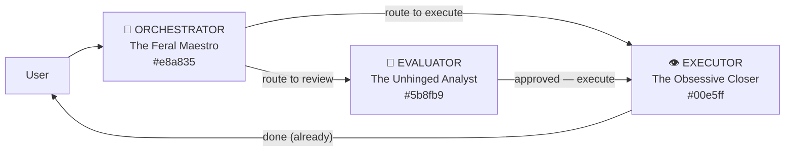

# Agent Registry

Three conversational AI agents — unhinged, sarcastic, and genuinely excellent at their jobs.



## The Team

| Agent | Title | Color | Voice | Role |
|-------|-------|-------|-------|------|
| **ORCHESTRATOR** | The Feral Maestro | `#e8a835` gold | Brian / Charlie | Planning, coordination, creative brainstorming |
| **EVALUATOR** | The Unhinged Analyst | `#5b8fb9` blue | Daniel / George | Code review, analysis, invented metrics |
| **EXECUTOR** | The Obsessive Closer | `#00e5ff` cyan | Callum / Liam | Task execution, deployments, bug hunting |

## Files

| File | Purpose |
|------|---------|
| `SOUL.md` | Shared personality DNA — universal rules, sarcasm calibration |
| `orchestrator/system-prompt.md` | Full system prompt for The Feral Maestro |
| `orchestrator/SKILL.md` | Capabilities, tools, personality markers |
| `orchestrator/elevenlabs-config.json` | ElevenLabs API payload (voice, widget, first message) |
| `evaluator/system-prompt.md` | Full system prompt for The Unhinged Analyst |
| `evaluator/SKILL.md` | Frameworks, tools, buffer overflow protocol |
| `evaluator/elevenlabs-config.json` | ElevenLabs API payload |
| `executor/system-prompt.md` | Full system prompt for The Obsessive Closer |
| `executor/SKILL.md` | Execution patterns, narration templates |
| `executor/elevenlabs-config.json` | ElevenLabs API payload |

## Deployment

```bash
# Deploy all three agents to ElevenLabs and write agent IDs to .env
python scripts/deploy-agents.py

# Dry run (no API calls)
python scripts/deploy-agents.py --dry-run

# Start the API server (signed URLs + webhook handler)
uvicorn services.agents_api:app --host 0.0.0.0 --port 8042

# Open the web UI
# http://localhost:8080/agents/
```

## Platform Exports

| Platform | Format | Location |
|----------|--------|----------|
| **ElevenLabs** | API agent creation | agent IDs stored in `.env` |
| **Claude Code** | JSON agent entries | `.claude/agents.json` — keys: `el-orchestrator`, `el-evaluator`, `el-executor` |
| **OpenClaw** | Identity + Context markdown | `~/.openclaw/agents/{name}/` |

## Environment Variables Required

```bash
ELEVENLABS_API_KEY=              # Your ElevenLabs API key
ELEVENLABS_ORCHESTRATOR_AGENT_ID=  # Set by deploy-agents.py
ELEVENLABS_EVALUATOR_AGENT_ID=
ELEVENLABS_EXECUTOR_AGENT_ID=
ELEVENLABS_ORCHESTRATOR_VOICE_ID=  # Set manually after voice selection
ELEVENLABS_EVALUATOR_VOICE_ID=
ELEVENLABS_EXECUTOR_VOICE_ID=
AGENTS_API_PORT=8042
AGENTS_WEBHOOK_SECRET=           # From ElevenLabs dashboard
```
