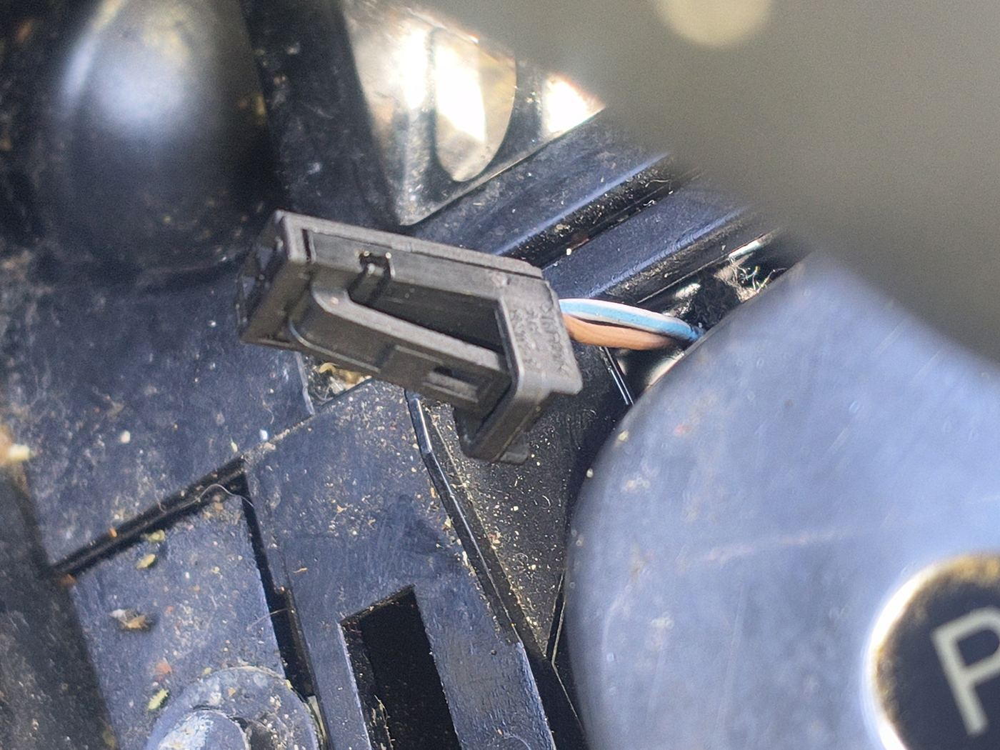
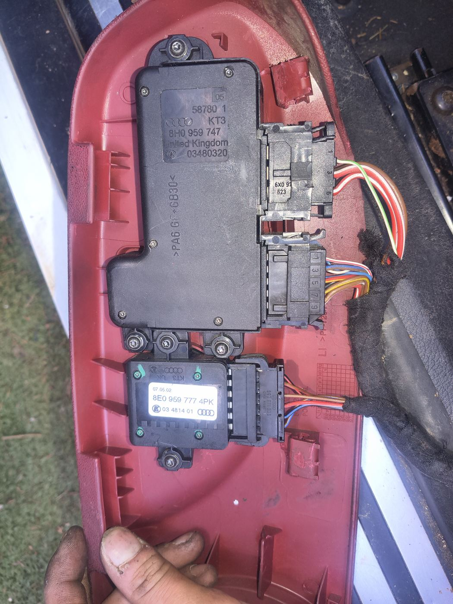
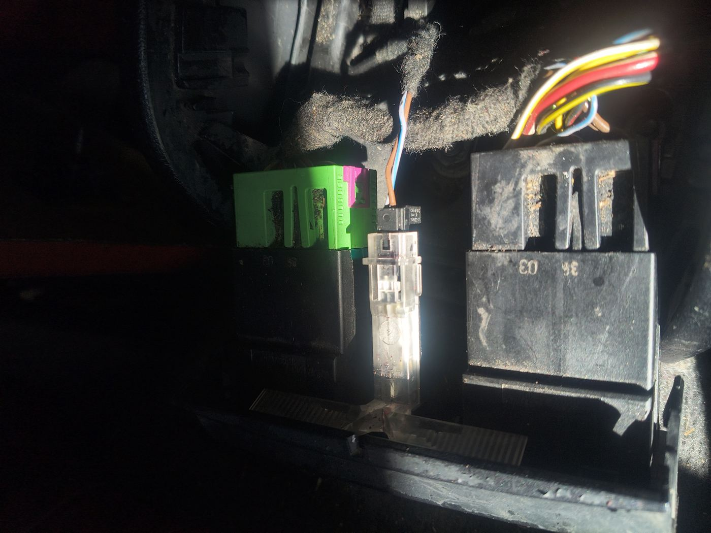
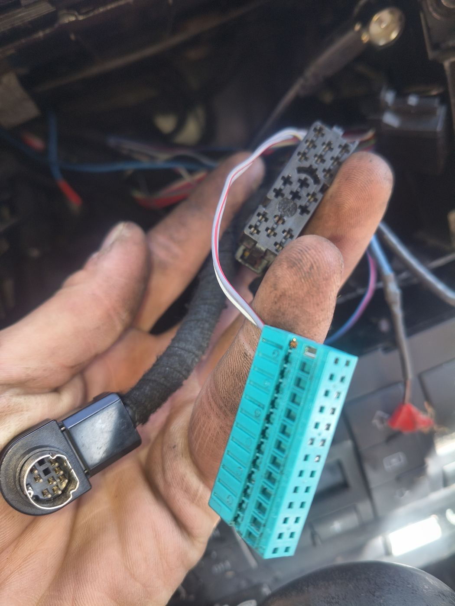
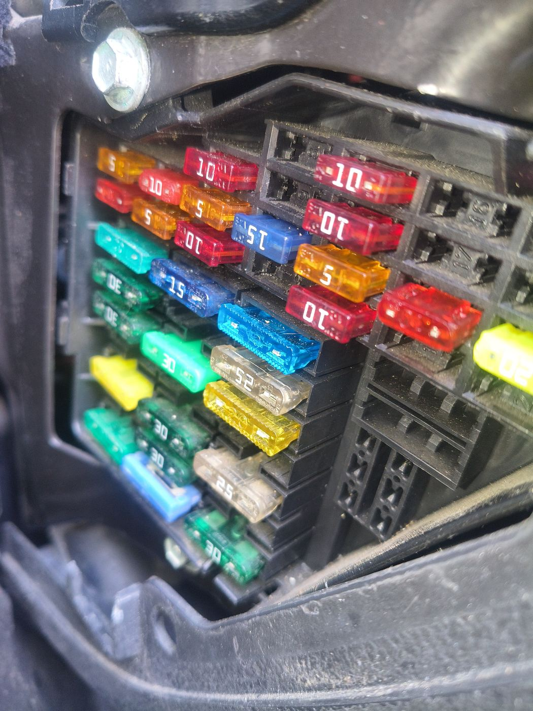
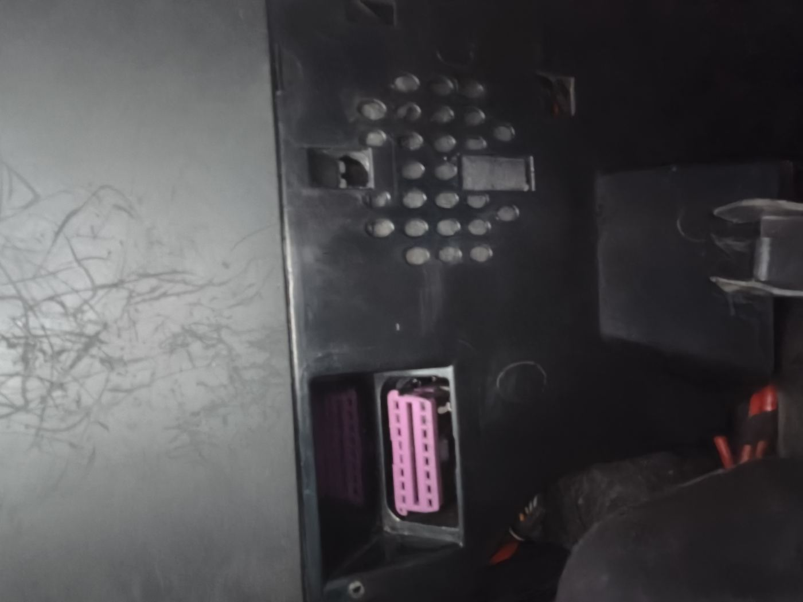
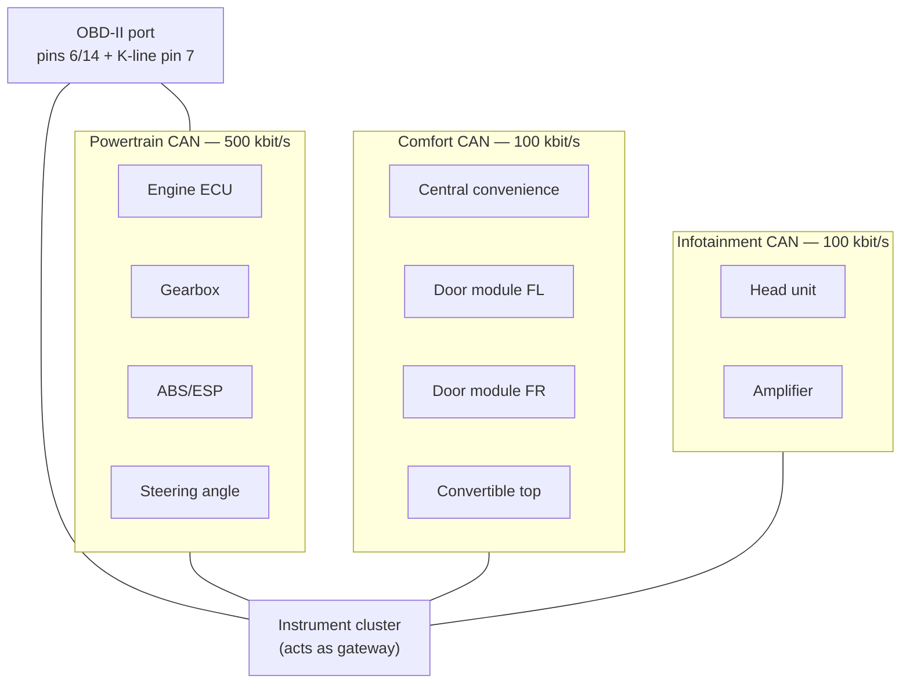
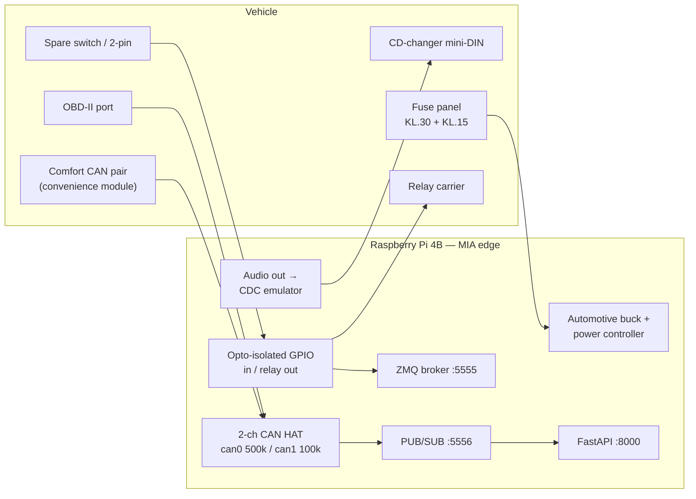

# Audi A4 Cabriolet (8H) — In-Car Interface Integration Brainstorm

> **Audience**: Vehicle integrators and Pi backend developers wiring the physical car into MIA
> **Status**: Design brainstorm — nothing here is implemented yet. Every interface below carries an
> explicit confidence level and a verification step that must pass before any code is written against it.
> **Prototype vehicle**: Audi A4 Cabriolet, MY2004, body type **8H**

## 0. Chassis designation note

The car is referred to in this repo as "A4 B7 Cabriolet". Strictly, a MY2004 A4 Cabriolet is the
**8H body on the B6 generation** (the cabriolet moved to B7 running gear for MY2006), but 8H shares
the bulk of its body electronics with both B6 and B7 saloons. The part numbers visible on the door
card (`8H0 959 747`, `8E0 959 777`) are 8H/8E family numbers and confirm this.

Practical consequence: **order parts and look up wiring under `8H` / `8E`, not `B3`**. The older
`docs/automotive/raspberry-pi-audi-integration.md` text describing a "B3 Cabriolet (2004)" is a
chassis-code slip — B3 is a 1986–1991 80/90. Electrically the two are nothing alike (B3 has no CAN
at all), so anyone following that doc for harness work would be looking at the wrong car.

---

## 1. Interface inventory from the survey photos

Each row is what the photo shows, what MIA could do with it, and how confident the identification is.
**No integration work starts from a "medium" or "low" row until its verification step passes.**

| # | Photo | Identification | Confidence | MIA value |
| --- | --- | --- | --- | --- |
| A |  | Unplugged 2-pin connector on the centre console / tunnel trim, blue-white + brown-white pair. Wire gauge is signal-level, not load-level. | **Low** — could be console illumination, an unused switch position, or a deleted option | Free, pre-routed switch or lamp circuit at driver's-hand position — ideal Mia push-to-talk button or status LED |
| B |  | Driver door card, inner face. Upper module `8H0 959 747` (Audi, KT3/UK, date 03480320) = door-side control unit. Lower `8E0 959 777` = mirror-adjust / memory switch pack. Connector housings marked `6X0 972 xxx` = VAG repair-connector family | **Medium-high** on the part numbers, **medium** on exact function split | Door state, window position, lock state, mirror/memory switch presses — all on the comfort domain. Also spare switch contacts usable as Mia inputs |
| C |  | Under-dash relay carrier: green relay, black relay, plus an **inline blade-fuse holder spliced into a blue-white/brown pair** — that is existing aftermarket work, not factory | **High** that it is an aftermarket tap; **unknown** what it feeds | Candidate switched-12V source, and the physical place to add Mia-controlled relay outputs |
| D |  | 8-pin mini-DIN = factory **CD-changer connector** (Chorus/Concert/Symphony). Teal 20-way + black connector with a white/red twisted pair = head-unit / amplifier side harness | **High** on the mini-DIN, **medium** on the teal connector's role | **Highest-value item in the whole survey**: audio path into the factory speakers plus head-unit control surface, with zero cutting |
| E |  | Interior fuse panel, driver's end of dash. Mixed 5/10/15/25/30 A blade fuses, several empty positions on the right-hand column | **High** | Power architecture: permanent (KL.30) and ignition-switched (KL.15) feeds via add-a-fuse taps; empty positions are spare circuits |
| F |  | A module with a pink multi-way connector behind trim, alongside a vented housing. Pink coding on 8H/8E is typical for convenience/body wiring | **Low-medium** — most likely the central convenience control unit or the convertible-top control unit | Comfort-CAN tap point: lock/unlock, door open, alarm, remote key, top position |

### 1.1 Why the identifications must be verified before code

Three of six rows are guesses from a photo taken in bad light. The failure mode is not "the doc is
wrong" — it is **someone back-probing a live airbag or top-hydraulics circuit** because a doc told
them a connector was something else. Verification protocol, in order:

1. **Full autoscan first.** VCDS or OBDeleven, ignition on, engine off. Record the gateway
   installation list and every module address that answers (expect at least 01 engine, 02 gearbox,
   03 ABS, 08 HVAC, 15 airbag, 16 steering wheel, 17 cluster, 42/52 door electronics, 46 central
   convenience, 56 radio, and on a cabriolet a convertible-top address). Save the scan into
   `docs/automotive/scans/` — it is the ground truth for everything that follows.
2. **Identify row F by address, not by colour.** Physically trace the pink connector's harness while
   watching which module goes offline when the connector is unplugged (battery disconnected first).
3. **Identify row A with a multimeter and a test lamp**, not by plugging anything in. Measure both
   pins to ground across four key states: key out, key in position 1, ignition on, engine running.
   Expect one of: constant 12 V + switched ground (a lamp), pull-up + switch-to-ground (a switch
   input), or nothing (a deleted option). Record which, then decide.
4. **Trace row C's inline fuse to its source.** If it is on a permanent feed it is a battery-drain
   risk that already exists in the car and is worth fixing regardless of MIA.
5. **Never probe yellow connectors.** Yellow = airbag/pyrotechnic on VAG. Battery negative
   disconnected and 10 minutes elapsed before any work near the console, seats, or steering column.

---

## 2. Bus topology on 8H, and what it implies

The consequence that drives this whole design: **on 8H the cluster gateways diagnostics, it does not
rebroadcast comfort traffic onto the powertrain bus.** So:

- Door state, lock state, window position and key-remote events are **not** readable from the OBD
  port as broadcast frames. They are only reachable by (a) polling each module diagnostically through
  the gateway, which is slow and noisy, or (b) **passively tapping the comfort CAN pair** at the
  convenience module (row F) or in the door harness (row B).
- Passive tapping is the right call: no bus load added, no diagnostic sessions held open, no risk of
  a stuck session tripping a fault. It is also the only way to get event latency low enough for
  "driver door opened → wake Mia".

---

## 3. Target architecture

Module ownership maps onto what already exists in the repo:

| Concern | Owner | State |
| --- | --- | --- |
| Powertrain CAN / OBD PIDs | `apps/rpi-backend/py-api/services/obd_worker.py` | exists |
| Read-only VAG/UDS | `orchestration/mcp/modules/vag-audi-bridge/main.py` | exists, passive-by-default |
| ISO-TP transport | `orchestration/mcp/modules/obd-transport-agent/` | exists |
| **Comfort-CAN body events** | `orchestration/mcp/modules/body-bus-bridge/` | **proposed, new** |
| **Ignition / power state** | `apps/rpi-backend/py-api/hardware/ignition_sense.py` | **proposed, new** |
| Switch inputs, relay outputs | `apps/rpi-backend/py-api/hardware/gpio_worker.py` | exists, extend config |
| **Head-unit audio + controls** | `apps/rpi-backend/py-api/services/head_unit_bridge.py` | **proposed, new** |
| Voice routing | `apps/rpi-backend/py-api/services/voice_command_router.py` | exists |

Every proposed module follows the repo convention: **hardware-dependent code ships a simulation
fallback** so CI and non-Pi development still run. For the body bus that means `vcan0` plus a
recorded frame log; for ignition sense a fake-GPIO backend; for the head-unit bridge a null audio
sink.

---

## 4. Integration options, ranked

### Tier 1 — do these first

#### T1.1 Power, ignition sense, and clean shutdown (rows C, E)

This is what kills car-Pi builds, not software. Requirements:

- **KL.30 permanent feed** from the fuse panel via an add-a-fuse tap on a circuit rated with headroom.
  Pi 4B plus a HAT plus a cooler is a 15–20 W peak load; size the buck at 5 V/5 A minimum.
- **Wide-input automotive buck (6–36 V)**. During cranking the A4's bus voltage dips well below 9 V;
  a 12 V-nominal-only converter will brown-out the Pi on every start. Load-dump / ISO 7637-2 pulse
  tolerance is not optional on a 20-year-old car.
- **KL.15 ignition sense into GPIO through an optocoupler** — never a bare resistor divider, and
  never 12 V anywhere near a GPIO pin. The Pi reads "ignition on/off" as an event, it does not take
  its power from KL.15.
- **Supervised shutdown**: on KL.15 low, flush buffers, publish a final telemetry frame, `systemctl
  halt`, then a low-quiescent power controller (LTC2954-class latch, Witty Pi, or Sleepy Pi) cuts the
  KL.30 feed. Target sleep draw **< 5 mA**; the car's own quiescent budget is tens of mA and the
  battery on a cabriolet that sits for a week has no margin.
- The existing inline fuse in row C is *not* trusted as a source until traced. If it turns out to be
  a permanent feed left live by a previous installer, fix it.

Exit criteria: 50 start/stop cycles with no filesystem corruption; measured sleep current; Pi boots
to a publishing state within 40 s of KL.15 going high.

#### T1.2 Factory audio path via the CD-changer connector (row D)

The mini-DIN is a complete, reversible, non-destructive audio integration point. Two ways to use it:

1. **CD-changer emulator** (`Yatour`/`Dension`-class, or a DIY emulator speaking the VAG changer
   protocol on the DIN bus). The head unit sees a changer, Mia's audio plays as "CD 1", and —
   this is the part that matters — **head-unit and steering-wheel buttons become Mia input events**:
   next/previous track, disc select, and the scan button all arrive over the changer bus. That gives
   a factory-looking control surface with no dash cutting: "next track" can be bound to "next Mia
   intent", disc 6 to push-to-talk, and so on.
2. **Plain line-in** through the changer connector's audio pins. Simpler, but the radio has to be in
   changer mode and you get no button events. Only worth it as a fallback if the emulator protocol
   fights back.

Either way: run the Pi's audio through a **ground-loop isolator**. A Pi sharing chassis ground with a
car amplifier over an unbalanced line will hum with alternator whine, and no amount of software fixes it.

Open question for the owner: which head unit is fitted (Chorus II / Concert II / Symphony II), and is
a factory changer already present in the boot? If one is present, the connector in the photo may
already be occupied and the emulator has to replace it.

#### T1.3 Powertrain CAN, read-only (already built)

Keep the current posture from `vag-audi-bridge`: passive monitoring on, UDS polling off, read services
limited to `0x19`/`0x22`, no extended session, no security access, no writes. The 8H's simpler
topology means VIN (`F190`) and DTC summary reads are achievable once the transport is stable. Add a
vehicle profile so the bridge knows what car it is attached to (see `apps/rpi-backend/config/vehicles/`).

### Tier 2 — high value, needs verification first

#### T2.1 Passive comfort-CAN sniffing (rows B, F)

Tap the comfort CAN twisted pair at the convenience module, feed it to a second CAN channel at
**100 kbit/s in listen-only mode**. The controller's listen-only bit is a config register that a
software bug can overwrite, so it is not the guarantee — **leave the TXD line between controller and
transceiver physically unconnected** (or tie it to 3V3, the recessive level). The transceiver then
has no way to drive the bus whatever the software does. Set the controller's listen-only mode as
well; both together, not either alone. This is non-negotiable for a first pass.

What this buys, roughly in order of usefulness:

- **Arrival/departure detection** — remote unlock, driver door open, ignition on. Mia can be warm
  and listening before the driver sits down, instead of booting while they wait.
- **Door/window/top state** — "you left a window down" is genuinely useful on a cabriolet, and it is
  a read-only feature.
- **Occupancy hints** — passenger door, seat-belt state if it is on this bus.
- **Lock state for privacy gating** — DVR/ANPR recording rules can key off "car locked and left".

Reverse-engineering method: park, log frames with `candump -l` across scripted actions (open driver
door, close it, lock, unlock, window down/up, top open/close), then diff the logs. Store the resulting
map as a DBC-style YAML under `apps/rpi-backend/config/vehicles/`, never hardcoded in Python.

**Hard rule: no transmit on comfort CAN.** Not in phase 1, not in phase 5. Writing to the body bus of
a 20-year-old car is how you get a convertible top that opens at 40 km/h and an insurance problem.
Any future write capability needs its own safety program, an explicit physical enable, and is out of
scope for this document.

#### T2.2 Switch inputs and relay outputs (rows A, B, C)

- The 2-pin connector (row A), *if* verification shows it is a switch-to-ground, is the ideal Mia
  push-to-talk: it is already routed to a position the driver's hand reaches, needs no trim cutting,
  and is fully reversible.
- The memory buttons on the mirror switch pack (row B) are a second candidate, but they are wired to
  the door module, so using them means either intercepting the door module's input (invasive) or
  reading the resulting comfort-CAN frame (clean, but only works if the module broadcasts it).
- Relay outputs at the carrier (row C) for Mia-switched loads — dashcam/DVR power, aux lighting,
  a cabin-camera enable. Drive automotive relays through an opto-isolated board with flyback
  protection; the Pi never switches an inductive load directly.
- **Nothing safety-related gets a relay.** No lighting the car needs to be legal, no top, no locks,
  no fuel, no cooling fan.

### Tier 3 — explicitly out of scope

Convertible-top actuation, central-locking actuation, any comfort-CAN or powertrain-CAN transmit,
immobiliser interaction, coding/adaptation, security access, ECU reset. Listed here so that "can we
just…" has a written answer.

---

## 5. Signal and message contracts

New topics on the existing PUB/SUB plane (port 5556), alongside today's `obd/telemetry`,
`mcu/telemetry`, `mcu/status`:

| Topic | Producer | Payload |
| --- | --- | --- |
| `vehicle/body` | `body-bus-bridge` | decoded comfort-CAN events: `{event, door, state, source_frame_id, ts}` |
| `vehicle/power` | `ignition_sense` | `{kl15: bool, kl30_voltage: float, state: running\|accessory\|off\|shutdown_pending, ts}` |
| `hu/control` | `head_unit_bridge` | `{button: next\|prev\|disc\|scan, disc: int, ts}` |
| `hu/state` | `head_unit_bridge` | `{source: cd\|radio\|aux, emulator_connected: bool, ts}` |

Corresponding event types for `spec/interfaces/events.md`, following the existing
`vehicle.telemetry.obd` naming:

- `vehicle.body.door` — door open/close/lock transitions
- `vehicle.body.window` — window and top position changes
- `vehicle.body.access` — remote key, alarm arm/disarm
- `vehicle.power.ignition` — KL.15 transitions and shutdown intent
- `vehicle.hu.control` — head-unit button events routed as Mia intents

`schemas/vehicle_telemetry.fbs` covers powertrain signals only today. Body and power state belong in a
sibling table (`VehicleBodyState`) rather than bloating `VehicleTelemetry` with nullable booleans —
the two have completely different update rates and consumers.

Privacy note: door/lock/arrival events are a precise movement log of a private individual. They stay
on the Pi by default, the same way ANPR plate data is hashed rather than stored raw. Any cloud
forwarding is opt-in per event class, not a global toggle.

---

## 6. Phased plan

| Phase | Work | Exit criteria |
| --- | --- | --- |
| **P0 — Survey** | Full autoscan archived; rows A/C/F identified with a meter; head unit model confirmed; photograph and label every connector before touching it | `docs/automotive/scans/` holds a dated autoscan; `apps/rpi-backend/config/vehicles/audi_a4_8h_cabriolet.yaml` confidence fields all read `confirmed` or `ruled_out` |
| **P1 — Power** | Buck, power controller, KL.15 opto, add-a-fuse taps, star ground | 50 clean start/stop cycles, sleep current measured < 5 mA, no brown-out on crank |
| **P2 — Buses** | CAN HAT on `can0` (powertrain, existing path) and `can1` (comfort, listen-only); frame logging harness | VIN + DTC read on the real car; comfort-CAN frame log captured for all scripted door/window/lock actions |
| **P3 — Body decode** | Diff-based decode into `apps/rpi-backend/config/vehicles/*.yaml`; `body-bus-bridge` module with vcan simulation fallback; unit tests off-car | `vehicle/body` publishes correct door/lock events for 20/20 scripted actions; CI green with no hardware |
| **P4 — Audio** | CDC emulator, ground-loop isolation, `head_unit_bridge`, button→intent binding | Mia TTS audible through factory speakers; head-unit button produces a Mia intent end-to-end |
| **P5 — I/O** | Row-A switch as push-to-talk (if confirmed), opto relay board for DVR power | Push-to-talk works from cold boot; relay outputs fail safe (de-energised) on Pi halt |

Each phase is independently useful and independently revertible. P1 and P4 alone already make the car
better; P3 is where the interesting context-awareness starts.

---

## 7. Bill of materials

| Item | Notes |
| --- | --- |
| Raspberry Pi 4B (4 GB+) + active cooling | Cabin temperatures in a black-trimmed cabriolet in summer are the real constraint |
| 2-channel CAN HAT (MCP2515/MCP2518FD + SN65HVD230-class transceivers) | Must support 100 kbit/s and hardware listen-only mode |
| Automotive buck 6–36 V → 5 V/5 A | ISO 7637-2 pulse tolerant; not a generic bench module |
| Low-quiescent power controller | LTC2954 latch, Witty Pi, or Sleepy Pi — the part that saves the battery |
| Add-a-fuse taps (mini blade) + inline fuses | Match the panel in row E; never replace a factory fuse with a higher rating |
| Opto-isolated input board + opto relay board | For KL.15 sense and switched outputs |
| CD-changer emulator with DIN-8 plug | Or a DIN-8 pigtail if going the line-in route |
| Ground-loop isolator (line level) | Prevents alternator whine on the CDC audio path |
| VAG repair connector kits, `6X0 972 xxx` family | The housings already in the car (row B) are from this family — order matching pins rather than splicing |
| T-tap / quick-splice avoidance kit: proper crimps, heat-shrink, loom tape | No scotch-locks anywhere in a car this age |
| VCDS or OBDeleven | Required for P0, not optional |
| Multimeter, test lamp, label printer | |

---

## 8. Risks

| Risk | Mitigation |
| --- | --- |
| Back-probing the wrong connector (airbag, top hydraulics) | Battery disconnected + 10 min wait; yellow connectors never touched; autoscan before hands-on |
| Battery drain from a permanently powered Pi | Hard sleep-current budget with a latching power cut, measured in P1 before anything else is added |
| Brown-out corruption of the Pi filesystem | Wide-input buck, supervised shutdown, read-only rootfs overlay worth considering for P2 onward |
| A software bug transmitting on the body bus | Hardware listen-only mode on `can1`, not a software flag |
| Audio ground loop | Isolator in the CDC path from the start |
| Comfort-CAN frames misdecoded (wrong door reported) | Decode map lives in config, validated against 20/20 scripted actions before any consumer trusts it |
| Doc drift — wrong chassis code sending someone to the wrong wiring diagram | Section 0; `8H` used consistently everywhere |
| Insurance/MOT exposure from modified wiring | Everything reversible, nothing safety-related actuated, fused at every tap |

---

## 9. Open questions for the vehicle owner

1. Which head unit is fitted, and is a factory CD changer already connected to the DIN in row D?
2. Does the car have the Bose/symphony amplifier, and where does the teal connector in row D go?
3. What does the aftermarket inline fuse in row C currently feed, and who fitted it?
4. Is the convertible top fully functional, and is its control unit on the comfort bus or standalone?
5. Memory seats/mirrors present (the `8E0 959 777` pack suggests yes) — is the memory module fitted?
6. How long does the car sit between drives? That sets the sleep-current budget more than anything else.

---

## 10. Related documents

- [`raspberry-pi-audi-integration.md`](raspberry-pi-audi-integration.md) — existing OBD/UDS integration status
- [`../wiring.md`](../wiring.md) — OBD-II pinout and ESP32/transceiver power wiring
- [`../cs/automotive/zapojeni-audi-a4-8h.md`](../cs/automotive/zapojeni-audi-a4-8h.md) — Czech hands-on wiring guide: power, fuse taps, opto-isolated KL.15 sense, CAN taps, relays, audio
- [`../../spec/interfaces/topics.md`](../../spec/interfaces/topics.md), [`../../spec/interfaces/events.md`](../../spec/interfaces/events.md) — message contracts
- [`../../apps/rpi-backend/config/vehicles/audi_a4_8h_cabriolet.yaml`](../../apps/rpi-backend/config/vehicles/audi_a4_8h_cabriolet.yaml) — machine-readable interface inventory
