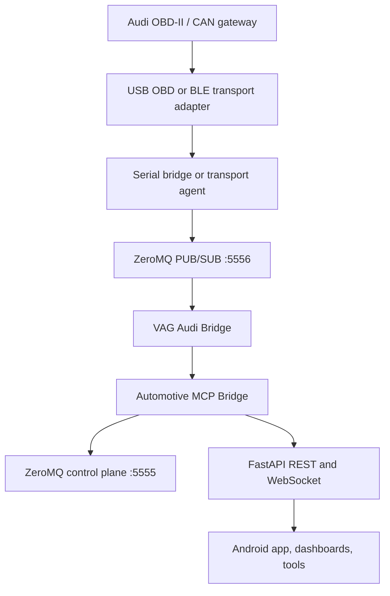

# Raspberry Pi and Audi Integration

This document explains how MIA integrates an Audi vehicle through a Raspberry Pi gateway, what is already implemented in the repository, and where the current limits are.

## Integration Goal

For Audi support, the Raspberry Pi is the edge runtime that sits between the vehicle bus and the rest of MIA. Its job is to:

- collect transport data from an OBD-II interface or transport agent
- normalize safe read-only telemetry into MIA runtime surfaces
- expose vehicle state to orchestration, API, WebSocket, and Android consumers
- keep hardware-specific concerns on the Pi instead of pushing them into UI clients

The current Audi strategy is intentionally conservative: generic OBD where possible, passive ingestion first, and optional read-only UDS only after the transport path is stable.

## Why Audi Needs a Different Path

Audi vehicles fit under the wider VAG family, so the integration model is different from a simple SAE J1979-only adapter.

- Generic OBD PIDs cover baseline signals such as RPM, speed, coolant temperature, and fuel level.
- Deeper Audi diagnostics usually move into UDS over CAN and depend on module-specific identifiers, gateway routing, and ISO-TP behavior.
- Many cheap ELM327 clones are good enough for standard PIDs but unreliable for sustained UDS work.
- Operations such as coding, adaptation, security access, routine control, and ECU resets should stay out of scope for MIA unless there is a dedicated safety and validation program.

That is why the repository currently treats Audi as a read-only integration problem, not a vehicle-coding platform.

## Recommended Starter Platform

The best first validation target is Audi A3 8V on MQB, roughly model years 2015 to 2019.

Reasons:

- widespread platform with strong community tooling and known UDS behavior
- modern enough to exercise VAG gateway realities without jumping to newer security constraints everywhere
- realistic overlap with the generic telemetry already present in MIA

## Raspberry Pi Runtime Topology

The Pi-side architecture should stay aligned with the existing MIA runtime boundary.

| Component | Role in Audi integration |
| --- | --- |
| `apps/rpi-backend/shared/messaging/broker.py` | ZeroMQ ROUTER/DEALER control plane on port `5555` |
| ZeroMQ PUB/SUB telemetry path | vehicle and MCU telemetry fan-out on port `5556` |
| `apps/rpi-backend/py-api/api/main.py` | FastAPI boundary for HTTP and WebSocket consumers |
| `orchestration/mcp/modules/automotive-mcp-bridge/main.py` | command routing and vehicle-aware orchestration |
| `orchestration/mcp/modules/vag-audi-bridge/main.py` | read-only Audi/VAG telemetry and diagnostic scaffold |
| `hardware/serial_bridge.py` or other transport source | injects raw or normalized telemetry into the Pi runtime |



The important constraint is that Audi-specific logic should remain at the Pi orchestration layer, while the API and Android layers consume normalized outputs.

## Current Repository Status

The repository already contains a first-pass Audi path.

### Implemented

- `orchestration/mcp/modules/vag-audi-bridge/main.py` provides a `VagAudiBridge` with safe read-only defaults.
- `orchestration/mcp/modules/automotive-mcp-bridge/main.py` loads that bridge when available and exposes Audi-specific intents.
- The Audi bridge can ingest transport messages, keep a current telemetry snapshot, and return read-only status data.
- The bridge now exposes a coarse transport capability class so the Pi can distinguish `unknown`, `generic_pid_only`, and `uds_read_only` paths.
- Focused tests cover the standalone bridge and its integration with the automotive bridge.

### Default Safety Posture

- passive monitoring enabled
- UDS polling disabled
- allowlisted read services limited to `0x19` and `0x22`
- default identifier hint limited to `F190` for VIN
- extended session disabled
- security access disabled
- write services disabled

### Audi Intents Already Routed

The automotive bridge already recognizes these Audi-oriented operations:

- `audi_vehicle_status`
- `audi_read_vin`
- `audi_read_dtc`
- `audi_read_identifiers`
- `audi_diagnostics`

These are still read-only surfaces. They do not turn MIA into a coding or dealership-style diagnostic tool.

## Capability Matrix

| Capability | Current state | Notes |
| --- | --- | --- |
| Passive telemetry ingestion | Available | Accepts normalized transport payloads and updates bridge state |
| Generic OBD-style values | Available | Speed, RPM, coolant, fuel, voltage, and VIN aliases are accepted |
| Adapter capability reporting | Available | Status surfaces now expose coarse capability class, transport kind, and last PID or UDS success times |
| VIN via DID `F190` | Scaffolded | Routed through `audi_read_vin`, but live UDS polling is disabled by default |
| DTC summary via service `0x19` | Scaffolded | Read-only surface exists, but transport is not wired to a live DTC source yet |
| Arbitrary DID reads via service `0x22` | Scaffolded | Allowlisted, but currently returns availability status until transport is connected |
| Coding, adaptation, write services | Blocked | Explicitly out of scope |
| Security access and extended diagnostic session | Blocked | Explicitly forced off in config |

## Hardware Recommendations

For Raspberry Pi validation, prefer known-good hardware instead of the cheapest possible adapter.

- Raspberry Pi 4B is the current baseline target.
- A stable USB adapter is safer than a random BLE clone when you want repeatable diagnostics.
- OBDLink SX, OBDLink MX+, or another interface with reliable ISO-TP behavior is a better starting point than generic ELM327 v2.1 clones.
- If BLE is used, keep it for convenience or Android pairing, not as the first path for deeper UDS experiments.

## Deployment on the Pi

The Pi deployment model should continue to use the existing MIA runtime anchors.

- install path: `/opt/mia`
- bundled Python environment prepared by `scripts/ensure-bundled-cpython.sh`
- runtime environment file: `/etc/mia/environment`
- Python services resolve the interpreter via `MIA_PYTHON` with fallback to the generated wrapper

Operational order still matters:

1. `zmq-broker`
2. `mia-api`
3. telemetry-producing workers such as `mia-serial-bridge` and `mia-obd-worker`
4. orchestration surfaces that consume or enrich vehicle state

The repo does not currently ship a dedicated `mia-vag-audi-bridge.service`. The Audi bridge exists as a module-level integration point and can also be started directly for development or test harness use.

## Recommended Validation Sequence

### 1. Bench Validation Without a Car

- run the focused Audi bridge tests
- feed sample transport payloads into the bridge
- verify that the automotive bridge status includes a `vag_audi` section

Useful check:

```bash
/bin/python3.13 -m unittest tests.test_vag_audi_bridge tests.test_automotive_mcp_bridge_vag
```

### 2. Raspberry Pi Runtime Validation

- confirm the bundled Python environment is prepared
- confirm `zmq-broker`, `mia-api`, `mia-serial-bridge`, and `mia-obd-worker` are healthy
- verify telemetry is flowing on the Pi before enabling any Audi-specific polling

Useful checks:

```bash
sudo systemctl status zmq-broker mia-api mia-serial-bridge mia-obd-worker
curl http://localhost:8000/status
```

### 3. In-Vehicle Passive Monitoring

- start with ignition on and passive telemetry only
- verify that speed, RPM, coolant, fuel, and voltage are stable
- confirm that no write, session, or security operations are attempted

### 4. Controlled Read-Only UDS Trial

Only after passive transport is stable:

- enable UDS polling explicitly
- start with VIN DID `F190`
- add DTC summary reads through `0x19`
- add more DIDs only after confirming module and gateway behavior on the target platform

## Design Boundaries

Keep these boundaries intact while extending Audi support.

- The Pi owns transport, hardware timing, and bus-adjacent logic.
- The automotive bridge owns orchestration and intent routing.
- FastAPI and Android should consume normalized data, not implement Audi protocol knowledge.
- Schema changes are not required for the current scaffold and should stay separate from transport experiments.

## Open Gaps

The current implementation is intentionally incomplete in a few places.

- No live Audi-specific UDS transport is connected yet.
- Only coarse capability classification exists today; there is still no per-platform negotiation for different Audi or VW variants.
- No dedicated Pi deployment asset exists yet for running the Audi bridge as its own service.
- Cloud-backed Audi Connect style integrations are not part of this path and should be treated as a separate data source if added later.

## Practical Next Step

The next useful engineering step is not more documentation. It is wiring a real Pi transport source into the VAG Audi bridge in read-only mode, validating VIN and DTC access on one known-good Audi A3 8V target, and only then widening the identifier set.