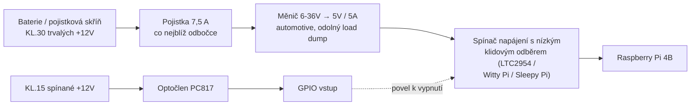

# Zapojení MIA do Audi A4 Cabriolet 8H (2004)

> **Pro koho**: ten, kdo to bude fyzicky montovat do auta
> **Stav**: návrh zapojení. Nic z toho zatím není v autě odzkoušené.
> **Anglický protějšek**: [`audi-a4-8h-interface-integration.md`](../../automotive/audi-a4-8h-interface-integration.md)
> — tam je rozbor rozhraní a fázový plán, tady je čistě elektrikařina.

Vůz: Audi A4 Cabriolet, karoserie **8H** (ročník 2004 = 8H na technice B6; kabrio přešlo na
techniku B7 až pro MY2006). Díly a schémata hledej pod `8H`/`8E`, ne pod B3.

---

## 0. Než sáhneš na auto

1. **Odpoj zápornou svorku baterie a počkej 10 minut.** Airbagové okruhy mají kondenzátory.
2. **Žluté konektory jsou airbagy a pyrotechnika. Na ty se nesahá.** Ani měřit, ani rozpojovat.
3. Nejdřív **kompletní autoscan** (VCDS / OBDeleven), ulož ho do `docs/automotive/scans/`.
   Bez něj nevíš, které řídicí jednotky vůz vůbec má.
4. **Vyfoť a olep každý konektor dřív, než ho rozpojíš.** Po dvou hodinách si nevzpomeneš.
5. Žádné scotchloky (rychlospojky s nožem). Ve 20 let starém autě je to jistá koroze a přerušený
   vodič za rok.
6. Pracuj s **pojistkou co nejblíž zdroji**, ne u spotřebiče. Chrání se kabel, ne přístroj.

---

## 1. Napájení — tady to většina podobných stavb položí

### 1.1 Princip



Klíčová myšlenka: **Pi se napájí z trvalého +12 V (KL.30), ne ze spínaného.** KL.15 slouží jen
jako *informace* „zapalování zapnuto/vypnuto". Kdyby Pi viselo přímo na KL.15, při každém otočení
klíčem mu spadne napájení uprostřed zápisu na kartu a za měsíc máš rozbitý filesystém.

### 1.2 Odběr a dimenzování

| Veličina | Hodnota | Poznámka |
| --- | --- | --- |
| Špičkový příkon Pi 4B + HAT + chlazení | ~20 W | tj. ~1,7 A na straně 12 V |
| Měnič | 5 V / min. 5 A | rezerva na rozběh a USB periferie |
| Vstupní rozsah měniče | **6–36 V** | při startování motoru napětí v palubní síti klesá hluboko pod 9 V; měnič „12 V nominal" Pi při každém startu shodí |
| Pojistka na odbočce | 7,5 A | nikdy nenahrazuj tovární pojistku silnější |
| Průřez napájení 12 V | 1,5 mm² | |
| Průřez signálů | 0,5 mm² | |
| **Cílový klidový odběr po uspání** | **< 5 mA** | kabrio, které stojí týden, nemá žádnou rezervu |

Měnič musí snést **load dump podle ISO 7637-2**. Levný modul z laboratorního zdroje tohle nesplňuje
a první odpojení baterie za chodu ho zabije.

### 1.3 Odbočka z pojistkové skříně

Použij **přídavné pojistkové adaptéry (add-a-fuse)** do volných pozic v palubní pojistkové skříni
(fotka 05 v anglickém dokumentu). Postup:

1. Změř multimetrem v klidu i se zapalováním, které pozice jsou trvalé (KL.30) a které spínané (KL.15).
2. Do trvalé pozice dej add-a-fuse: tovární pojistka zůstane, nová větev dostane vlastní 7,5 A.
3. Totéž pro KL.15, ale tam stačí **1 A** — bereš jen signál, ne proud.
4. Zem **neber z pojistkové skříně**. Najdi tovární zemnící šroub na karoserii a udělej z něj
   jediný společný bod (viz kap. 7).

**Pozor na už existující zásah**: na fotce 03 je do svazku vložené přídavné pouzdro s pojistkou —
to není z výroby. Než ho použiješ jako zdroj, vystopuj, odkud je napájené a co napájí. Pokud visí na
trvalém plusu, je to existující vybíječ baterie a patří to opravit tak jako tak.

### 1.4 Snímání KL.15 optočlenem

12 V nikdy nesmí na GPIO. Galvanické oddělení optočlenem:

```
KL.15 (+12V spínané) ──[ R1 2,2 kΩ / 0,25 W ]──┬── anoda PC817
                                                │
                                          D1 1N4148
                                       (antiparalelně k LED,
                                        chrání proti záporným
                                        špičkám v palubní síti)
                                                │
                                katoda PC817 ────┴──── GND (společná zem)

Výstup PC817:
  kolektor ──┬── GPIO17
             │
        R2 10 kΩ  (pull-up)
             │
            3V3
  emitor ────── GND
  Navíc C1 100 nF mezi GPIO17 a GND (odrušení, zákmity).
```

Výpočet R1: při 14,4 V (motor běží) prochází LED `(14,4 − 1,2) / 2200 ≈ 6 mA`, ztráta na odporu
`≈ 0,08 W` — odpor 0,25 W je v pohodě. Při 12 V klidových je to ~4,9 mA, pořád dost.

**Logika je obrácená**: zapalování zapnuto → optočlen sepne → GPIO čte **LOG. 0**. Ošetři to
v softwaru, ať to nikoho nepřekvapí.

### 1.5 Řízené vypnutí

1. GPIO zaznamená pokles KL.15.
2. MIA dopublikuje poslední telemetrii, uzavře soubory (`vehicle/power` s `state: shutdown_pending`).
3. `systemctl halt`.
4. Spínač napájení (LTC2954 nebo hotový Witty Pi) po doběhu **odpojí i KL.30** → klidový odběr klesne
   na jednotky mA.

Doporučený test před ostrým provozem: **50 cyklů zapni/vypni** a po nich kontrola, že se souborový
systém nerozsypal. A změřit ampérmetrem skutečný klidový odběr po uspání, ne ho odhadnout.

---

## 2. OBD-II / hnací CAN (500 kbit/s)

Pinout konektoru OBD-II ve voze:

| Pin | Signál | Poznámka |
| --- | --- | --- |
| 6 | CAN High | |
| 14 | CAN Low | |
| 4, 5 | Zem (kostra / signálová) | |
| 16 | +12 V trvalých | **nepoužívej pro napájení Pi** — viz níže |
| 7 | K-line | starší KWP2000 jednotky |

Zapojení na Pi: CAN HAT (MCP2515 / MCP2518FD + budič SN65HVD230) → kroucený pár na piny 6/14, zem
na pin 4. Rychlost 500 kbit/s, 11bitové identifikátory.

**Terminátor 120 Ω nepřidávej.** Sběrnice ve voze je zakončená na obou koncích z výroby; třetí
odpor sníží impedanci a rozhodí komunikaci.

Napájení z pinu 16 je lákavé, ale je to tenký, slabě jištěný vodič určený pro diagnostiku, ne pro
trvalých 1,7 A. Napájení ber z pojistkové skříně podle kapitoly 1.

---

## 3. Komfortní CAN (100 kbit/s) — jen poslech

Komfortní domény (dveře, zámky, okna, střecha) **se přes OBD zásuvku nedají číst** — přístrojová
deska funguje jako brána a komfortní provoz nepřeposílá na hnací sběrnici. Musí se odbočit přímo ze
svazku u komfortní jednotky (fotka 06) nebo ve dveřním svazku (fotka 02).

### 3.1 Jak zajistit, že se nedá vysílat

Softwarový přepínač „listen-only" v MCP2515 je konfigurační registr — chyba v kódu ho přepíše.
Chceš tvrdou pojistku:

- **Vodič TXD mezi kontrolérem a budičem fyzicky nezapojuj** (nebo ho na budiči vytáhni a přivaž
  na 3V3 = recesivní úroveň).
- Budič pak konstrukčně nemá čím sběrnici rozkmitat, ať v softwaru nastaví kdokoli cokoli.

K tomu navíc zapni listen-only mód i v kontroléru. Jistí se to dvakrát, protože zápis do karoserní
sběrnice dvacet let starého kabria je přesně ta chyba, po které se střecha otevře za jízdy.

### 3.2 Odbočka

- Kroucený pár, průřez 0,35–0,5 mm².
- Odboč **paralelně** (piggyback na kontakt v opravném pouzdře), vodič **nepřerušuj**.
- Zem budiče na stejný společný bod jako zbytek instalace.
- **Žádný terminátor** — jsi pasivní posluchač s vysokou impedancí.
- Na Pi druhý kanál CAN HATu (`can1`), 100 kbit/s.

### 3.3 Opravné konektory

Na fotce 02 jsou pouzdra řady `6X0 972 xxx` — to je VAG řada opravných konektorů. Existují k nim
pasující pouzdra i kontakty ke koupi. **Použij je** místo naříznutí původního vodiče: instalace pak
jde beze stopy vrátit do původního stavu.

---

## 4. Vstupy — tlačítko pro MIA

Kandidát je nezapojený dvoupinový konektor na tunelu (fotka 01). **Nejdřív ho změř** (kap. 8), teprve
pak zapojuj.

Pokud se potvrdí, že jde o spínač na kostru:

```
Kontakt 1 ──┬── GPIO27
            │
       R 10 kΩ pull-up na 3V3
            │
Kontakt 2 ──┴── GND
+ C 100 nF mezi GPIO27 a GND (odrušení zákmitů)
```

Pokud by šlo o okruh, kde je 12 V, **musí tam jít znovu optočlen** podle kapitoly 1.4, ne přímé
spojení. Stisk = LOG. 0 na GPIO.

---

## 5. Výstupy — relé

Pro spínané zátěže (napájení kamery/DVR, přídavné osvětlení v kufru):

- **Optočlenem oddělená relé deska** s 12 V cívkami, řízená z GPIO.
- **Ochranná dioda** (1N4007) antiparalelně k cívce, pokud ji deska nemá — bez ní indukční špička
  zabije budič.
- Cívku napájej z vlastní jištěné větve (1 A), ne z 5 V Pi.
- Kontakty relé dimenzuj na 2× předpokládaný proud zátěže.
- **Klidový stav = rozepnuto.** Při vypnutém Pi musí zátěž zůstat bez proudu sama od sebe.

**Na relé nesmí nic, co souvisí s bezpečností**: střecha, centrální zamykání, vnější osvětlení,
palivový systém, chlazení. Ani „jen na zkoušku".

---

## 6. Audio — vstup do tovární autorádia přes konektor měniče CD

Osmipinový mini-DIN (fotka 04) je tovární konektor pro CD měnič. Je to nejčistší cesta, jak dostat
hlas MIA do továrních reproduktorů — nic se neřeže a jde to kdykoli vrátit.

Dvě varianty:

1. **Emulátor CD měniče** (Yatour/Dension nebo vlastní, mluvící protokolem měniče VAG).
   Rádio ho vidí jako měnič, MIA hraje jako „CD 1" — a hlavně: **tlačítka na rádiu a na volantu se
   stanou vstupem pro MIA** (další/předchozí stopa, volba disku). Ovládací plocha bez vrtání do palubky.
2. **Prostý linkový vstup** přes audio piny konektoru. Jednodušší, ale rádio musí být přepnuté do
   režimu měniče a žádné tlačítkové události nedostaneš.

**Oddělovací transformátor (ground loop isolator) do audio cesty patří od začátku.** Pi a zesilovač
sdílejí kostru, vznikne zemní smyčka a v reproduktorech se ozve houkání alternátoru měnící se
s otáčkami. Softwarem se to neodstraní.

Otevřená otázka: jaké rádio je ve voze (Chorus II / Concert II / Symphony II) a jestli v kufru není
připojený skutečný měnič. Pokud ano, konektor je obsazený a emulátor ho musí nahradit.

---

## 7. Zemnění a vedení kabelů

- **Jediný společný zemnící bod** (hvězda): měnič, Pi, CAN budiče i relé deska na jeden tovární
  zemnící šroub karoserie. Zem braná na dvou místech = zemní smyčka a šum v audiu.
- Napájecí a signálové vodiče veď **odděleně**, nejlépe po opačných stranách tunelu.
- CAN vždy kroucený pár. Vedle zapalovacích kabelů nebo vedení alternátoru ho netahej.
- Svazek zajisti textilní páskou (jako z výroby), ne izolepou — ta se v horku rozteče.
- Průchodky pryžovými manžetami: nic se nesmí odírat o plech.
- V kabriu počítej s **teplotou v kabině přes 60 °C v létě** — Pi potřebuje aktivní chlazení a nesmí
  být v přímém slunci pod plastem palubky.

---

## 8. Postup pro neznámý dvoupin (fotka 01)

Jen multimetr, **nic nezapojovat**:

| Stav klíče | Měř kontakt 1 vůči kostře | Měř kontakt 2 vůči kostře |
| --- | --- | --- |
| Klíč vytažený | | |
| Klíč v poloze 1 | | |
| Zapalování zapnuto | | |
| Motor běží | | |

Vyhodnocení:

- **Trvalých 12 V na jednom + druhý spíná na kostru** → je to žárovka/osvětlení. Použitelné jako výstup.
- **Napětí přes pull-up, spínání na kostru** → je to vstup spínače. Ideální pro tlačítko MIA.
- **Všude 0 V ve všech stavech** → nezapojená výbava. Vodiče existují, ale nikam nevedou — dá se
  využít jako natažená kabeláž.

Výsledek zapiš do `config/vehicles/audi_a4_8h_cabriolet.yaml` (pole `confidence` a `verified_on`).
Dokud tam je `blocked_until: verification_passes`, nic se na ten konektor nepřipojuje.

---

## 9. Materiál

| Položka | Poznámka |
| --- | --- |
| Raspberry Pi 4B (4 GB+) s aktivním chlazením | |
| 2kanálový CAN HAT (MCP2515/MCP2518FD + SN65HVD230) | musí umět 100 kbit/s |
| Měnič 6–36 V → 5 V / 5 A, automotive | odolný load dump |
| Spínač napájení s nízkým klidovým odběrem | LTC2954, Witty Pi nebo Sleepy Pi |
| Add-a-fuse adaptéry (mini) + pojistky 7,5 A a 1 A | |
| Optočleny PC817, odpory 2,2 kΩ a 10 kΩ, diody 1N4148, kondenzátory 100 nF | |
| Optočlenem oddělená relé deska 12 V + diody 1N4007 | |
| Emulátor CD měniče s mini-DIN 8 | nebo jen mini-DIN pigtail |
| Oddělovací audio transformátor | |
| Opravné konektory VAG řady `6X0 972 xxx` | pouzdra + kontakty |
| Kabel 1,5 mm² (napájení), 0,5 mm² (signály), kroucený pár 0,35 mm² (CAN) | |
| Dutinky, kleště na dutinky, smršťovací bužírky, textilní páska | žádné scotchloky |
| VCDS nebo OBDeleven | povinné pro fázi 0 |
| Multimetr, zkoušečka, popisovač na štítky | |

---

## 10. Kontrolní seznam před prvním zapnutím

- [ ] Autoscan uložený, žádná nová chybová hlášení oproti výchozímu stavu
- [ ] Všechny odbočky jištěné co nejblíž zdroji
- [ ] Zem na jednom jediném bodě, dotažená, očištěná od laku
- [ ] Na GPIO nikde nevede 12 V — překontrolováno multimetrem při odpojeném Pi
- [ ] TXD komfortního CAN budiče fyzicky odpojen
- [ ] Na komfortním ani hnacím CAN není přidaný terminátor
- [ ] Relé v klidu rozepnutá, na nic bezpečnostního nepřipojená
- [ ] Audio přes oddělovací transformátor
- [ ] Změřen klidový odběr po uspání (cíl < 5 mA)
- [ ] 50 cyklů zapalování bez poškození souborového systému
- [ ] Svazky uvázané, nic se neodírá, nic nepřekáží pedálům ani airbagům

---

## 11. Související dokumenty

- [Rozbor rozhraní a plán integrace (anglicky)](../../automotive/audi-a4-8h-interface-integration.md)
- [Strojově čitelný soupis rozhraní](../../../config/vehicles/audi_a4_8h_cabriolet.yaml)
- [Zapojení OBD-II / ESP32 (obecné)](../../wiring.md)
- [Integrace Audi na Raspberry Pi (anglicky)](../../automotive/raspberry-pi-audi-integration.md)
