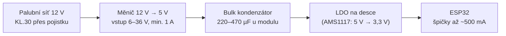
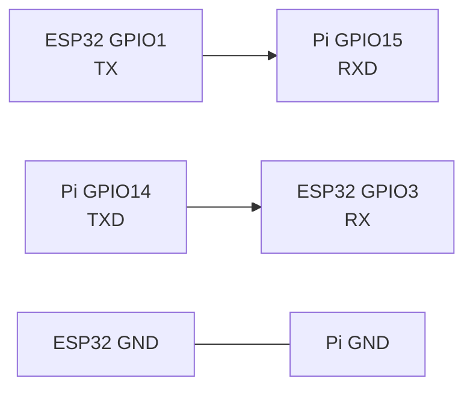

# Zapojení ESP32 modulů do MIA

> **Pro koho**: ten, kdo pájí a montuje ESP32 desky do auta nebo na stůl
> **Stav**: návrh zapojení + revize firmwaru. Pět chyb v `ai_servis_obd.c` je opravených (kap. 10), zapojení v autě zatím odzkoušené není.
> **Sourozenecký dokument**: [Zapojení MIA do Audi A4 Cabriolet 8H](zapojeni-audi-a4-8h.md) — tam je strana Raspberry Pi a vozu, tady je strana mikrokontroléru.

---

## 1. Co v repu reálně je

Tohle není přání, ale stav zdrojáků. Piny jsou vyčtené z kódu, ne z dokumentace:

| Modul | Cesta | Rozhraní | Piny / rychlost |
| --- | --- | --- | --- |
| OBD přes TWAI (ESP-IDF) | `apps/esp32/firmware-obd/components/ai_servis_obd/ai_servis_obd.c` | CAN (TWAI), MQTT | RX `GPIO16`, TX `GPIO17`, 500 kbit/s |
| Telemetrie po UART (ESP-IDF) | `apps/esp32/main/main.c` | UART0 → Pi, JSON po řádcích | LED `GPIO2`, tlačítko `GPIO0`, `ADC1_CH0` (= GPIO36), 115200 Bd |
| ELM327 emulátor (Arduino) | `firmware/esp32_obd/src/main.cpp` | 2× UART | `Serial` 38400 Bd (skener), `Serial2` 115200 Bd (Pi) |
| WiFi most (Arduino) | `apps/esp32/MIAWiFiBridge/MIAWiFiBridge.ino` | WiFi AP + TCP | TCP port 8888, SSID `MIA-Bridge` |
| Protokol MIA | `arduino/MIAProtocol/` | rámce po sériové lince | — |
| Protistrana na Pi | `apps/rpi-backend/py-api/hardware/serial_bridge.py` | UART → ZeroMQ `:5556` | výchozí `/dev/ttyUSB0`, 115200 Bd |

!!! warning "Sestavení v CI nepokrývá všechno"
    `apps/esp32/platformio.ini` má `src_dir = main`, takže CI job `esp32-build` překládá **jen `apps/esp32/main/`**.
    Projekt `apps/esp32/firmware-obd/` má vlastní CMake a do CI se nedostane — chyby v něm nikdo nezachytí (viz [kapitola 10](#10-nalezy-proti-firmwaru)).

---

## 2. Mapa pinů — co si můžeš dovolit


Tři pravidla, která tahle mapa shrnuje:

1. **GPIO6–GPIO11 nikdy.** Jsou drátem k flash paměti na modulu. Připojíš cokoliv → modul nenabootuje.
2. **Strapping piny čtou svůj stav při resetu.** `GPIO0` stažený k zemi v okamžiku resetu = modul jde do bootloaderu místo do aplikace. `GPIO12` tažený nahoru při resetu přepne napájení flash na 1,8 V a modul se nerozběhne.
3. **GPIO34–39 jsou jen vstupy** a nemají interní pull-up ani pull-down. Externí odpor je povinný, jinak vstup plave.

!!! danger "Tlačítko na GPIO0 je past, kterou si MIA nese ve firmwaru"
    `apps/esp32/main/main.c` používá `GPIO0` jako tlačítko s interním pull-upem. Funguje to, **dokud tlačítko nikdo nedrží při zapnutí zapalování.** Pak modul naběhne do bootloaderu a MIA ho nikdy neuvidí.
    V autě, kde se napájení objeví ve stejný okamžik, kdy může řidič držet tlačítko, to je reálný scénář.
    Řešení: přesuň tlačítko na volný pin (`GPIO4`, `GPIO13`, `GPIO27`…) a `GPIO0` nech být.

!!! warning "GPIO16/17 nejsou volné na každém modulu"
    TWAI je v repu na `GPIO16` a `GPIO17`. Na modulech **ESP32-WROVER** (ty s PSRAM) jsou tyhle dva piny obsazené právě tou PSRAM a ven nevedou.
    Na WROOM-32 (bez PSRAM) volné jsou. `platformio.ini` má `-DBOARD_HAS_PSRAM=0`, takže projekt s WROOM počítá — kup WROOM, nebo TWAI piny přemapuj.

---

## 3. Napájení



| Veličina | Hodnota | Proč |
| --- | --- | --- |
| Vstup měniče | **6–36 V** | při startování motoru napětí padá hluboko pod 9 V; „12V nominal" modul ESP32 shodí |
| Výstup měniče | 5 V / ≥ 1 A | ESP32 bere ve špičkách při vysílání WiFi kolem 500 mA, měnič musí mít rezervu |
| Bulk kondenzátor | 220–470 µF co nejblíž modulu | pokrývá vysílací špičky, bez něj brownout uprostřed WiFi přenosu |
| Blokovací kondenzátor | 100 nF u pinu 3V3 | vysokofrekvenční šum |
| Pojistka | 1 A na odbočce | chrání kabel, ne modul |
| Průřez napájení | 0,5 mm² | proud je malý, mechanická pevnost velká |

!!! danger "Nikdy nenapájej desku z USB a z auta současně"
    Většina DevKit desek vede 5 V z USB a z pinu `VIN`/`5V` na stejný uzel, jen přes Schottkyho diodu (a spousta klonů ani to ne).
    Zapojené obojí = měnič z auta tlačí proud do USB portu notebooku. Při flashování **odpoj napájení z auta**.

!!! tip "3,3 V z Raspberry Pi jako napájení ESP32 nestačí"
    Pin 3V3 na Pi má rozpočet zhruba 250 mA pro celou lištu. ESP32 s WiFi si ve špičce řekne o dvojnásobek.
    Napájej ESP32 vlastní větví z 5 V a s Raspberry Pi spoj **jen zem a datové vodiče**.

---

## 4. CAN / TWAI


`docs/wiring.md` dosud uváděl „SN65HVD230/TJA1050" jako by šlo o alternativy. Nejdou:
**SN65HVD230 je 3,3V budič, TJA1050 je 5V budič a ESP32 není 5V tolerantní.**
TJA1050 se na ESP32 připojit dá, ale jen s převodníkem úrovní na vodiči RXD, nebo výměnou za typ s odděleným pinem VIO (TJA1051T/3).

### 4.1 Zapojení

| SN65HVD230 | ESP32 | Poznámka |
| --- | --- | --- |
| `VCC` | `3V3` | **ne 5 V** |
| `GND` | `GND` | společná zem, viz kap. 7 |
| `RXD` | `GPIO16` | budič → ESP32 |
| `TXD` | `GPIO17` | ESP32 → budič; pro pasivní odposlech **nezapojuj** |
| `Rs` | přes 10 kΩ na `GND` | normální rychlost; přímo na GND taky funguje |
| `CANH` / `CANL` | OBD piny 6 a 14 | kroucený pár |

### 4.2 Terminace — v autě ne, na stole ano

Tohle plete nejvíc lidí:

| Kde | Odpor 120 Ω | Proč |
| --- | --- | --- |
| V autě na OBD | **nepřidávej** | sběrnice je z výroby zakončená na obou koncích; třetí odpor sníží impedanci a rozhodí komunikaci |
| Na stole (ESP32 ↔ ESP32, ESP32 ↔ USB-CAN) | **2× 120 Ω, na každém konci jeden** | bez nich se nedomluví nic a budeš hledat chybu v kódu |

Většina modulů SN65HVD230 z tržiště má 120 Ω osazený napevno na desce. Před použitím v autě ho **vypájej nebo přeřízni propojku.**

### 4.3 Pasivní odposlech vs. aktivní dotazování

Jsou to dva různé režimy a firmware musí vědět, ve kterém je:

| Režim | Co dělá | Jak sestavit | Drát |
| --- | --- | --- | --- |
| Pasivní odposlech | jen poslouchá, na sběrnici nic neposílá | `idf.py build -DMIA_TWAI_LISTEN_ONLY=1` | TXD **nezapojený** |
| Aktivní OBD dotazy | posílá rámce na `0x7DF`, čte odpovědi z `0x7E8` | `idf.py build` (výchozí) | TXD zapojený |

!!! warning "Softwarový přepínač sám o sobě není záruka"
    `TWAI_MODE_LISTEN_ONLY` je hodnota v konfiguračním registru — chyba v kódu ji přepíše.
    Když chceš mít jistotu, že se na sběrnici nic neobjeví, **nezapoj vodič TXD** mezi ESP32 a budičem. Budič pak nemá čím sběrnici rozkmitat, ať v softwaru nastaví kdokoli cokoli. Nastav oboje, ne jedno místo druhého.

---

## 5. UART k Raspberry Pi

Dvě cesty:

| | Zapojení | `serial_bridge.py` | Kdy |
| --- | --- | --- | --- |
| **A) USB** | USB kabel DevKit → Pi | funguje bez úprav (`/dev/ttyUSB0`) | vývoj, stůl |
| **B) GPIO UART** | 3 vodiče, viz níže | nutné přepnout na `/dev/serial0` | do auta — míň konektorů, míň bodů selhání |

Zapojení varianty B. Všimni si, že **TX vždy jde do RX** — linka se kříží:



- **Křížení je povinné**: TX jde do RX, ne TX do TX.
- **Zem musí být společná**, jinak se linka chová náhodně.
- **Převodník úrovní tady nepotřebuješ**: ESP32 i Raspberry Pi mají 3,3V logiku. (Pozor: klasické Arduino Uno má 5V logiku a tam převodník nutný je.)
- Pro variantu B je potřeba v Pi vypnout sériovou konzoli, zapnout `enable_uart=1` a `serial_bridge.py` nasměrovat na `/dev/serial0` (výchozí je `/dev/ttyUSB0`, 115200 Bd).

!!! warning "UART0 sdílí piny s flashováním"
    `GPIO1`/`GPIO3` jsou zároveň programovací linka. Když na nich visí Raspberry Pi, může držet úrovně tak, že flashování přes USB selže.
    Při aktualizaci firmwaru dráty k Pi rozpoj, nebo používej OTA (`apps/esp32/MIAWiFiBridge` už ArduinoOTA obsahuje).

---

## 6. Vstupy a výstupy

### 6.1 Vstup z autoelektriky (12 V) — vždy přes optočlen

Stejné schéma jako pro Raspberry Pi v [sourozeneckém návodu](zapojeni-audi-a4-8h.md), jen cílové napětí je 3,3 V:

```
12V signál ──[ R1 2,2 kΩ / 0,25 W ]──┬── anoda PC817
                                      │
                                 D1 1N4148 (antiparalelně k LED)
                                      │
                       katoda PC817 ──┴── GND

Výstup PC817:
  kolektor ──┬── GPIO (např. GPIO27)
             │
        R2 10 kΩ pull-up
             │
            3V3          ← pozor: 3V3, ne 5V
  emitor ────── GND
  C1 100 nF mezi GPIO a GND
```

Logika je obrácená: signál aktivní → optočlen sepne → GPIO čte **LOG. 0**.

!!! danger "Na GPIO nesmí 12 V ani 5 V"
    Absolutní maximum na pinu ESP32 je přibližně 3,6 V. Odporový dělič z 12 V není dostatečná ochrana — při špičkách v palubní síti (load dump) dělič propustí násobky.
    Galvanické oddělení optočlenem je jediná varianta, která to přežije.

### 6.2 Výstup na zátěž — relé přes optočlen

- Optočlenem oddělená relé deska s 12V cívkou, řízená z GPIO.
- Ochranná dioda 1N4007 antiparalelně k cívce.
- Cívku napájej z vlastní jištěné větve, ne z 3,3 V modulu.
- **Klidový stav = rozepnuto.** Při resetu ESP32 jsou GPIO ve vysoké impedanci — zátěž musí sama od sebe zůstat vypnutá.
- Nic bezpečnostního: střecha, zamykání, vnější světla, palivo, chlazení.

---

## 7. Uzemnění, stínění, teplota

- **Jeden společný zemnící bod** pro měnič, ESP32, budič CAN i relé desku. Zem braná na dvou místech karoserie = zemní smyčka a šum na CAN i na audiu.
- CAN vždy **kroucený pár**, průřez 0,35–0,5 mm². Nevést podél zapalovacích kabelů ani vedení alternátoru.
- Anténa ESP32 nesmí ležet na plechu ani v kovové krabičce. Pokud je modul v krabici, vyveď anténu ven nebo použij variantu s U.FL konektorem.
- V kabinu v létě přes 60 °C. ESP32 je specifikované do 85 °C, ale levné LDO a elektrolyty na klonech ne — elektrolyty volte na 105 °C a modul nedávej na přímé slunce pod palubku.

---

## 8. Flashování a první boot

```bash
# PlatformIO (apps/esp32 — překládá jen main/)
cd apps/esp32
pio run -t upload
pio device monitor -b 115200

# ESP-IDF (apps/esp32/firmware-obd — vlastní projekt, mimo CI)
cd apps/esp32/firmware-obd
idf.py set-target esp32
idf.py build flash monitor
```

Když modul nenabootuje, projdi tohle pořadí:

1. Drží něco `GPIO0` u země? (tlačítko, Pi, odpor) → modul je v bootloaderu.
2. Je na `GPIO12` pull-up? → flash běží na špatném napětí.
3. Visí něco na `GPIO6`–`GPIO11`? → konflikt s flash pamětí.
4. Padá napájení při startu WiFi? → chybí bulk kondenzátor, hlaska `Brownout detector was triggered`.
5. Je připojené Raspberry Pi na `GPIO1`/`GPIO3`? → rozpoj a zkus znovu.

---

## 9. Kontrolní seznam před montáží do auta

- [ ] Modul je WROOM (ne WROVER), nebo jsou TWAI piny přemapované
- [ ] Tlačítko není na `GPIO0`
- [ ] Budič CAN je 3,3V typ, nebo je na RXD převodník úrovní
- [ ] Odpor 120 Ω na modulu budiče je pro provoz v autě odstraněný
- [ ] Pro pasivní odposlech je TXD fyzicky nezapojený
- [ ] Bulk kondenzátor 220–470 µF je osazený u modulu
- [ ] Vstupy z autoelektriky jdou přes optočlen, nikde není 12 V blízko GPIO
- [ ] Zem na jednom bodě, dotažená, očištěná od laku
- [ ] Při flashování odpojené napájení z auta
- [ ] Anténa není na plechu
- [ ] Relé v klidu rozepnutá, na nic bezpečnostního nepřipojená

---

## 10. Nálezy proti firmwaru — opravené {#10-nalezy-proti-firmwaru}

Při psaní tohohle návodu jsem porovnával dokumentaci se zdrojáky
`apps/esp32/firmware-obd/components/ai_servis_obd/ai_servis_obd.c`. Nesedělo pět věcí.
**Všech pět je v tomhle PR opravených** a ověřených překladem i během proti náhradním (stub) hlavičkám ESP-IDF.

### N1 — OBD dotaz měl rámec posunutý o bajt, takže jednotka nikdy neodpověděla {#n1}

Šablona dotazu měla jako první prvek pole `uint8_t` hodnotu `0x7DF` — CAN identifikátor.
Do bajtu se nevejde a uřízne se na `0xDF`, čímž se posune celý zbytek rámce:

| | Odesílaná data | PCI nibble | Výsledek |
| --- | --- | --- | --- |
| Před | `DF 02 01 0C 00 00 00 00` | `0xD` | neplatný typ rámce → ECU zahodí |
| Po | `02 01 0C 55 55 55 55 55` | `0x0` | platný jednoduchý rámec |

CAN identifikátor do datové části nepatří; nastavuje se na zprávě zvlášť, což kód už dělal.
Že šlo o posun o jeden bajt, potvrzovala i kontrola odpovědi (`message.data[2] == pid`), která
odpovídá *správnému* rozložení `03 41 <pid> …`, zatímco dotaz se plnil na `data[3]`.

Oprava: identifikátor ze šablony pryč, PID se plní na `data[2]`, výplň `0x55` podle ISO 15765-2.

### N2 — `twai_message_t` se neinicializovala {#n2}

Vyplňovaly se `data`, `identifier` a `data_length_code`, ale **ne příznaky**. Struktura má bitové
pole (`extd`, `rtr`, `ss`, `self`, `dlc_non_comp`), které tím zůstalo s náhodným obsahem ze
zásobníku — rámec mohl odejít jako 29bitový extended nebo jako RTR, nereprodukovatelně.

Oprava: `twai_message_t message = {0};`

### N3 — nešlo zvolit pasivní odposlech {#n3}

Ovladač se instaloval napevno v `TWAI_MODE_NORMAL` a odposlechová varianta nešla sestavit,
ačkoli `docs/wiring.md` listen-only sliboval.

Oprava: přepínač při překladu, **ve výchozím stavu vypnutý** (aktivní dotazování je smysl téhle
komponenty, listen-only by ji umlčel):

```bash
idf.py build                                  # normální režim, posílá dotazy
idf.py build -DMIA_TWAI_LISTEN_ONLY=1         # pasivní odposlech
```

V odposlechové variantě se ovladač instaluje v `TWAI_MODE_LISTEN_ONLY` a `ai_servis_obd_read_pid()`
místo vysílání vrátí `ESP_ERR_NOT_SUPPORTED`. Přepínač je napojený v `CMakeLists.txt` komponenty
přes `target_compile_definitions()` — bez toho by `idf.py` ten `-D` na příkazové řádce přijal
a tiše zahodil. Kconfig zatím ne; soubor už stejný `#ifndef` vzor používá pro
`MQTT_ALERT_BROKER_URI`.

!!! warning "Přepínač nenahrazuje odpojený drát"
    Režim řadiče je registr, který chyba v kódu přepíše. Pro tvrdou záruku nech vodič `TXD`
    mezi ESP32 a budičem fyzicky nezapojený. Nastav oboje, ne jedno místo druhého.

### N4 — zbytečná konfigurace TX pinu před instalací ovladače {#n4}

`TWAI_TX_PIN` se nastavoval jako obyčejný výstup GPIO těsně před `twai_driver_install()`.
Ovladač si pin směruje sám přes GPIO matici, takže to nic nedělalo — a kdyby někdo ten blok při
úpravách přesunul **za** instalaci ovladače, přebil by směrování a vysílání by přestalo fungovat.

Oprava: blok smazán, na jeho místě je komentář vysvětlující proč tam nepatří.

### N5 — `twai_transmit()` volaný s chybějícím argumentem {#n5}

```c
esp_err_t ret = twai_transmit(&message);      // chybí ticks_to_wait
```

Skutečná signatura v ESP-IDF je `twai_transmit(const twai_message_t *message, TickType_t ticks_to_wait)`.
**Proti opravdovému ESP-IDF se tenhle soubor nepřeložil vůbec** — což je zároveň důkaz, že komponenta
nikdy sestavená nebyla.

Oprava: `twai_transmit(&message, pdMS_TO_TICKS(100))`, stejný timeout jako u čekání na odpověď.

### N6 — projekt `firmware-obd` byl nesestavitelný {#n6}

Tenhle nález **už opravený je**, ale stálo to víc než doplnit build soubory.

Chyběly `CMakeLists.txt` pro `main/` i pro komponentu `ai_servis_obd/`. Doplnit je ale
**nestačilo** — build by se posunul jen o krok dál, k chybějícím hlavičkám. `main.c` includuje
a volá čtyři komponenty a existovala z nich jedna:

| Komponenta | Stav před | Stav teď |
| --- | --- | --- |
| `ai_servis_obd` | existovala | beze změny, plus `ai_servis_obd_get_queue()` |
| `ai_servis_config` | nebyla v repu | dopsaná — konfigurace v NVS, výchozí hodnoty přeložené napevno |
| `ai_servis_mqtt` | nebyla v repu | dopsaná — WiFi STA + esp-mqtt klient, fronta publikací |
| `ai_servis_ble` | nebyla v repu | dopsaná — Bluedroid GATT server, příkazy a notifikace telemetrie |

Projektový `CMakeLists.txt` navíc ukazoval `EXTRA_COMPONENT_DIRS` na
`${CMAKE_CURRENT_SOURCE_DIR}/../shared`, což je adresář, který v repu není. Odstraněno —
`components/` si ESP-IDF najde samo.

Při tom vyplavaly dvě další věci ve `sdkconfig.defaults`:

- **Bluetooth nebyl zapnutý.** Byl tam `CONFIG_BT_BLE_ENABLED=y`, ale ne `CONFIG_BT_ENABLED`
  ani host stack. Bez nich komponenta `bt` neexportuje ani `esp_bt.h`, takže ta jedna řádka
  byla bez účinku.
- **`CONFIG_NVS_ENCRYPTION=y` nic nedělalo.** Závisí na `CONFIG_SECURE_FLASH_ENC_ENABLED`,
  který nastavený nebyl, takže se volba při generování `sdkconfig` tiše zahodila. Šifrování
  NVS tedy nikdy zapnuté nebylo, jen to tak v souboru vypadalo. Zapnout kvůli tomu šifrování
  flash je na reálném kusu železa nevratný krok a patří do rozhodnutí o provisioningu, ne do
  build defaultů — proto je tam teď místo té řádky komentář, který to říká.

Binárka se taky nevešla do výchozího 1MB oddílu, takže přibyl
`CONFIG_PARTITION_TABLE_SINGLE_APP_LARGE=y` a 4MB flash. I tak zbývají **jen ~4 % volného
místa** v app oddílu — při dalším růstu bude potřeba vlastní tabulka oddílů.

!!! warning "Fan-out telemetrie je nový kus chování"
    `ai_servis_obd_task()` plnil frontu, kterou nikdo nevyprazdňoval. Přibyla úloha
    `telemetry_fanout_task` v `main.c`, která vzorky rozesílá na BLE notifikaci a na MQTT
    téma `mia/telemetry/<device_id>`. Bez ní by telemetrická charakteristika vracela nuly.

!!! note "Proč to nechytila CI — a co s tím teď je"
    `apps/esp32/platformio.ini` má `src_dir = main`, takže job `esp32-build` překládal jen
    `apps/esp32/main/`. Projekt `firmware-obd/` se nepřekládal vůbec — `-Woverflow` u N1 ani
    chyba argumentu u N5 tak neměly kde vzniknout. Přibyl proto job
    `esp32-obd-build`, který `firmware-obd` staví přes ESP-IDF v obou konfiguracích
    (výchozí i `-DMIA_TWAI_LISTEN_ONLY=1`).

### Jak jsem opravy ověřil

Ověřovalo se ve dvou kolech. Nejdřív, než byly komponenty dopsané, proti náhradním (stub)
hlavičkám se skutečnými signaturami z ESP-IDF:

| Kontrola | Výsledek |
| --- | --- |
| `gcc -Wall -Wextra -Woverflow` na původní verzi | `warning: … changes value from '2015' to '223'` |
| původní verze proti skutečné signatuře `twai_transmit()` | `error: too few arguments` (N5) |
| `gcc` i `clang`, `-Wall -Wextra`, obě konfigurace | bez varování |
| běh, výchozí režim | `twai_driver_install: mode=0`, rámec `id=0x7DF extd=0 rtr=0 data=02 01 0C 55 55 55 55 55` |
| běh, `-DMIA_TWAI_LISTEN_ONLY=1` | `mode=2`, `read_pid → ESP_ERR_NOT_SUPPORTED`, nic se neodeslalo |
| volání `gpio_config()` | žádné — blok z N4 je pryč |

Clang stojí za zmínku zvlášť: v odposlechové konfiguraci hlásil `obd_request_template` jako
nepoužitou proměnnou, zatímco GCC mlčel. Šablona je proto schovaná za `#if !MIA_TWAI_LISTEN_ONLY`.

Po vyřešení N6 už jde projekt sestavit doopravdy, takže druhé kolo proběhlo skutečným
ESP-IDF v5.5.5 s `xtensa-esp32-elf-gcc 14.2.0`:

| Kontrola | Výsledek |
| --- | --- |
| `idf.py build`, výchozí konfigurace | projde, `ai-servis-obd.bin` 0x167560 B |
| `idf.py build -DMIA_TWAI_LISTEN_ONLY=1` | projde, 0x166ec0 B — o 1 696 B méně |
| varování v našich zdrojích (IDF staví s `-Wall -Wextra`) | žádné |
| `nm` na odposlechové binárce | `twai_transmit` **0 výskytů** — linker vysílací cestu vyhodil |

Ten poslední řádek je to, co u N3 dosud chybělo: že se v odposlechové variantě opravdu nedá
vysílat, ne jen že to tak vypadá ve zdrojáku.

Co ani tohle nenahrazuje: běh na cílové desce připojené ke skutečné sběrnici. Že se firmware
přeloží a slinkuje, neříká nic o tom, jestli ECU na rámce odpoví.

## 11. Materiál

| Položka | Poznámka |
| --- | --- |
| ESP32-WROOM-32 DevKit | ne WROVER, pokud chceš TWAI na GPIO16/17 |
| Modul budiče SN65HVD230 | 3,3V typ; zkontroluj a odstraň napevno osazený 120 Ω |
| Měnič 12 V → 5 V, vstup 6–36 V, ≥ 1 A | automotive, odolný load dump |
| Elektrolyt 220–470 µF / 16 V, 105 °C + keramika 100 nF | u modulu |
| Optočleny PC817, odpory 2,2 kΩ a 10 kΩ, diody 1N4148, kondenzátory 100 nF | vstupy |
| Optočlenem oddělená relé deska 12 V + diody 1N4007 | výstupy |
| Kroucený pár 0,35 mm² (CAN), 0,5 mm² (napájení, signály) | |
| USB-CAN adaptér nebo druhá ESP32 + 2× 120 Ω | stolní testování bez auta |
| Dutinky, kleště, smršťovací bužírky, textilní páska | žádné scotchloky |

---

## 12. Odkazy

**Oficiální dokumentace** (ověřeno, že odkazy fungují):

- [ESP-IDF — TWAI (CAN) driver](https://docs.espressif.com/projects/esp-idf/en/stable/esp32/api-reference/peripherals/twai.html) — režimy, časování, `twai_message_t`
- [ESP-IDF — GPIO & RTC GPIO](https://docs.espressif.com/projects/esp-idf/en/stable/esp32/api-reference/peripherals/gpio.html)
- [ESP-IDF — UART](https://docs.espressif.com/projects/esp-idf/en/stable/esp32/api-reference/peripherals/uart.html)
- [ESP-IDF — ADC oneshot](https://docs.espressif.com/projects/esp-idf/en/stable/esp32/api-reference/peripherals/adc_oneshot.html) — proč ADC2 při WiFi nejde
- [ESP-IDF — Application startup flow](https://docs.espressif.com/projects/esp-idf/en/stable/esp32/api-guides/startup.html) — co se děje se strapping piny při bootu
- [ESP-IDF — OTA aktualizace](https://docs.espressif.com/projects/esp-idf/en/stable/esp32/api-reference/system/ota.html)
- [ESP-IDF — Hardware reference](https://docs.espressif.com/projects/esp-idf/en/stable/esp32/hw-reference/index.html)
- [ESP-IDF — Get Started](https://docs.espressif.com/projects/esp-idf/en/stable/esp32/get-started/index.html)
- [PlatformIO — platforma Espressif 32](https://docs.platformio.org/en/latest/platforms/espressif32.html)

**Datasheety** (ověřeno):

- [ESP32 datasheet](https://www.espressif.com/sites/default/files/documentation/esp32_datasheet_en.pdf) — absolutní maxima na pinech, strapping
- [ESP32-WROOM-32 datasheet](https://www.espressif.com/sites/default/files/documentation/esp32-wroom-32_datasheet_en.pdf) — odběr, doporučené zapojení napájení
- [TI SN65HVD230](https://www.ti.com/lit/ds/symlink/sn65hvd230.pdf) — 3,3V budič, funkce pinu `Rs`
- [NXP TJA1050](https://www.nxp.com/docs/en/data-sheet/TJA1050.pdf) — 5V budič, porovnej úrovně na `RXD` s maximy ESP32

**Linux / strana Raspberry Pi**:

- [SocketCAN v jádře Linuxu](https://www.kernel.org/doc/html/latest/networking/can.html) — `can0`, listen-only, `candump`
- [python-can](https://python-can.readthedocs.io/en/stable/) — čtení sběrnice z Pythonu

**Repozitáře** (kanonické projekty; přes firemní proxy je nešlo ověřit, ověř si je sám):

- `github.com/espressif/esp-idf` — příklady v `examples/peripherals/twai/`
- `github.com/espressif/arduino-esp32` — Arduino jádro pro ESP32
- `github.com/linux-can/can-utils` — `candump`, `cansend`, `cangen` pro stolní testy

**V tomhle repu**:

- [Zapojení MIA do Audi A4 Cabriolet 8H](zapojeni-audi-a4-8h.md) — strana vozu a Raspberry Pi
- [Wiring & Power (OBD-II/CAN)](../../wiring.md) — stručná verze zapojení OBD
- [Rozbor rozhraní vozu (anglicky)](../../automotive/audi-a4-8h-interface-integration.md)
