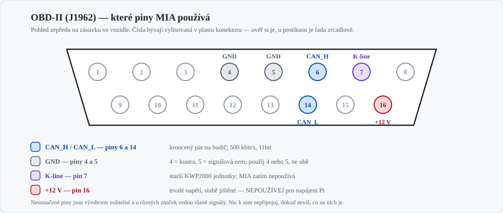
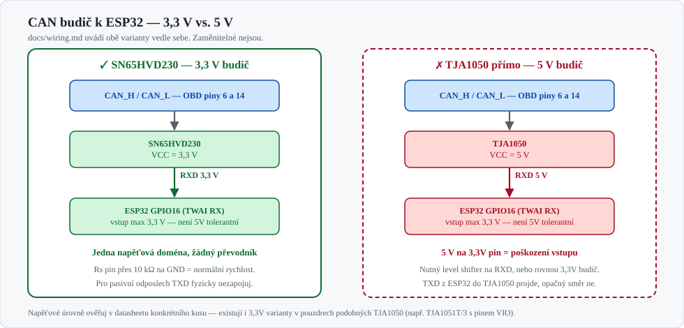
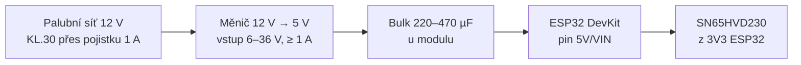

# Wiring & Power (OBD‑II / CAN)

> Rychlá referenční karta pro připojení ESP32 na OBD-II.
> Podrobnosti, napájení v autě, vstupy/výstupy a revize firmwaru: **[Zapojení ESP32 modulů do MIA](cs/automotive/zapojeni-esp32-moduly.md)**.

## 1. Konektor OBD-II — které piny potřebuješ

| Pin | Signál | Pozn. |
| --- | --- | --- |
| 6 | CAN_H | kroucený pár s pinem 14 |
| 14 | CAN_L | |
| 4 / 5 | Kostra / signálová zem | použij jednu, ne obě |
| 7 | K‑line | starší KWP2000 jednotky; MIA zatím nepoužívá |
| 16 | +12 V trvalých | **nenapájet odsud Raspberry Pi** — tenký, slabě jištěný vodič pro diagnostiku |

## 2. Volba budiče — SN65HVD230 ano, TJA1050 ne

Dřívější verze tohoto dokumentu uváděla „SN65HVD230/TJA1050" jako zaměnitelné. Nejsou:
**TJA1050 je 5V budič a ESP32 není 5V tolerantní** — jeho `RXD` by na 3,3V vstup pustil 5 V.
Použij 3,3V typ (SN65HVD230, TJA1051T/3 s pinem VIO), nebo dej na `RXD` převodník úrovní.

### Zapojení SN65HVD230 → ESP32

| Budič | ESP32 | |
| --- | --- | --- |
| `VCC` | `3V3` | ne 5 V |
| `GND` | `GND` | společná zem |
| `RXD` | `GPIO16` | budič → ESP32 |
| `TXD` | `GPIO17` | ESP32 → budič; pro pasivní odposlech **nezapojuj** |
| `Rs` | 10 kΩ na `GND` | normální rychlost |
| `CANH` / `CANL` | OBD 6 / 14 | kroucený pár |

Piny odpovídají zdrojáku `apps/esp32/firmware-obd/components/ai_servis_obd/ai_servis_obd.c`.

## 3. Napájení

- Vstupní rozsah měniče **6–36 V**: při startování motoru napětí padá hluboko pod 9 V.
- Bulk kondenzátor u modulu pokryje vysílací špičky WiFi (~500 mA), jinak `Brownout detector was triggered`.
- Společná zem: OBD GND → měnič → ESP32 → budič, všechno na jeden bod.
- **Nikdy nenapájej desku z USB a z auta současně** — při flashování odpoj auto.

## 4. Parametry sběrnice

- Bitrate **500 kbit/s**, 11bitové identifikátory (EU vozy zhruba po r. 2008).
- Dotazy na `0x7DF`, odpovědi z `0x7E8`.

### Terminace: v autě ne, na stole ano

| Kde | 120 Ω | Proč |
| --- | --- | --- |
| V autě na OBD | **nepřidávej** | sběrnice je zakončená z výroby na obou koncích |
| Na stole (ESP32 ↔ ESP32 / USB-CAN) | **2× 120 Ω** | bez nich se nedomluví nic |

Moduly SN65HVD230 z tržiště mívají 120 Ω osazený napevno — před montáží do auta ho vypájej nebo přeřízni propojku.

## 5. Bezpečnost

- Pro odposlech používej **listen-only**: `TWAI_MODE_LISTEN_ONLY` **a zároveň** fyzicky nezapojený vodič `TXD`.
  Softwarový přepínač je registr, který chyba v kódu přepíše; nezapojený drát ne.
- Pojistka 0,5–1 A co nejblíž odbočce, kroucený pár pro CAN, jediný zemnící bod.
- Žluté konektory ve voze jsou airbagy — nesahat.

!!! warning "Firmware zatím neodpovídá tomuhle dokumentu"
    `ai_servis_obd.c` instaluje ovladač napevno v `TWAI_MODE_NORMAL` a v odesílaném rámci má chybu, kvůli které řídicí jednotka na dotazy neodpoví.
    Rozbor včetně navržených oprav: [nálezy proti firmwaru](cs/automotive/zapojeni-esp32-moduly.md#10-nalezy-proti-firmwaru).

## 6. Kam dál

- [Zapojení ESP32 modulů do MIA](cs/automotive/zapojeni-esp32-moduly.md) — napájení, GPIO, flashování, materiál, nálezy
- [Zapojení MIA do Audi A4 Cabriolet 8H](cs/automotive/zapojeni-audi-a4-8h.md) — strana vozu a Raspberry Pi
- [ESP-IDF: TWAI driver](https://docs.espressif.com/projects/esp-idf/en/stable/esp32/api-reference/peripherals/twai.html) · [SN65HVD230 datasheet](https://www.ti.com/lit/ds/symlink/sn65hvd230.pdf) · [SocketCAN](https://www.kernel.org/doc/html/latest/networking/can.html)
