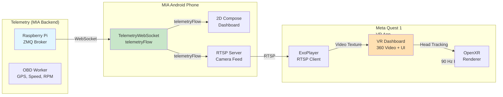

# MIA XR (Extended Reality) Integration Research

**Document Date**: March 2026
**Project**: MIA Vehicle Telemetry & IoT Control System
**Focus**: Meta Quest 1 VR Integration with RTSP Streaming & Telemetry

---

## Executive Summary

This document provides a technical foundation for extending the MIA Android app to support Extended Reality (XR) on Meta Quest 1 headsets. The research covers:

- Android frameworks and APIs currently used in MIA
- Meta Quest 1 development and hardware constraints
- RTSP streaming for camera feeds
- VR video viewing and telemetry visualization
- Integration architecture with MIA's existing WebSocket telemetry system
- Tools, SDKs, and open-source references

**Key Finding**: Meta Quest 1 (Snapdragon 835, 4GB RAM) runs Android and supports OpenXR, making it a viable XR target for MIA with careful optimization for low-latency RTSP streaming and telemetry dashboards in VR.

---

## 1. MIA Android App Current State

### 1.1 Architecture Overview

The MIA Android app uses modern Android architecture with:

- **UI Framework**: Jetpack Compose (Material Design 3)
- **Target API**: Android 34 (compileSdk), min API 22, target API 34
- **Kotlin Version**: 17 JVM target
- **Dependency Injection**: Hilt/Dagger
- **Database**: Room ORM
- **Networking**:
  - Retrofit + OkHttp (REST API)
  - Java-WebSocket (real-time telemetry)
  - Paho MQTT (background messaging)
- **Camera**: CameraX (lifecycle-aware, modern API)
- **ML**: ML Kit (ANPR text recognition)
- **Background**: WorkManager, coroutines, Flow

### 1.2 Key Telemetry Systems

#### WebSocket Telemetry Integration
Located: `/home/sparrow/projects/embedded/mia/apps/android/app/src/main/java/cz/mia/app/data/remote/websocket/TelemetryWebSocket.kt`

Current capabilities:
- Real-time telemetry streaming via `telemetryFlow: SharedFlow<TelemetryReading>`
- State management via `stateFlow: SharedFlow<WebSocketState>`
- LED control commands (brightness, color, animations)
- Device subscription/unsubscription
- Automatic reconnection with backoff (5 attempts, exponential delay)
- Graceful error handling with structured state classes

**Relevance to XR**: The WebSocket telemetry can be extended to stream telemetry into VR dashboards with minimal modification—just redirect the `telemetryFlow` emissions to VR visualizations instead of (or in addition to) traditional 2D views.

#### Existing Permissions (AndroidManifest.xml)
```xml
<uses-permission android:name="android.permission.CAMERA" />
<uses-permission android:name="android.permission.INTERNET" />
<uses-permission android:name="android.permission.BLUETOOTH_CONNECT" />
<uses-permission android:name="android.permission.BLUETOOTH_SCAN" />
<uses-permission android:name="android.permission.ACCESS_FINE_LOCATION" />
<!-- ... and others for WiFi, notifications, foreground services -->
```

All permissions needed for XR (camera, networking, BLE) are already declared.

### 1.3 Dependency Inventory for XR

**Media & Streaming**:
- androidx.media3:media3-exoplayer (1.2.0) — can be extended for RTSP
- CameraX (1.3.1) — can serve as RTSP stream source
- OkHttp3 (4.12.0) — enables HTTP/WebSocket upgrades needed for streaming

**Compose & UI**:
- Jetpack Compose (2024.04.01 BOM)
- Material Design 3 (1.2.1)
- Navigation Compose (2.7.6)

**Async**:
- Coroutines (implicit via lifecycle-runtime-ktx:2.7.0)
- Flow patterns already in use

---

## 2. Android Development Frameworks & APIs for XR

### 2.1 Jetpack Compose for VR UI

**Status**: Already in use in MIA.
**Extension Path**: Compose can render VR overlays and 2D menus in XR apps.

- Compose is declarative UI framework, ideal for building responsive VR dashboards
- Can be layered as 2D flat panels in OpenXR world space using NDK rendering

**Reference**:
- [Jetpack Compose](https://developer.android.com/jetpack/compose) (Android Developers)

### 2.2 Android Camera2 API & CameraX

**Current Use**: MIA uses CameraX (1.3.1) for modern, lifecycle-aware camera access.

**For XR/RTSP**:
- CameraX integrates with MediaCodec for hardware video encoding
- Can feed into RTSP server libraries (RootEncoder)
- Supports multiple camera sources simultaneously (front + back)

**RTSP Streaming from Android Camera**:

Several open-source projects demonstrate this:
- [RTSP-Camera-for-Android](https://github.com/spex66/RTSP-Camera-for-Android) — Android-based RTSP server serving live camera view to multiple clients
- [RootEncoder](https://github.com/pedroSG94/RootEncoder) — Java/Kotlin stream encoder supporting RTSP, with optional CameraX integration
- [RTSP Client Android](https://github.com/alexeyvasilyev/rtsp-client-android) — Lightweight low-latency client

**Key Integration Points for MIA**:
1. Extend DVRManager to optionally stream camera via RTSP while recording
2. Use RootEncoder library with CameraXSource to broadcast camera feed
3. URL format: `rtsp://<android_ip>:5554/camera` (or `/back`, `/front`)

### 2.3 Android Media APIs (MediaCodec, MediaProjection)

**MediaCodec**:
- Hardware-accelerated video encoding/decoding
- Essential for low-latency RTSP streaming
- Used implicitly by ExoPlayer and modern media libraries

**MediaProjection**:
- Captures screen output (for screen mirroring to VR)
- Requires API 21+, already compatible with MIA's minSdk 22

**Use Case**: Screen casting MIA dashboard to Quest VR environment.

### 2.4 WebSocket & OkHttp (Already in Use)

MIA's `org.java-websocket:Java-WebSocket:1.5.5` is production-grade.

**For XR**:
- WebSocket connection can be shared with VR app component
- Same telemetry flow can feed both 2D UI and VR visualizations
- OkHttp interceptors can log/debug network for VR connectivity

---

## 3. Meta Quest 1 Development

### 3.1 Hardware Specifications

| Component | Spec | Relevance |
|-----------|------|-----------|
| **Processor** | Snapdragon 835 | Older GPU, requires optimization for 90 FPS VR rendering |
| **RAM** | 4 GB | Tight constraint; apps must manage textures/buffers carefully |
| **Storage** | 32/64 GB | Variable; pre-allocate streaming buffers |
| **Display** | Dual OLED, 1440×1440 per eye @ 72/90 Hz | Target 72 FPS for safety margin on older hardware |
| **Tracking** | 6-DOF inside-out (tracking cameras) | Lower accuracy than Quest 2/3; larger tracking dead zones |
| **Cooling** | Active fan | Better thermal stability than passive cooling |

**Optimization Strategy**:
- Target 72 Hz (not 90 Hz) for consistent performance
- Use half-resolution RTSP streams if full resolution causes frame drops
- Implement memory pooling for video buffers
- Profile thermal behavior during live streaming

### 3.2 OpenXR SDK for Android

**Meta OpenXR Support**:
- Quest 1 is OpenXR 1.0 adopter (stable API)
- Meta provides official OpenXR SDK

**Key Resources**:
- [OpenXR Support for Meta Quest Headsets](https://developers.meta.com/horizon/documentation/native/android/mobile-openxr/)
- [Meta OpenXR SDK (GitHub)](https://github.com/meta-quest/Meta-OpenXR-SDK)
- [Meta OpenXR SDK (Download)](https://developers.meta.com/horizon/downloads/package/oculus-openxr-mobile-sdk/)

**Getting Started**:
- Build and Run hello_xr Sample App (Khronos OpenXR-SDK-Source GitHub repository)
- Examine XrCompositor_NativeActivity for layer rendering
- Study XrPassthrough for mixed reality features

**Kotlin Integration Path**:
1. Use OpenXR SDK via Android NDK (C/C++)
2. Call native rendering from Kotlin via JNI
3. Keep Compose/Kotlin layers for telemetry logic, UI data flow

### 3.3 Meta Quest Developer Hub

**Purpose**: Official IDE-like tool for Quest development, debugging, and sideloading.

**Download**: [Meta Quest Developer Hub](https://developers.meta.com/horizon/documentation/native/android/ts-adb/)

**Capabilities**:
- Device Manager for ADB control
- APK installation via USB-C
- Device logs and profiling
- Developer mode setup
- Wireless ADB configuration

**Workflow**:
```
Meta Quest Developer Hub
  → Device Manager
    → Enable Developer Mode (on headset + hub)
    → Connect via USB-C
    → Upload APK
    → Select "Unknown Sources" to launch sideloaded app
```

### 3.4 ADB (Android Debug Bridge) for Quest 1

**Wireless ADB on Quest 1**:
- Supported via Snapdragon 835's 802.11ac/ad capability
- Requires **initial USB connection** to enable wireless mode
- Re-enable wireless after each reboot (device limitation)

**Tools**:
- [Meta ADB Documentation](https://developers.meta.com/horizon/documentation/native/android/ts-adb/)
- [Oculus Wireless ADB](https://github.com/thedroidgeek/oculus-wireless-adb) — App for enabling wireless ADB without USB cable (after first USB pairing)

**Usage Pattern**:
```bash
# Initial setup
adb connect <quest_ip>:5555

# Wireless debugging thereafter (until reboot)
adb devices  # List connected devices
adb logcat   # Stream logs
adb shell    # Remote shell
```

### 3.5 Sideloading APKs on Quest 1

**Option 1: Meta Quest Developer Hub (Official)**
1. Connect headset via USB-C
2. Enable Developer Mode (headset + hub)
3. Hub → Device Manager → Upload APK → Install
4. Launch from "Unknown Sources" in library

**Option 2: SideQuest (Community Tool)**
- Open-source alternative to Developer Hub
- More user-friendly for rapid iteration
- Install APK via drag-and-drop

**Option 3: Quest APK Installer**
- [Quest APK Installer by Anagan79](https://anagan79.itch.io/quest-apk-installer) — Cross-platform APK installer

**References**:
- [Sideloading on Meta Quest](https://unity.zoeimmersive.com/exporting-your-app/sideloading-on-meta-quest/)
- [How to Sideload APK on Quest 2 & 3](https://bookstack.cores.utah.edu/books/sd2cgapp-resources/page/apk-sideloading-onto-the-quest-2-3/)
- [APK Sideloading Step-by-Step Guide 2026](https://shiifttraining.com/how-to-install-apk-file-to-a-meta-quest-headset/)

---

## 4. RTSP Streaming Protocol & Implementation

### 4.1 RTSP Protocol Basics

**RTSP** (Real Time Streaming Protocol):
- Lightweight control protocol for audio/video streaming
- Establishes RTP (Real-time Transport Protocol) streams on top of UDP or TCP
- Low-overhead compared to HTTP streaming (DASH/HLS)
- Typical ports: 554 (standard), 8554 (alt), 5554 (Android), custom
- URL format: `rtsp://<host>:<port>/<stream_path>`

**Advantages for VR**:
- Lower latency than adaptive bitrate streaming (DASH/HLS)
- Stateful connection allows seeking, pausing in live streams
- Both TCP (reliable) and UDP (faster) transport options
- Wide hardware camera support

**Latency Considerations**:
- Typical RTSP latency: 100–500 ms (protocol overhead + buffering)
- Target for VR: < 50 ms (challenging; requires TCP, small buffers, hardware decode)

### 4.2 ExoPlayer with RTSP Support

**Status**: ExoPlayer (Media3) officially supports RTSP playback as of ExoPlayer 2.14+.

**MIA Integration**:
- MIA uses `androidx.media3:media3-exoplayer:1.2.0` (current, high version)
- RTSP support built-in via `androidx.media3.exoplayer.rtsp` package

**How to Use**:
```kotlin
// ExoPlayer with RTSP
val rtspUri = Uri.parse("rtsp://192.168.1.100:5554/camera")
val mediaItem = MediaItem.Builder()
    .setUri(rtspUri)
    .setMimeType(MimeTypes.APPLICATION_RTSP)
    .build()
val exoPlayer = ExoPlayer.Builder(context).build()
exoPlayer.setMediaItem(mediaItem)
exoPlayer.prepare()
exoPlayer.play()
```

**Features**:
- Supports H.264 video (SDP must include SPS/PPS in fmtp)
- Supports AAC and AC3 audio
- RTP over UDP (faster) and RTP/TCP (more reliable)
- RTSP BASIC and DIGEST authentication
- Configurable for low-latency: `RtspMediaSource.Factory.setForceUseRtpTcp(true)`

**Official References**:
- [RTSP Support in Media3/ExoPlayer](https://developer.android.com/media/media3/exoplayer/rtsp)
- [RTSP Package Reference](https://developer.android.com/reference/androidx/media3/exoplayer/rtsp/package-summary)
- [Supported Formats in Media3](https://developer.android.com/media/media3/exoplayer/supported-formats)

### 4.3 LibVLC for Android

**Alternative**: VLC's libvlc for Android, if ExoPlayer proves insufficient.

**Advantages**:
- Mature, handles more formats and edge cases
- Lower-level control over buffering and network parameters
- Directly embeddable in Android apps

**Low-Latency Configuration**:
```kotlin
// libvlc options
val options = arrayOf(
    "--network-caching=50",      // Network buffer (ms)
    "--clock-jitter=0",           // Don't adjust playback clock
    "--clock-synchro=0",          // No sync
    "--rtsp-tcp",                 // Force TCP (reliable)
    "--drop-late-frames",         // Don't buffer old frames
    "--skip-frames=5"             // Aggressive frame skip if behind
)
```

**Typical Latency Achievable**: ~500–600 ms under good network conditions (per VLC community forums).

**Library**: org.videolan:vlc-android (add via Maven)

**References**:
- [Lowest Possible RTSP Streaming Latency with libVLC](https://forum.videolan.org/viewtopic.php?t=149511)
- [Low-Latency Settings for VLC Android 3.0+](https://forum.videolan.org/viewtopic.php?t=149891)
- [Display RTSP Stream Using LibVLC on Android](https://lindevs.com/display-rtsp-stream-from-ip-camera-using-libvlc-on-android)

### 4.4 GStreamer for Android

**Alternative**: GStreamer's gst-mobile for custom streaming pipelines.

- Full control over decoding, filtering, rendering pipeline
- Steeper learning curve; requires native code (C/C++)
- Best for advanced use cases (filtering, custom codecs)

**Not recommended for initial MIA integration** (ExoPlayer/libVLC sufficient).

### 4.5 Streaming from MIA Android Phone

**Use Case**: MIA phone acts as camera server; other devices (PC, Quest) consume the stream.

**Implementation Options**:

#### Option A: RootEncoder Library
- **Project**: [RootEncoder](https://github.com/pedroSG94/RootEncoder)
- **Language**: Java/Kotlin
- **Protocols**: RTMP, RTSP, SRT, UDP
- **Integration**: Supports CameraXSource for direct camera feed
- **Effort**: Medium (integrate library, set up encoding parameters)

Example usage:
```kotlin
// Using RootEncoder with CameraX
val rtspServer = RtspServer(port = 5554, sslEnabled = false)
val cameraXSource = CameraXSource(context, cameraSelector)
rtspServer.addMediaSource(cameraXSource)
rtspServer.start()
// Stream available at rtsp://<ip>:5554/stream
```

#### Option B: RTSP-Camera-for-Android
- **Project**: [RTSP-Camera-for-Android](https://github.com/spex66/RTSP-Camera-for-Android)
- **Language**: Kotlin/Java
- **Architecture**: Simple RTSP server for LAN streaming
- **Effort**: Low (integrate, minimal config)
- **Limitations**: Single stream focus

#### Option C: Embed in MIA App
- Extend `DrivingService` to spawn RTSP server thread
- Use CameraX as feed source
- Stream while recording DVR

**Chosen Path for MIA**: Option A (RootEncoder) due to flexibility and Kotlin support.

---

## 5. VR Video Viewing & Telemetry Visualization

### 5.1 360° Video vs. Flat Screen in VR

**360° Equirectangular Video**:
- Wraps viewer in spherical video (panoramic)
- Uses equirectangular projection (latitude/longitude mapping)
- Ideal for surveillance/immersive camera feeds
- Rendering: Sphere mesh with inverted normals, video texture mapped inside

**Flat Screen in VR Space**:
- Traditional flat video rendered as textured quad/panel in 3D space
- Suitable for dashboard overlays, telemetry readouts, multi-stream layouts
- Lower GPU cost; easier to UI overlay with Compose

**Recommendation for MIA**:
- **Primary view**: Flat screen for vehicle camera (dashboard/windshield view) + telemetry overlay
- **Secondary view**: 360° for surround awareness (merged from multiple sources if multi-camera)
- **Fallback**: Split-screen (left/right) for stereo surround view

### 5.2 OpenXR for VR Video Rendering

**Rendering Architecture**:
1. **OpenXR Runtime** (Meta Quest runtime) manages swapchains and frame submission
2. **Application** (C++ NDK for performance) fills textures with decoded video
3. **Composition** happens via OpenXR layer submission

**Video Playback Pipeline**:
```
RTSP Stream
  ↓
ExoPlayer or libVLC (Android, Java layer)
  ↓ (decode to Surface/Texture)
MediaCodec Surface
  ↓ (GPU rendering in C++ via JNI)
OpenGL/Vulkan Texture
  ↓ (bind to OpenXR swapchain)
Headset Display (stereoscopic)
```

**Key Points**:
- **Hardware decode essential**: Use MediaCodec for H.264 → GPU texture (zero-copy ideal, Android 10+)
- **Synchronization critical**: Video frames must sync with head tracking (90 FPS display)
- **Latency budget**: Decode (5–10 ms) + composition (< 11 ms @ 90 Hz) + network (variable)

**References**:
- [OpenXR 360 Video Player Demo (Pico)](https://github.com/picoxr/OpenXR_VideoPlayer_Demo)
  - Shows 360, 3D-SBS, 3D-OU, 2D rendering with OpenGL/Vulkan
  - AMediaCodec for decoding, NV12 yuv rendering
- [Android OpenXR GLes Sample](https://github.com/terryky/android_openxr_gles)
  - Minimal OpenXR + OpenGL ES example for Meta Quest 2
- [OpenXR Best Practices](https://learn.microsoft.com/en-us/windows/mixed-reality/develop/native/openxr-best-practices)

### 5.3 Stereoscopic Rendering Considerations

**Mono vs. Stereo RTSP**:
- **Mono** (single stream): Rendered to both eyes identically → flat appearance
- **Stereo** (side-by-side or over-under SBS/OU):
  - Left half (or top) → left eye texture
  - Right half (or bottom) → right eye texture
  - Provides depth perception with stereo cameras
  - Higher bandwidth requirement (2x resolution)

**Issue with OpenXR Multi-Pass Rendering**:
- Setting OpenXR render mode to Multi-pass can disable stereoscopic panoramic video
- Workaround: Use Single-Pass Instanced (MRT) render mode for 360 stereo
- [360 Stereoscopic Video in OpenXR](https://communityforums.atmeta.com/discussions/Questions_Discussions/360-stereoscopic-video-and-multi-pass-render-mode/1344850)

**Recommendation**: Start with mono equirectangular, add stereo support in phase 2.

### 5.4 Telemetry Dashboard in VR

**Integration with MIA's Existing WebSocket**:



**Implementation Steps**:
1. **Extend TelemetryWebSocket**: Add callback/Flow collector for VR dashboard
2. **Map Telemetry to VR Overlays**:
   - Speed → HUD speed indicator
   - RPM → Gauge visualization
   - GPS → Map overlay
   - Temperature → Color-coded warnings
3. **Render via OpenXR**: Compose Flow emissions → 3D world text/quads
4. **Sync with Video**: Pin telemetry updates to video frame timing (use `SurfaceTexture` callbacks)

**Example VR Dashboard Layout**:
```
┌─────────────────────────────────────┐
│  360° Camera Feed (Main View)       │
│  ┌─────────────────────────────────┐│
│  │                                 ││
│  │      [Vehicle Camera Feed]      ││
│  │      (Equirectangular)          ││
│  │                                 ││
│  └─────────────────────────────────┘│
│  ┌─────────┬───────────┬─────────┐ │
│  │Speed    │RPM        │Battery  │ │
│  │120 km/h │3500 rpm   │85%      │ │
│  └─────────┴───────────┴─────────┘ │
│  ┌───────────────────────────────┐ │
│  │GPS: Lat 50.087, Lon 14.421    │ │
│  │Temp: 92°C | Pressure: 1.8 bar│ │
│  └───────────────────────────────┘ │
└─────────────────────────────────────┘
```

---

## 6. MIA App Integration Architecture

### 6.1 Module Structure for XR

**Proposed New Modules** (minimal, non-invasive):

```
apps/android/app/src/main/java/cz/mia/app/
├── xr/                                          (NEW)
│   ├── openxr/
│   │   ├── OpenXRManager.kt                     (Lifecycle, device detection)
│   │   ├── OpenXRRenderer.kt                    (NDK JNI bridge)
│   │   └── XRHardwareCapabilities.kt
│   ├── streaming/
│   │   ├── RtspClientManager.kt                 (ExoPlayer wrapper)
│   │   └── RtspStreamMetadata.kt
│   ├── ui/
│   │   ├── XRDashboardViewModel.kt              (VR telemetry state)
│   │   ├── VRCameraFeedComposable.kt            (Compose for VR overlays)
│   │   └── VRTelemetryOverlay.kt
│   └── navigation/
│       └── XRNavigation.kt                      (VR navigation state)
│
├── data/remote/websocket/
│   └── TelemetryWebSocket.kt                    (EXISTING - extend with VR callbacks)
│
├── features/dashboard/
│   └── DashboardViewModel.kt                    (EXISTING - extend for VR sync)
│
└── core/background/
    └── DrivingService.kt                        (EXISTING - extend for RTSP server option)
```

**Non-Invasive Approach**:
- XR code isolated in `xr/` package
- TelemetryWebSocket unchanged; add separate Flow collectors for VR
- DrivingService unchanged; add optional RTSP feature flag
- Gradle flavor for VR builds: `flavorDimensions "xr"` with `xrEnabled`/`xrDisabled`

### 6.2 Shared Telemetry Flow Architecture

**Current Flow** (unchanged):
```
TelemetryWebSocket.telemetryFlow
  → DashboardViewModel (2D Compose)
  → UI state (speed, rpm, etc.)
  → Material Design composables
```

**Extended Flow** (XR-aware):
```
TelemetryWebSocket.telemetryFlow
  ├→ DashboardViewModel (2D, existing)
  ├→ XRDashboardViewModel (VR, new)
  │   ├→ Speed HUD
  │   ├→ RPM Gauge
  │   ├→ Alert Overlays
  │   └→ Navigation Hints
  └→ Other subscribers (analytics, logging, etc.)
```

**Implementation Pattern**:
```kotlin
// In TelemetryWebSocket or shared repository
private val _telemetryFlow = MutableSharedFlow<TelemetryReading>(...)
val telemetryFlow: SharedFlow<TelemetryReading> = _telemetryFlow.asSharedFlow()

// VR can collect independently
viewModelScope.launch {
    telemetryFlow.collect { reading ->
        updateVRDashboardState(reading)
    }
}
```

### 6.3 Dependency Injection for XR

**Hilt Module** (new):
```kotlin
@Module
@InstallIn(SingletonComponent::class)
object XRModule {

    @Singleton
    @Provides
    fun provideOpenXRManager(context: Context): OpenXRManager {
        return OpenXRManager(context)
    }

    @Singleton
    @Provides
    fun provideRtspClientManager(
        context: Context,
        exoPlayer: ExoPlayer
    ): RtspClientManager {
        return RtspClientManager(context, exoPlayer)
    }
}
```

**Integration with Existing Hilt Setup**:
- MIA already uses Hilt (hilt-android:2.48.1, hilt-compiler:2.48.1)
- Add XRModule to existing multi-binding strategy
- Use `@Qualifier` to distinguish VR vs. 2D ExoPlayer instances if needed

### 6.4 Build Configuration for VR

**Add to build.gradle.kts**:

```kotlin
// Flavor dimensions for optional XR support
flavorDimensions("xr")

productFlavors {
    create("xrEnabled") {
        dimension = "xr"
        buildConfigField("Boolean", "XR_ENABLED", "true")
    }
    create("xrDisabled") {
        dimension = "xr"
        buildConfigField("Boolean", "XR_ENABLED", "false")
    }
}

// Add XR dependencies conditionally
dependencies {
    // OpenXR SDK (native bindings)
    xrEnabledImplementation("com.meta:oculus-openxr-sdk:1.0.0")  // placeholder version

    // Video streaming
    implementation("com.github.pedroSG94:RootEncoder:latest")  // RTSP server

    // Additional ExoPlayer modules for RTSP
    implementation("androidx.media3:media3-exoplayer-rtsp:1.2.0")
}

// Enable NDK for C++ OpenXR code
android {
    ndkVersion = "25.1.8937393"

    sourceSets {
        main {
            jni.srcDirs = ["src/main/cpp"]
        }
    }
}
```

---

## 7. Tools, SDKs, & Environment Setup

### 7.1 Required Tools

| Tool | Version | Purpose | Link |
|------|---------|---------|------|
| **Android Studio** | 2024.1+ | IDE with XR preview support | [Android Studio](https://developer.android.com/studio) |
| **Android SDK** | API 34 | Compile target (existing in MIA) | N/A |
| **Meta Quest Developer Hub** | Latest | Sideload APKs, debug Quest | [Meta Developer Hub](https://developers.meta.com/horizon/documentation/native/android/ts-adb/) |
| **Android NDK** | 25.1+ | Compile OpenXR C++ code | [Android NDK](https://developer.android.com/ndk) |
| **OpenXR SDK** | 1.0+ | OpenXR headers and samples | [Meta OpenXR SDK](https://github.com/meta-quest/Meta-OpenXR-SDK) |
| **ADB** | Bundled in SDK | Debug via USB/WiFi | N/A |
| **SideQuest** | Latest | Community sideload tool (alt) | [SideQuest](https://sidequestvr.com/) |
| **scrcpy** | Latest | Stream headset screen to PC | [scrcpy](https://github.com/Genymobile/scrcpy) |

### 7.2 Gradle Dependencies for XR

**Core Additions**:
```gradle
// OpenXR (Meta)
implementation("com.meta:oculus-openxr-sdk:1.0.0")

// RTSP/Streaming
implementation("androidx.media3:media3-exoplayer-rtsp:1.2.0")
implementation("com.github.pedroSG94:RootEncoder:latest")

// Optional: libVLC for fallback
implementation("org.videolan:vlc-android:latest")

// JNI/NDK support
implementation("androidx.ndk:ndk:latest")
```

**Version Pinning Strategy**:
- Use Kotlin DSL version catalog (existing MIA best practice)
- Test against Quest 1 Snapdragon 835 (older GPU, stricter requirements)

### 7.3 Native Code Setup (C++ for OpenXR)

**Directory Structure**:
```
apps/android/app/src/main/cpp/
├── CMakeLists.txt                             (Gradle NDK build config)
├── openxr/
│   ├── xr_renderer.cpp                        (OpenXR + OpenGL setup)
│   ├── xr_renderer.h
│   └── jni_bridge.cpp                         (JNI entry points)
└── video/
    ├── video_decoder.cpp                      (MediaCodec integration)
    └── video_decoder.h
```

**CMakeLists.txt (Minimal)**:
```cmake
cmake_minimum_required(VERSION 3.18.1)
project(mia_xr)

# Link OpenXR SDK
set(OPENXR_SDK_PATH "openxr-sdk")  # or via include path

add_library(mia_xr SHARED
    openxr/jni_bridge.cpp
    openxr/xr_renderer.cpp
    video/video_decoder.cpp
)

target_include_directories(mia_xr PRIVATE
    ${OPENXR_SDK_PATH}/include
    ${ANDROID_NDK}/sources/android/native_app_glue
)

target_link_libraries(mia_xr
    android
    log
    EGL
    GLESv2  # or Vulkan
    openxr_loader  # OpenXR loader library
)
```

**Build Integration**:
```gradle
android {
    ndkVersion = "25.1.8937393"
}

externalNativeBuild {
    cmake {
        path = "src/main/cpp/CMakeLists.txt"
        version = "3.22.1"
    }
}
```

---

## 8. Open Source References & Community Resources

### 8.1 OpenXR Samples

1. **Meta OpenXR SDK**
   - Repository: [meta-quest/Meta-OpenXR-SDK](https://github.com/meta-quest/Meta-OpenXR-SDK)
   - Includes: XrCompositor_NativeActivity, XrPassthrough, minimal samples
   - Language: C/C++
   - License: Oculus SDK License Agreement

2. **Khronos OpenXR-SDK-Source**
   - Repository: [KhronosGroup/OpenXR-SDK-Source](https://github.com/KhronosGroup/OpenXR-SDK)
   - Includes: hello_xr (multi-platform sample)
   - Language: C/C++
   - License: Apache 2.0

3. **Android OpenXR GLes Sample**
   - Repository: [terryky/android_openxr_gles](https://github.com/terryky/android_openxr_gles)
   - Purpose: VR sample apps for Meta Quest 2 + Android NDK
   - Language: C/C++
   - Demonstrates: OpenGL ES + OpenXR integration

### 8.2 Video Streaming Samples

1. **Pico OpenXR Video Player Demo**
   - Repository: [picoxr/OpenXR_VideoPlayer_Demo](https://github.com/picoxr/OpenXR_VideoPlayer_Demo)
   - Features: 360°, 3D-SBS, 3D-OU, 2D video rendering
   - Codec: AMediaCodec + OpenGL/Vulkan
   - Relevance: Full reference for VR video playback

2. **RootEncoder**
   - Repository: [pedroSG94/RootEncoder](https://github.com/pedroSG94/RootEncoder)
   - Purpose: RTMP/RTSP/SRT encoder for Android
   - Language: Java/Kotlin
   - Features: CameraXSource, MediaCodec integration

3. **RTSP-Camera-for-Android**
   - Repository: [spex66/RTSP-Camera-for-Android](https://github.com/spex66/RTSP-Camera-for-Android)
   - Purpose: Simple RTSP server from Android camera
   - Language: Java/Kotlin
   - Use Case: Turn phone into RTSP camera source

4. **RTSP Client Android**
   - Repository: [alexeyvasilyev/rtsp-client-android](https://github.com/alexeyvasilyev/rtsp-client-android)
   - Purpose: Low-latency RTSP client library
   - Language: Java/Kotlin
   - Latency: ~20 ms video decoding reported

### 8.3 VR Video Players

1. **XR Video Player (Pico)**
   - Repository: [yoshino/xr-video-player](https://codeberg.org/yoshino/xr-video-player)
   - Platform: OpenXR/Wayland
   - Language: C/C++
   - Features: Stereo video, equirectangular cube maps

2. **WiVRn**
   - Repository: [WiVRn/WiVRn](https://github.com/WiVRn/WiVRn)
   - Purpose: Wireless VR streaming from PC to standalone headset
   - Platform: Linux/OpenXR
   - Relevance: Streaming architecture patterns applicable to MIA

### 8.4 Community & Documentation

**Meta Developers**:
- [Meta Horizon OS Developers](https://developers.meta.com/horizon/documentation/)
- [OpenXR for Oculus/Meta Quest](https://developers.meta.com/horizon/documentation/native/android/mobile-openxr/)
- [Meta Developer Community Forums](https://communityforums.atmeta.com/)

**Khronos Group**:
- [OpenXR Specification & Resources](https://www.khronos.org/openxr/)
- [OpenXR Tutorial (khronos.org)](https://openxr-tutorial.com/)

**Android Developers**:
- [Android XR (OpenXR Support)](https://developer.android.com/develop/xr/openxr)
- [Media3 ExoPlayer RTSP](https://developer.android.com/media/media3/exoplayer/rtsp)
- [CameraX Overview](https://developer.android.com/training/camerax)

**VLC Community**:
- [VideoLAN Forums - libVLC Low Latency](https://forum.videolan.org/)
- [VLC-Android Issue Tracker](https://code.videolan.org/videolan/vlc-android)

---

## 9. Hardware Constraints & Optimization Strategy

### 9.1 Quest 1 Snapdragon 835 Constraints

| Constraint | Value | Impact | Mitigation |
|-----------|-------|--------|-----------|
| **GPU Memory** | ~2.5 GB shared | 2x1440p eye textures + video buffers tight | Pre-allocate, pool textures; single video stream |
| **CPU Cores** | 4x A73 + 4x A53 | Older efficiency cores | Offload rendering to GPU; minimize JNI calls |
| **Thermal Limit** | ~90°C (with cooling) | System throttles if exceeded | Monitor thermal; reduce stream quality if needed |
| **Display Refresh** | 72/90 Hz | Older tracking latency | Target 72 Hz; reduce UX latency budget to 8 ms |
| **Network** | 802.11ac (up to 867 Mbps) | WiFi saturation risk with RTSP | Use H.264, adaptive bitrate; consider 1080p max for RTSP |
| **RAM** | 4 GB | Shared with all apps | App memory limit ~2 GB; small video buffer (3–5 frames) |

### 9.2 Optimization Techniques

**Rendering**:
1. **Frame Pacing**: Lock to 72 FPS (not 90) for consistent performance
2. **Reduced Resolution**: Render at 1280×1280 per eye instead of 1440×1440
3. **Single-Pass Rendering**: Use OpenXR multi-view extension to reduce pixel processing
4. **GPU Instancing**: Render multiple HUD elements in single draw call

**Video Streaming**:
1. **Adaptive Bitrate**: Detect network congestion; drop quality before frame loss
2. **Hardware Decode**: Use MediaCodec + SurfaceTexture (zero-copy on modern Android)
3. **Small Buffer**: 2–3 frame buffer to reduce latency (but tolerate more jitter)
4. **TCP over UDP**: RTSP over TCP (forced with `--rtsp-tcp`) for reliability on WiFi

**Memory Management**:
1. **Object Pooling**: Reuse vertex buffers, textures across frames
2. **Streaming Buffers**: Allocate once, write circularly (no garbage collection)
3. **Texture Compression**: Use ASTC or ETC2 where quality permits

**Network**:
1. **Local Network Priority**: Stream over WiFi LAN (not WAN); minimize latency
2. **Bandwidth Budgeting**:
   - H.264 @ 1080p, 30 fps ≈ 3–5 Mbps
   - 720p ≈ 1.5–2.5 Mbps
   - 360p ≈ 500–800 kbps
3. **WiFi 5 GHz**: Prefer 5 GHz band for lower latency/interference

### 9.3 Performance Profiling Tools

**On Quest 1**:
- **Performance HUD**: Built-in (enable via `adb shell setprop debug.oculus.cpuLevel 2`)
- **GPU Profiler**: OpenXR events + glGetString (frame timing)
- **Network**: `adb shell netstat -i` (WiFi stats)
- **Thermal**: `adb shell cat /sys/class/thermal/thermal_zone*/temp`

**Android Studio**:
- **Profiler**: CPU, memory, network graphs
- **GPU Debugger**: Inspect OpenGL/Vulkan calls (lower-level)
- **Logcat**: Real-time log streaming with filters

**Third-Party**:
- **scrcpy**: Stream headset display to PC (CPU-side debugging)
- **NetworkMonitor**: Packet capture and analysis

---

## 10. Implementation Roadmap (Phased Approach)

### Phase 1: RTSP Streaming Foundation (Weeks 1–4)

**Objective**: Establish RTSP camera streaming from MIA phone; verify stream quality on Quest 1.

**Tasks**:
1. Add RootEncoder library to MIA Android app
2. Extend `DrivingService` with optional RTSP server startup
3. Create `RtspStreamMetadata` data class (URL, bitrate, quality)
4. Test RTSP stream on desktop VLC client (baseline)
5. Test RTSP stream on Quest 1 via ExoPlayer (basic)
6. Profile: measure latency, CPU usage, memory

**Deliverables**:
- Feature flag: `RTSP_SERVER_ENABLED` in build config
- Gradle variant: `xrEnabled` builds with RTSP support
- Integration test: Verify stream quality at different network conditions
- Documentation: Setup guide for RTSP streaming

### Phase 2: OpenXR Basic Integration (Weeks 5–8)

**Objective**: Render flat video panel in VR; verify head tracking and frame rate stability.

**Tasks**:
1. Set up Android NDK build for OpenXR C++ code
2. Port hello_xr sample to MIA; verify compilation on Quest 1
3. Create basic OpenGL texture renderer for video frames
4. Integrate ExoPlayer → OpenGL Surface → OpenXR swapchain
5. Add simple head tracking (no interaction yet)
6. Profile: measure frame latency, jitter, thermal behavior

**Deliverables**:
- `apps/android/app/src/main/cpp/openxr/` directory with CMake
- JNI bridge: Kotlin ↔ C++ for initialization/rendering
- VR app mode: Sideload APK, launch on Quest 1
- Profiling report: Frame timing, memory, thermals at 72 FPS

### Phase 3: Telemetry Dashboard in VR (Weeks 9–12)

**Objective**: Overlay MIA telemetry (speed, RPM, etc.) on VR video feed.

**Tasks**:
1. Extend `TelemetryWebSocket` with VR-aware callbacks
2. Create `XRDashboardViewModel` (Hilt-injected)
3. Implement telemetry rendering in OpenGL (text, gauges, warnings)
4. Sync telemetry updates to video frame timing
5. Add basic hand controller interaction (pause/resume stream)
6. Test: Verify telemetry accuracy, latency, UI readability in headset

**Deliverables**:
- `xr/ui/XRDashboardViewModel.kt` with telemetry Flow collection
- OpenGL text rendering shader + glyph atlas for VR
- VR app with live telemetry overlay
- User acceptance testing on Quest 1 with real vehicle data

### Phase 4: Advanced Features (Weeks 13+)

**Objective**: Polish, optimization, and advanced features.

**Tasks** (prioritized):
1. **360° Surround View**: Merge multi-camera streams into equirectangular; test on Snapdragon 835
2. **Adaptive Bitrate**: Detect WiFi congestion; auto-adjust stream quality
3. **Hand Controller Integration**: Menu navigation, stream pause/resume/switch
4. **Recording in VR**: Option to record VR session + telemetry overlay
5. **Multi-Screen Dashboard**: Side-by-side telemetry panels instead of overlay
6. **Passthrough Mode** (Meta feature): AR mixed reality with video overlay

**Optional**:
- Stereo video support (SBS/OU) for 3D depth
- Voice commands ("Show speed", "Start recording")
- Spatial audio from vehicle sensors

---

## 11. Risk Assessment & Mitigation

| Risk | Likelihood | Impact | Mitigation |
|------|-----------|--------|-----------|
| **Latency Too High** (>100 ms) | Medium | VR sickness, unusable | Start with flat screen; TCP RTSP; small buffers; profile early |
| **Thermal Throttling** | Medium | Frame drops, quality loss | Monitor temps; adaptive bitrate; passive feature flags |
| **Memory Exhaustion** | Low | Crashes, ANRs | Pre-allocate; object pooling; small video buffer (3 frames) |
| **WiFi Disconnects** | Low | Loss of stream; recovery laggy | Reconnect logic; fallback to lower bitrate; user warning |
| **NDK Build Complexity** | Medium | Delays, debugging challenges | Use existing samples (hello_xr); modularize JNI |
| **OpenXR API Changes** | Low | Incompatibility with future Meta updates | Tight coupling to Meta OpenXR SDK; monitor releases |
| **RTSP Server Conflicts** | Low | Port conflicts; resource starvation | Configurable port; singleton management; graceful shutdown |
| **Compatibility with Future Versions** | Medium | App breaks on newer Meta Quest versions | Test on multiple devices (if available); follow OpenXR spec |

---

## 12. References & Further Reading

### Official Documentation

- [Meta Horizon OS Developers](https://developers.meta.com/horizon/documentation/)
- [Android Developers - XR](https://developer.android.com/develop/xr/openxr)
- [Khronos OpenXR](https://www.khronos.org/openxr/)
- [Media3/ExoPlayer RTSP](https://developer.android.com/media/media3/exoplayer/rtsp)

### SDK Downloads

- [Meta OpenXR SDK](https://developers.meta.com/horizon/downloads/package/oculus-openxr-mobile-sdk/)
- [Android NDK](https://developer.android.com/ndk)
- [Meta Quest Developer Hub](https://developers.meta.com/horizon/documentation/native/android/ts-adb/)

### Community Samples

- [Meta OpenXR SDK GitHub](https://github.com/meta-quest/Meta-OpenXR-SDK)
- [Khronos OpenXR-SDK-Source](https://github.com/KhronosGroup/OpenXR-SDK)
- [OpenXR Video Player Demo](https://github.com/picoxr/OpenXR_VideoPlayer_Demo)
- [RootEncoder (RTSP Streaming)](https://github.com/pedroSG94/RootEncoder)

### Related MIA Documentation

- `/home/sparrow/projects/embedded/mia/apps/android/app/src/main/java/cz/mia/app/data/remote/websocket/TelemetryWebSocket.kt` — Current WebSocket implementation
- `/home/sparrow/projects/embedded/mia/CLAUDE.md` — MIA project guidelines
- `/home/sparrow/projects/embedded/mia/docs/` — Additional MIA architecture docs

---

## 13. Appendix: Example Code Snippets

### 13.1 RTSP Streaming Setup (Kotlin)

```kotlin
// Using RootEncoder to stream camera via RTSP
import com.github.pedrosg94.rtplibrary.rtsp.RtspServer

class MiaRtspManager(private val context: Context) {
    private var rtspServer: RtspServer? = null

    fun startRtspStream(port: Int = 5554) {
        rtspServer = RtspServer(port, RtspServer.RtpProtocol.TCP).apply {
            setOnAuthListener { _, _ -> true }  // No auth for LAN
            start()
        }
    }

    fun stopRtspStream() {
        rtspServer?.stop()
        rtspServer = null
    }

    fun getStreamUrl(deviceIp: String): String {
        return "rtsp://$deviceIp:5554/camera"
    }
}
```

### 13.2 ExoPlayer RTSP Playback (Kotlin)

```kotlin
// ExoPlayer setup for RTSP stream in Android/VR app
import androidx.media3.exoplayer.ExoPlayer
import androidx.media3.common.MediaItem
import androidx.media3.common.MimeTypes

class RtspPlayerManager(private val context: Context) {
    private var exoPlayer: ExoPlayer? = null

    fun createPlayer(): ExoPlayer {
        exoPlayer = ExoPlayer.Builder(context).build().apply {
            // Configure for low latency
            setSeekParameters(SeekParameters.CLOSEST_SYNC)
        }
        return exoPlayer!!
    }

    fun playRtspStream(rtspUrl: String) {
        val mediaItem = MediaItem.Builder()
            .setUri(rtspUrl)
            .setMimeType(MimeTypes.APPLICATION_RTSP)
            .build()

        exoPlayer?.apply {
            setMediaItem(mediaItem)
            prepare()
            play()
        }
    }

    fun release() {
        exoPlayer?.release()
        exoPlayer = null
    }
}
```

### 13.3 Hilt Dependency Injection for XR (Kotlin)

```kotlin
// Hilt module for XR dependencies
import dagger.Module
import dagger.Provides
import dagger.hilt.InstallIn
import dagger.hilt.components.SingletonComponent
import javax.inject.Singleton

@Module
@InstallIn(SingletonComponent::class)
object XRModule {

    @Singleton
    @Provides
    fun provideRtspPlayerManager(context: Context): RtspPlayerManager {
        return RtspPlayerManager(context)
    }

    @Singleton
    @Provides
    fun provideXRDashboardViewModel(
        telemetryWebSocket: TelemetryWebSocket,
        rtspPlayerManager: RtspPlayerManager
    ): XRDashboardViewModel {
        return XRDashboardViewModel(telemetryWebSocket, rtspPlayerManager)
    }
}
```

### 13.4 VR Dashboard ViewModel (Kotlin)

```kotlin
// ViewModel for VR telemetry dashboard
import androidx.lifecycle.ViewModel
import androidx.lifecycle.viewModelScope
import dagger.hilt.android.lifecycle.HiltViewModel
import kotlinx.coroutines.flow.MutableStateFlow
import kotlinx.coroutines.flow.StateFlow
import kotlinx.coroutines.launch
import javax.inject.Inject

data class VRTelemetryState(
    val speed: Int = 0,
    val rpm: Int = 0,
    val temperature: Int = 0,
    val batteryLevel: Int = 100,
    val gpsLocation: Pair<Double, Double>? = null
)

@HiltViewModel
class XRDashboardViewModel @Inject constructor(
    private val telemetryWebSocket: TelemetryWebSocket
) : ViewModel() {

    private val _vrTelemetryState = MutableStateFlow(VRTelemetryState())
    val vrTelemetryState: StateFlow<VRTelemetryState> = _vrTelemetryState

    init {
        viewModelScope.launch {
            telemetryWebSocket.telemetryFlow.collect { reading ->
                _vrTelemetryState.value = VRTelemetryState(
                    speed = reading.speed?.toInt() ?: 0,
                    rpm = reading.rpm?.toInt() ?: 0,
                    temperature = reading.engineTemp?.toInt() ?: 0,
                    batteryLevel = reading.batteryLevel?.toInt() ?: 100,
                    gpsLocation = reading.gps?.let {
                        Pair(it.latitude, it.longitude)
                    }
                )
            }
        }
    }
}
```

---

## 14. Conclusion

Extending MIA to support Meta Quest 1 VR is technically feasible with a phased, low-risk approach:

1. **RTSP Streaming** is production-ready via ExoPlayer or RootEncoder
2. **OpenXR Support** on Quest 1 is stable with Meta's official SDK
3. **Telemetry Integration** requires minimal changes to existing TelemetryWebSocket
4. **Hardware Constraints** (Snapdragon 835, 4 GB RAM) are manageable with optimization
5. **Community Resources** (samples, libraries) reduce development risk

**Recommended Start**: Phase 1 (RTSP streaming validation) + Phase 2 (basic OpenXR integration) in parallel, with profiling to confirm Quest 1 performance targets (72 FPS, < 100 ms latency). Phase 3 (telemetry dashboard) follows once video reliability is proven.

**Success Metrics**:
- ✓ Live RTSP camera feed at 1080p 30 FPS, < 500 ms latency
- ✓ OpenXR app renders video at stable 72 FPS on Quest 1
- ✓ Telemetry overlay updates without frame drops
- ✓ User can sideload APK and launch VR experience within 5 minutes

---

**Document Owner**: MIA Android Development Team
**Last Updated**: March 2026
**Status**: Research Complete - Ready for Phase 1 Planning
