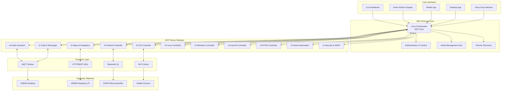

# 🏠🚗 MIA Universal: From Automotive to Multi-Platform AI Assistant Ecosystem

## 📋 Executive Summary

**MIA Universal** represents the evolution of our automotive AI assistant into a comprehensive, modular ecosystem that seamlessly operates across vehicles, homes, and all computing platforms. By leveraging the Model Context Protocol (MCP), containerization, and cross-platform architecture, we create a unified AI experience that adapts to any environment while maintaining the privacy-first, edge-computing principles established in the automotive domain.

### 🎯 **Vision Statement**
*"One AI assistant that knows you everywhere - from your car to your kitchen, from your phone to your desktop - while keeping your data private and under your control."*

## 🔍 **Current State Analysis**

### **MIA Automotive Foundation**
Our existing automotive platform provides:
- **Voice Control**: Hands-free interaction via ElevenLabs TTS/STT
- **OBD-2 Integration**: Real-time vehicle diagnostics
- **ANPR**: License plate recognition for security
- **Edge Processing**: Privacy-first local computation
- **Modular Design**: ESP32 + Android + Raspberry Pi architecture

### **Gap Analysis: Automotive → Universal**
**Missing Components:**
1. **Cross-Platform Runtime**: No AMD64 desktop support
2. **Home Environment Adapters**: No smart home integration
3. **Audio Output Management**: Limited to car speakers
4. **Platform Controllers**: No iOS, Windows, macOS agents
5. **Service Discovery**: Manual configuration only
6. **Container Orchestration**: Development-only Docker usage

## 🏗️ **Proposed Architecture: Modular AI Ecosystem**

### **Core Principles**
1. **MCP-First Design**: Every capability exposed as MCP server
2. **Platform Agnostic**: Write once, deploy everywhere
3. **Containerized Services**: Docker-based microservices
4. **Edge-Cloud Hybrid**: Local processing + selective cloud augmentation
5. **Privacy by Design**: Data minimization and local storage

### **System Architecture Overview**



### **Module Specifications**

#### **1. AI Audio Assistant (Core Module)**
**Purpose**: Universal voice interaction and audio management
**MCP Tools**:
- `play_music(artist, album, track, playlist)`
- `pause_resume_playback()`
- `switch_audio_output(device_type)` - headphones, bluetooth, RTSP, speakers
- `set_volume(level, zone?)`
- `voice_command(text)` - natural language processing
- `tts_speak(text, voice_id?, speed?)`

**Target Environments**:
- 🏠 **Home**: Kitchen/cooking voice control, multi-room audio
- 🚗 **Car**: Existing automotive integration
- 💻 **Desktop**: System audio control, productivity assistance
- 📱 **Mobile**: Phone integration, Bluetooth management

**Key Features**:
- **Zonal Audio**: Different content in different rooms/areas
- **Cross-Platform Codecs**: Support for all audio formats
- **Real-time Streaming**: Low-latency voice interaction (<200ms)
- **Audio Routing**: Intelligent device switching (cooking → bluetooth headphones)

#### **2. AI Maps & Navigation**
**MCP Tools**:
- `get_directions(from, to, transport_mode)`
- `find_places(query, location, radius)`
- `traffic_updates(route_id)`
- `save_favorite_location(name, address)`
- `estimate_eta(destination)`

#### **3. AI Calls & Messages (Universal Communication)**
**MCP Tools**:
- `send_message(platform, contact, message)` - WhatsApp, Signal, Telegram, Twitter/X, Instagram, Facebook
- `make_call(contact, platform?)`
- `read_messages(platform?, unread_only?)`
- `schedule_message(platform, contact, message, datetime)`
- `create_group_chat(platform, participants, name)`

**Platform Integrations**:
- **WhatsApp Business API**: Automated responses
- **Signal**: Privacy-focused messaging
- **Telegram Bot API**: Rich interactions
- **Social Media APIs**: Twitter/X, Instagram, Facebook
- **Traditional SMS/Calls**: SIP integration, carrier APIs

#### **4-9. Platform Controllers (AI Android/iOS/Linux/Windows/macOS/RTOS)**
**Common MCP Tools Pattern**:
- `execute_command(platform_cmd)`
- `launch_app(app_name, parameters?)`
- `get_system_status()` - CPU, memory, storage
- `file_operations(action, path, content?)`
- `network_control(interface, action)`
- `process_management(action, process_id?)`

**Platform-Specific Extensions**:
- **Android**: APK installation, intent handling, notification management
- **iOS**: Shortcut integration, app permissions, device controls
- **Linux**: Package management, service control, container operations
- **Windows**: Registry access, service management, PowerShell execution
- **macOS**: AppleScript integration, system preferences, app store management
- **RTOS**: Real-time task management, interrupt handling, resource allocation

#### **10. AI Home Automation**
**MCP Tools**:
- `control_smart_device(device_id, action, parameters)`
- `get_device_status(device_id?)`
- `create_automation_rule(trigger, condition, action)`
- `manage_lighting(zone, brightness?, color?)`
- `climate_control(temperature, humidity?, zone?)`

**Protocol Support**:
- **Matter/Thread**: Industry standard smart home
- **Zigbee/Z-Wave**: Legacy device support
- **Wi-Fi Smart Devices**: Direct API integration
- **IR/RF Control**: Universal remote capabilities

#### **11. AI Security & ANPR**
**MCP Tools**:
- `analyze_camera_feed(camera_id, detection_types)`
- `recognize_license_plate(image_data)`
- `person_detection(image_data, known_faces?)`
- `security_alert(alert_type, location, severity)`
- `access_control(person_id, location, grant/deny)`

## 🎯 **Home Environment Use Cases**

### **Cooking Assistant Scenario**
```
User: "AI, play jazz music while I cook"
AI Audio Module → select kitchen speakers → stream jazz playlist

User: "Switch to my Bluetooth headphones" 
AI Audio Module → detect available devices → seamless handover

User: "Set a 15-minute timer for the pasta"
AI Linux Controller → system timer → voice notification

User: "What's the weather like for tomorrow's BBQ?"
AI Maps Module → weather API → voice response
```

### **Work-from-Home Productivity**
```
User: "Focus mode - close social media and play concentration music"
AI Windows Controller → close specified apps
AI Audio Module → switch to productivity playlist

User: "Join my 2 PM meeting"
AI Calls Module → calendar integration → auto-join Teams/Zoom

User: "Send a message to the team that I'm running late"
AI Messages Module → Slack/Teams → contextual message
```

### **Smart Home Integration**
```
User: "Good night routine"
AI Home Automation → dim lights → set thermostat → arm security
AI Audio Module → fade out music → white noise bedroom speakers

User: "Someone's at the door"
AI Security Module → ANPR camera → face recognition → notify + unlock if authorized
```

## 🐳 **Containerization Strategy**

### **Docker Compose Architecture**
```yaml
# docker-compose.yml structure
services:
  core-orchestrator:
    image: ai-servis/core:latest
    environment:
      - MCP_DISCOVERY_PORT=8080
      - AUDIO_ENGINE=pipewire
    
  ai-audio-assistant:
    image: ai-servis/audio:latest
    devices:
      - /dev/snd:/dev/snd
    environment:
      - MCP_SERVER_PORT=8081
      - ELEVENLABS_API_KEY=${ELEVENLABS_KEY}
    
  ai-platform-controller:
    image: ai-servis/platform-linux:latest
    privileged: true
    environment:
      - MCP_SERVER_PORT=8082
      - TARGET_PLATFORM=linux
    
  mqtt-broker:
    image: eclipse-mosquitto:latest
    ports:
      - "1883:1883"
      - "9001:9001"
    
  service-discovery:
    image: ai-servis/discovery:latest
    environment:
      - MQTT_BROKER=mqtt-broker:1883
```

### **Platform-Specific Images**
- **ai-servis/core**: Universal orchestrator (AMD64, ARM64)
- **ai-servis/audio**: Audio processing (with hardware access)
- **ai-servis/platform-linux**: Linux system control
- **ai-servis/platform-windows**: Windows system integration
- **ai-servis/mobile-bridge**: iOS/Android communication bridge
- **ai-servis/rtos**: Real-time systems adapter

### **Raspberry Pi Simulation**
```yaml
# docker-compose.pi-sim.yml
services:
  pi-simulator:
    image: balenalib/raspberry-pi:latest
    platform: linux/arm64
    volumes:
      - ./ai-servis-modules:/opt/ai-servis
    environment:
      - SIMULATE_HARDWARE=true
      - GPIO_SIMULATION=true
```

## 🔗 **MCP Integration Patterns**

### **MCP Server Implementation Example**
```python
# ai_audio_assistant/mcp_server.py
from mcp_server import MCPServer, Tool, Resource

class AudioAssistantMCP(MCPServer):
    def __init__(self):
        super().__init__("ai-audio-assistant", "1.0.0")
        self.setup_tools()
    
    def setup_tools(self):
        # Music control
        self.add_tool(Tool(
            name="play_music",
            description="Play music by artist, album, or track",
            parameters={
                "query": {"type": "string", "required": True},
                "source": {"type": "string", "enum": ["spotify", "apple", "local"]}
            }
        ))
        
        # Audio output management
        self.add_tool(Tool(
            name="switch_audio_output",
            description="Switch audio output to different device",
            parameters={
                "device": {"type": "string", "enum": ["speakers", "headphones", "bluetooth", "rtsp"]},
                "zone": {"type": "string", "optional": True}
            }
        ))
    
    async def execute_play_music(self, query: str, source: str = "spotify"):
        # Implementation for music playback
        audio_engine = self.get_audio_engine()
        result = await audio_engine.play(query, source)
        return {"status": "playing", "track": result.current_track}
    
    async def execute_switch_audio_output(self, device: str, zone: str = None):
        # Implementation for audio routing
        audio_manager = self.get_audio_manager()
        success = await audio_manager.switch_output(device, zone)
        return {"status": "switched" if success else "failed", "device": device}
```

### **Cross-Module Communication via MCP over MQTT**
```python
# Core orchestrator handling cross-module requests
class CoreOrchestrator:
    def __init__(self):
        self.mqtt_client = MQTTClient("localhost", 1883)
        self.mcp_clients = {}
    
    async def handle_user_command(self, command: str):
        # Parse natural language command
        intent = await self.nlp_engine.parse(command)
        
        if intent.action == "play_music_and_dim_lights":
            # Multi-module coordination
            audio_result = await self.call_mcp_tool(
                "ai-audio-assistant", 
                "play_music", 
                {"query": intent.music_query}
            )
            
            lights_result = await self.call_mcp_tool(
                "ai-home-automation", 
                "control_lighting", 
                {"zone": "kitchen", "brightness": 30}
            )
            
            return {"audio": audio_result, "lights": lights_result}
```

## 🧪 **Testing & Integration Strategy**

### **Modular Testing Approach**
1. **Unit Tests**: Each MCP server independently
2. **Integration Tests**: Module pairs (e.g., Audio + Platform Controller)
3. **System Tests**: Full ecosystem with simulated hardware
4. **Performance Tests**: Latency, throughput, resource usage
5. **Cross-Platform Tests**: Ensure compatibility across all target platforms

### **Test Scenarios**
```yaml
# test-scenarios.yml
scenarios:
  - name: "cooking_assistant"
    description: "Voice control while cooking"
    modules: [ai-audio, ai-platform-linux]
    test_steps:
      - voice_command: "Play cooking playlist"
      - verify: audio_output_active
      - voice_command: "Switch to headphones"
      - verify: bluetooth_headphones_connected
    
  - name: "cross_platform_messaging" 
    description: "Send message from desktop to mobile platforms"
    modules: [ai-messages, ai-platform-windows, ai-android-controller]
    test_steps:
      - command: "Send WhatsApp message to John"
      - verify: message_delivered
      - platform: android
      - verify: notification_received
```

### **Continuous Integration Pipeline**
```dockerfile
# CI test environment
FROM ubuntu:22.04
RUN apt-get update && apt-get install -y docker-compose python3 nodejs

# Install platform simulators
RUN apt-get install -y qemu-user-static
RUN docker buildx create --platform linux/amd64,linux/arm64

# Test execution
COPY . /mia-universal
WORKDIR /mia-universal
RUN ./scripts/run-integration-tests.sh
```

## 📊 **Technical Specifications**

### **System Requirements**

#### **Minimum Requirements (Home Desktop)**
- **CPU**: AMD64 dual-core 2.5GHz+ or ARM64 quad-core 1.8GHz+
- **RAM**: 4GB (8GB recommended)
- **Storage**: 10GB available space
- **Network**: Wi-Fi 802.11n or Ethernet
- **Audio**: Built-in or USB audio interface

#### **Recommended Requirements**
- **CPU**: AMD64 quad-core 3.0GHz+ or ARM64 octa-core 2.0GHz+
- **RAM**: 16GB
- **Storage**: 50GB SSD
- **Network**: Wi-Fi 6 or Gigabit Ethernet
- **Audio**: Dedicated audio interface with multiple outputs

### **Performance Targets**
- **Voice Command Latency**: <500ms end-to-end
- **Module Startup Time**: <10s for critical modules
- **Memory Usage**: <2GB for full system (moderate load)
- **CPU Usage**: <20% idle, <80% peak processing
- **Network Bandwidth**: <1Mbps sustained, <10Mbps burst

### **Platform Support Matrix**

| Platform | Audio Control | System Control | App Integration | Hardware Access |
|----------|---------------|----------------|-----------------|-----------------|
| **Linux AMD64** | ✅ PipeWire/ALSA | ✅ systemd/proc | ✅ D-Bus/APIs | ✅ Full access |
| **Windows 10/11** | ✅ WASAPI | ✅ PowerShell/WMI | ✅ COM/UWP | ⚠️ Limited |
| **macOS** | ✅ Core Audio | ✅ AppleScript | ✅ NSWorkspace | ⚠️ Sandboxed |
| **Android** | ✅ AudioManager | ⚠️ Limited | ✅ Intent/APIs | ⚠️ Permissions |
| **iOS** | ✅ AVAudioSession | ❌ Restricted | ⚠️ Shortcuts only | ❌ Sandboxed |
| **RTOS** | ⚠️ Hardware-specific | ✅ Direct | ❌ N/A | ✅ Direct |

## 🔒 **Security & Privacy Architecture**

### **Privacy-First Design**
1. **Local Processing**: Voice recognition and intent parsing on-device
2. **Selective Cloud**: Only when explicitly required (weather, maps)
3. **Data Minimization**: Collect only necessary information
4. **Encrypted Communications**: TLS 1.3 for all network traffic
5. **User Consent**: Granular permissions for each module

### **Security Measures**
- **MCP Authentication**: JWT-based token validation
- **Container Isolation**: Docker security profiles
- **Network Segmentation**: VLANs for different component types
- **Regular Updates**: Automated security patches
- **Audit Logging**: All user commands and system actions

## 📈 **Business Value & ROI**

### **Market Opportunities**
1. **Home Automation Market**: $537B by 2030 (25% CAGR)
2. **Voice Assistant Market**: $50B by 2030 (24.9% CAGR) 
3. **Enterprise AI**: $390B by 2025
4. **Cross-Platform Development**: Reduced development costs by 60-80%

### **Competitive Advantages**
- **Privacy-First**: Unlike Google/Amazon, all processing stays local
- **Universal Platform**: Single solution across all environments
- **Open Architecture**: MCP enables third-party extensions
- **Cost Effective**: No subscription fees for core functionality
- **Modular Design**: Pay only for features you need

### **Revenue Streams**
1. **Hardware Bundles**: Pre-configured devices (Raspberry Pi kits)
2. **Professional Services**: Custom integrations, consulting
3. **Enterprise Licenses**: Advanced features for business use
4. **App Store**: Third-party MCP modules marketplace
5. **Cloud Services**: Optional backup, sync, advanced AI models

## 🚀 **Implementation Roadmap**

### **Phase 1: Foundation (Months 1-3)**
- Core orchestrator development
- MCP server framework
- Basic audio assistant module
- Docker containerization
- Linux platform controller

### **Phase 2: Multi-Platform (Months 4-6)**
- Windows & macOS controllers
- Mobile platform bridges (Android/iOS)
- Home automation integrations
- MQTT communication layer
- Integration testing framework

### **Phase 3: Advanced Features (Months 7-9)**
- RTOS support for embedded systems
- Advanced security & privacy features
- Performance optimizations
- Cloud-optional features
- Mobile apps (iOS/Android)

### **Phase 4: Ecosystem & Polish (Months 10-12)**
- Third-party MCP module SDK
- Advanced AI features (contextual awareness)
- Enterprise features
- Comprehensive documentation
- Community platform launch

## 🎯 **Success Metrics**

### **Technical KPIs**
- **Response Time**: <500ms voice command to action
- **Reliability**: 99.9% uptime for critical modules
- **Cross-Platform Compatibility**: 95%+ feature parity
- **Resource Efficiency**: <2GB RAM full system load
- **Module Independence**: 100% isolated failure recovery

### **User Experience KPIs**
- **Voice Recognition Accuracy**: >95% in quiet environments
- **Task Completion Rate**: >90% successful intent execution
- **Learning Curve**: <30 minutes to basic proficiency
- **User Satisfaction**: >4.5/5 rating
- **Platform Adoption**: >3 platforms per active user

### **Business KPIs**
- **Development Cost Reduction**: 70% vs custom per-platform solutions
- **Time to Market**: 50% faster than traditional approaches
- **Community Growth**: 1000+ developers using MCP SDK (Year 1)
- **Enterprise Adoption**: 100+ business customers (Year 2)
- **Revenue Growth**: $1M ARR by end of Year 2

## 🔮 **Future Vision & Extensibility**

### **Advanced AI Capabilities**
- **Contextual Awareness**: Learn user patterns and preferences
- **Predictive Actions**: Anticipate needs based on time/location/activity
- **Multi-Modal Interaction**: Voice + vision + gesture recognition
- **Emotional Intelligence**: Adapt responses to user mood and situation
- **Collaborative AI**: Multiple AI personalities for different contexts

### **Extended Ecosystem**
- **IoT Integration**: Seamless device onboarding and control
- **Automotive Evolution**: Full self-driving car integration
- **Enterprise Features**: Teams, organizations, policy management
- **Health & Wellness**: Integration with fitness trackers, health monitors
- **Entertainment**: Gaming, VR/AR experiences, content creation

### **Technology Evolution**
- **Edge AI Hardware**: Dedicated NPUs for faster local processing
- **5G/6G Integration**: Ultra-low latency cloud augmentation
- **Blockchain Integration**: Decentralized identity and data ownership
- **Quantum-Safe Cryptography**: Future-proof security
- **AR/VR Interfaces**: Spatial computing integration

---

**MIA Universal represents the natural evolution from automotive-specific AI to a comprehensive, privacy-respecting, cross-platform AI ecosystem. By building on our proven automotive foundation and embracing industry standards like MCP, we create a sustainable competitive advantage in the rapidly growing AI assistant market while maintaining the core values of privacy, modularity, and user control that differentiate us from big tech solutions.**

**This proposal positions us to capture significant market share across multiple verticals while building a thriving ecosystem of third-party developers and integrators, creating a network effect that compounds our market position over time.**