# 🏗️ MIA Universal: Architecture Diagrams

This document contains comprehensive system architecture diagrams for the MIA Universal ecosystem, showing the relationships between components, data flows, and interaction patterns.

## 🎯 **System Overview**

### **High-Level Architecture**
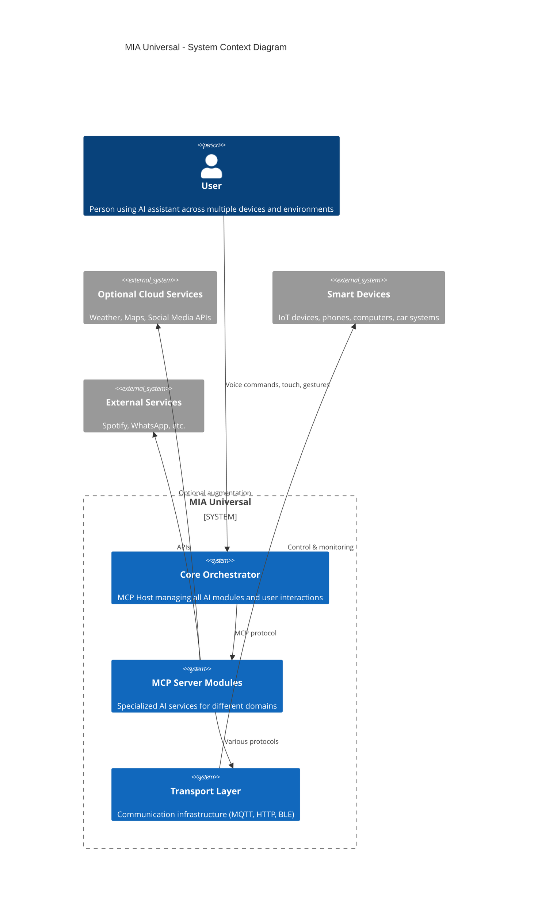

## 🔄 **MCP Communication Flow**

### **Request-Response Pattern**
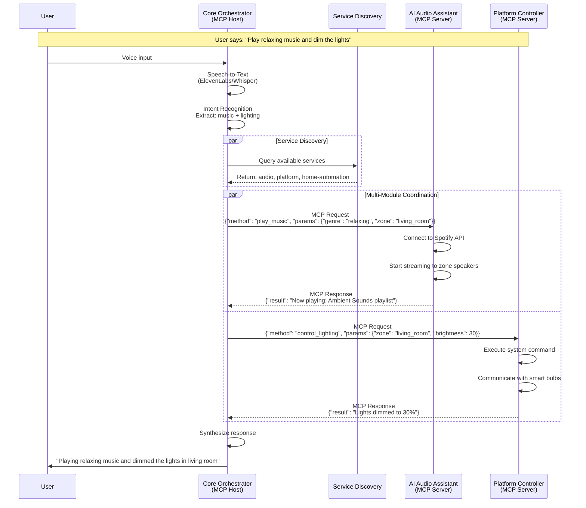

### **Service Discovery & Registration**
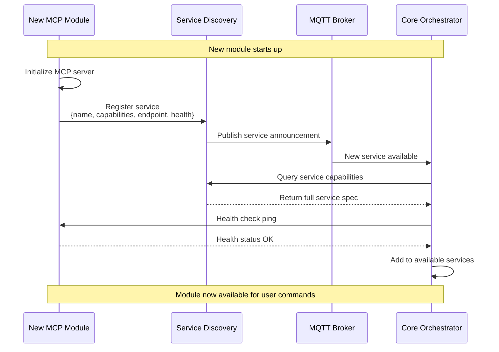

## 🏠 **Home Environment Integration**

### **Smart Home Ecosystem**
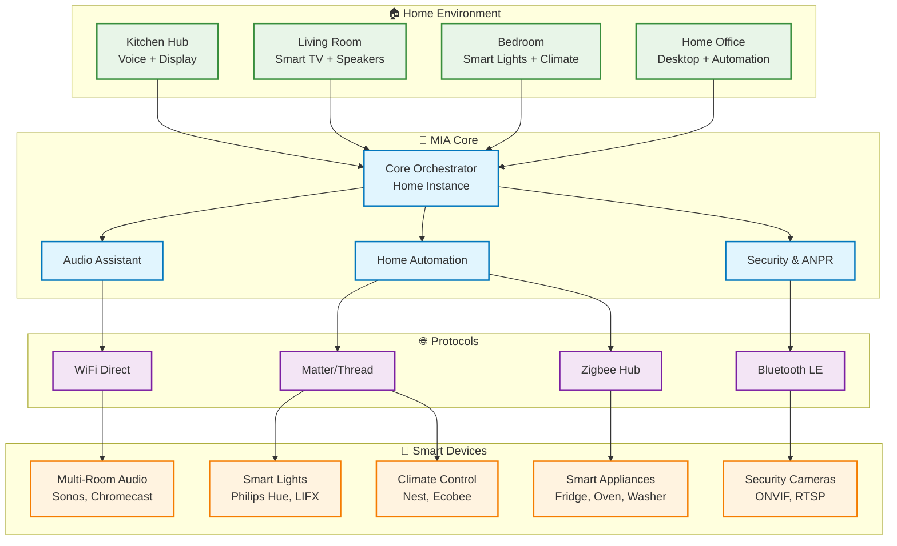

## 🚗 **Automotive Integration (Existing)**

### **Car System Architecture**
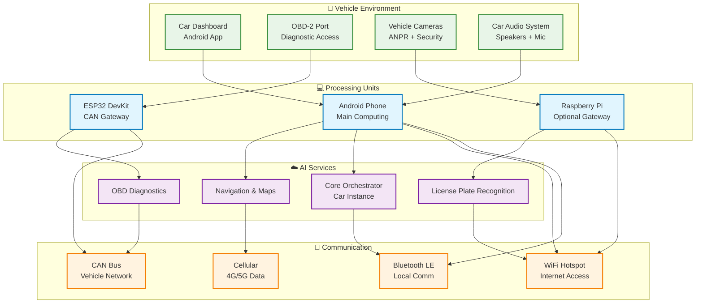

## 💻 **Cross-Platform Architecture**

### **Platform Controller Matrix**
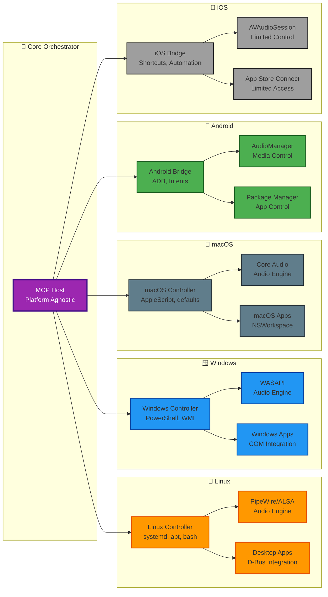

## 🔐 **Security & Privacy Architecture**

### **Privacy-First Data Flow**
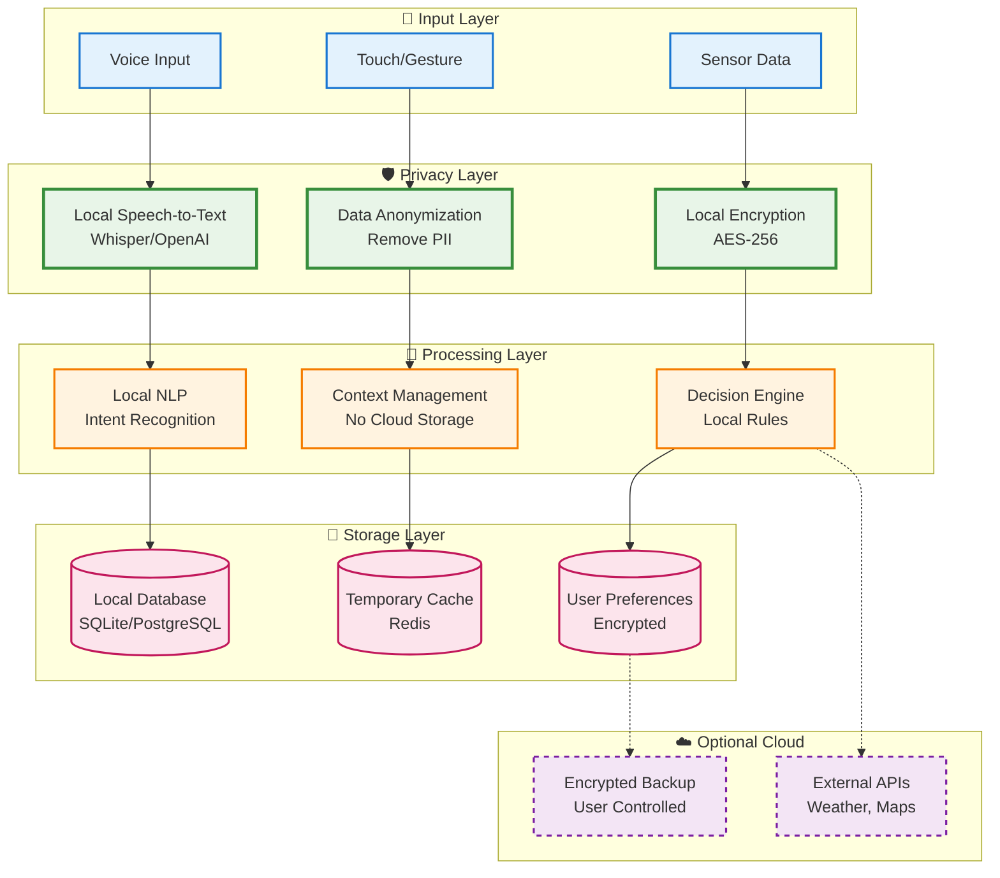

## 🚀 **Deployment Architecture**

### **Container Orchestration**
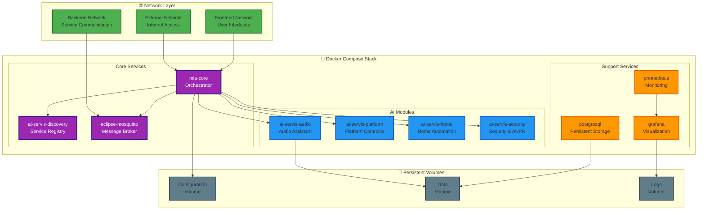

### **Multi-Environment Deployment**
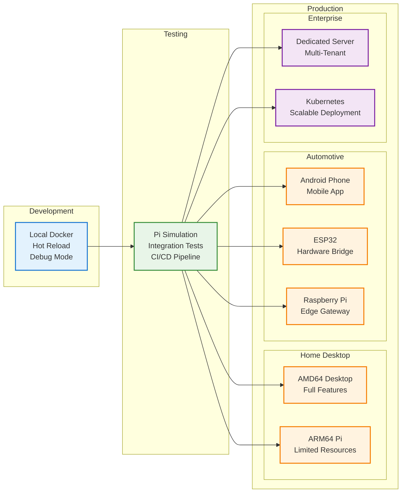

## 📊 **Performance & Scaling**

### **Performance Monitoring Dashboard**
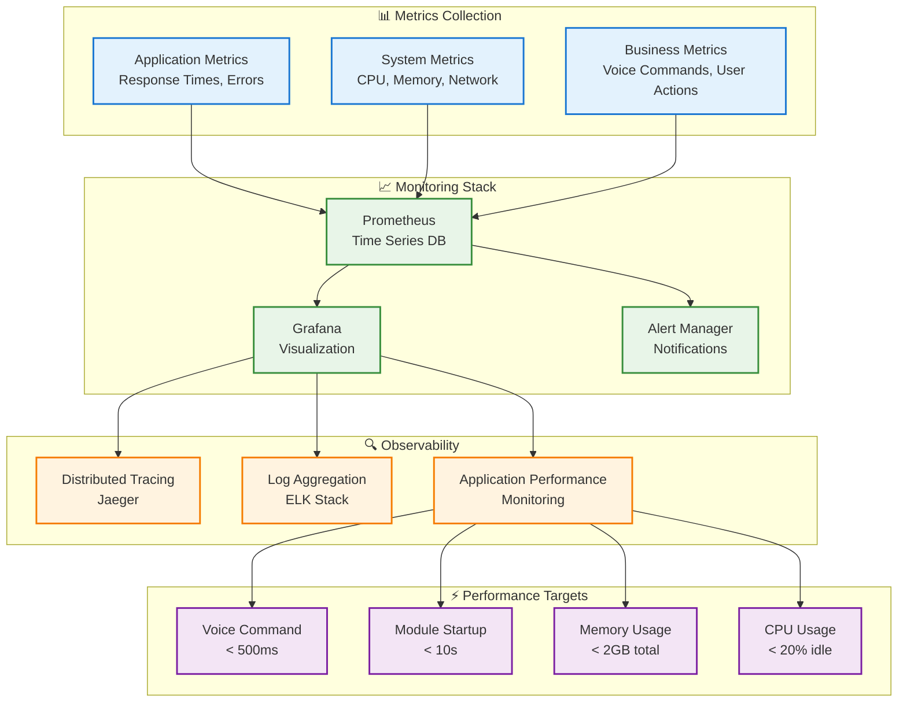

---

## 🎯 **Usage Examples**

### **Cooking Assistant Flow**
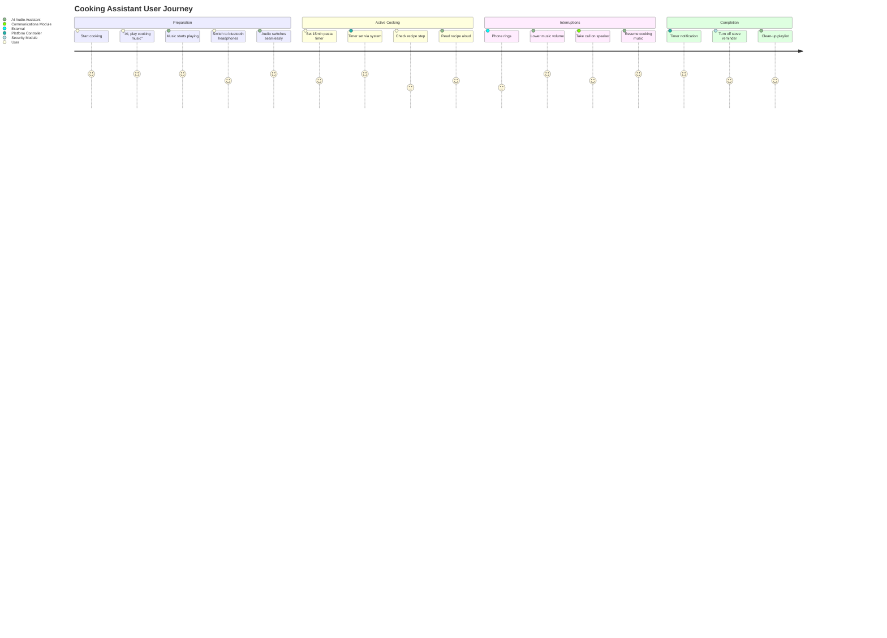

### **Work-from-Home Productivity**
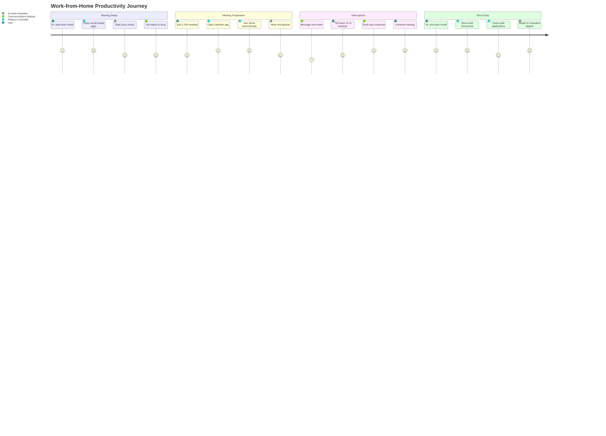

These diagrams provide a comprehensive view of the MIA Universal architecture, from high-level system context to detailed component interactions and user journeys. They serve as both documentation and implementation guides for the development team.