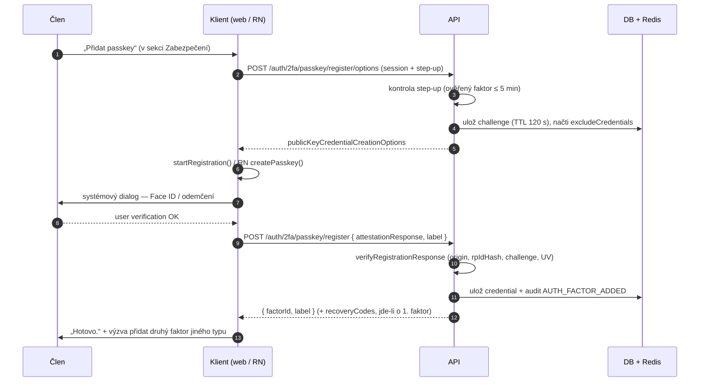
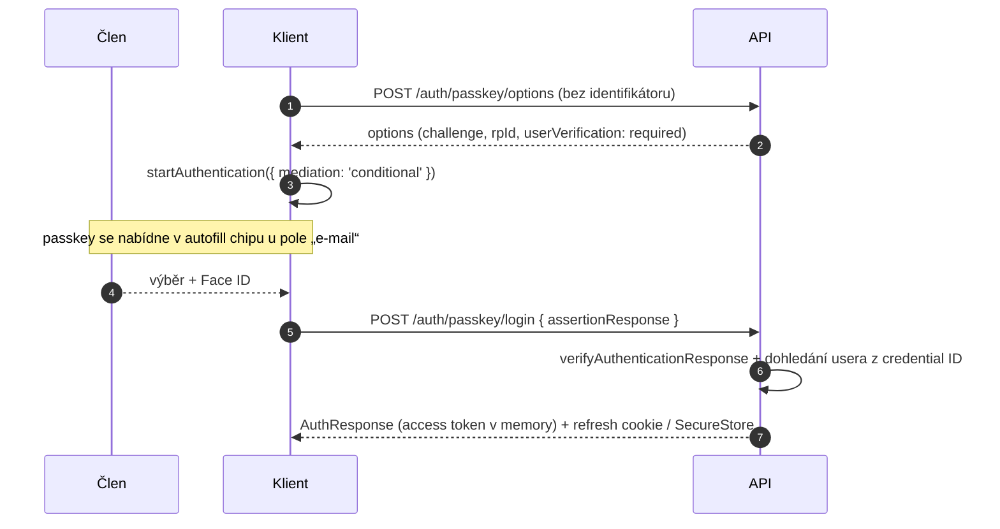
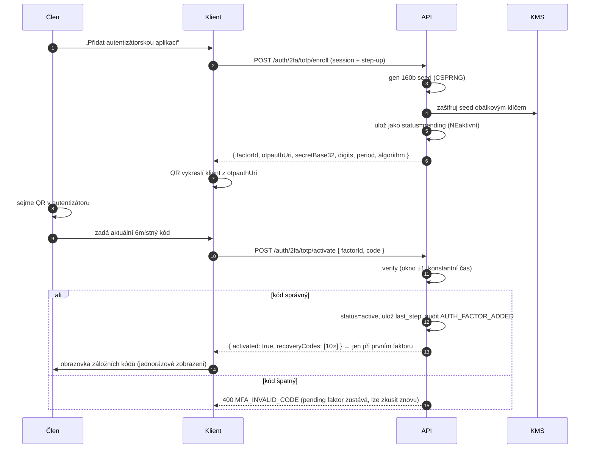
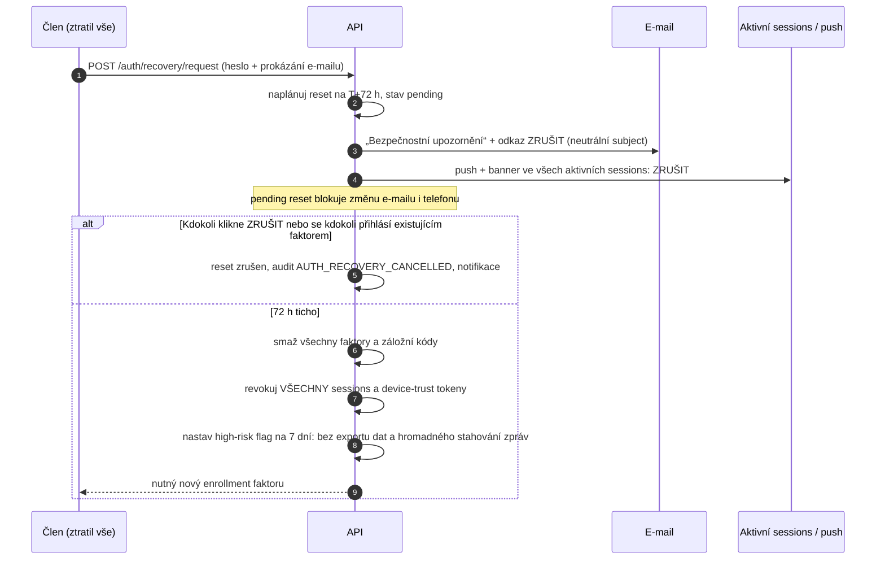

# ADR 0001 — Architektura 2FA (TOTP + passkey/WebAuthn + SMS) pro web i React Native

| | |
|---|---|
| **Stav** | Navrženo (accepted pro implementaci, jedna otázka eskalovaná objednateli — viz §15) |
| **Datum** | 2026-07-30 |
| **Role** | `security` |
| **Backlog** | E2-T1 (feeds → E2-T2, E2-T3, E2-T4, E2-T5) |
| **Smluvní kódy** | **B4.2** (primární), B4.1, B4.4, B14, podpůrně B1, B2, B13, C2, C12.1, C13 |
| **Výzkum** | RES-002 (tento ADR je jeho výstupem) |
| **Nutná návazná rozhodnutí** | D-003 (backend stack), D-004 (hosting), nově navrhované **D-006** (§15) |

> Tento dokument je psán tak, aby podle něj implementoval i externí inženýr bez
> přístupu k autorovi (C8 — předatelnost). Kde je rozhodnutí kompromis, je
> kompromis pojmenován, ne zamlčen.

---

## 1. Kontext

Smlouva v bodě **B4.2** ukládá, že přihlášení musí podporovat 2FA a že jako
druhý faktor musí být **volitelně** k dispozici **SMS, TOTP i passkey**. To je
podepsaný závazek, nikoli doporučení — nelze vypustit ani jeden z faktorů.

Současný stav (Phase 2/3): `POST /auth/login` vrací rovnou `AuthResponse`
(`token` + `user`), `POST /auth/verify` řeší jen ověření e-mailu. Druhý faktor
neexistuje nikde — ani v kontraktu, ani v UI, ani v mobilní appce. Token se v
mobilní appce drží pouze v React state (`apps/mobile/src/AuthFlow.tsx`), tj.
zatím nikde neperzistuje — což je paradoxně bezpečné a **nesmí se to zkazit**
tím, že se přidá `AsyncStorage` (viz §10).

Legacy platforma (`docs/live-audit.md`): Laravel, session cookie
`swingerslife_session` + XSRF token, login POST posílá pole `user`, ne `email`.
Náš snapshot modeluje JSON + bearer. Rozhodnutí o backendu (**D-003**) je otevřené.
Návrh v tomto ADR je proto **nezávislý na volbě backendu** — pro obě varianty je
uvedena knihovna a je popsáno, kde se liší jen nosič `mfaToken` (tělo requestu
vs. dočasná `HttpOnly` cookie), nikoli logika.

**Proč je tohle u Libertinu jiné než u běžného e-shopu.** Populace platformy
(naturisté / swingers / BDSM) čelí reálné škodě z prozrazení: ztráta zaměstnání,
rozpad rodiny, vydírání. Převzetí účtu tady neznamená finanční ztrátu, ale
přístup k soukromým zprávám a fotografiím konkrétní identifikovatelné osoby a k
její účasti na akcích. Zároveň — a to je v návrzích 2FA nejčastěji opomíjené —
**významná část útočníků má fyzický přístup k zařízení oběti** (partner, ex-partner,
rodina). To zásadně mění hodnocení SMS a hlavně recovery cest.

---

## 2. Threat model

### 2.1 Chráněná aktiva

| # | Aktivum | Škoda při kompromitaci |
|---|---|---|
| AS-1 | Vazba reálná identita (e-mail, telefon, platba) ↔ profil | Outing → reálná škoda mimo internet |
| AS-2 | Soukromé zprávy a neveřejná fotoalba | Vydírání, sextorze, rozeslání okolí |
| AS-3 | Účast na akcích + geolokace | „Kdo byl kdy s kým“ — nevyvratitelný důkaz |
| AS-4 | Administrátorský účet | Celá členská databáze = AS-1 pro všechny |
| AS-5 | Samotný fakt členství | Stačí sám o sobě ke škodě; proto i „účet existuje“ je citlivá informace |

### 2.2 Protivníci

| # | Protivník | Co získá | Nejlevnější útok |
|---|---|---|---|
| A1 | **Blízká osoba** (partner, ex, rodina) — nejpravděpodobnější protivník této populace | AS-1, AS-2, AS-3, páku pro nátlak | Přečte SMS kód z náhledu na zamčené obrazovce telefonu, ke kterému má fyzický přístup; nebo projde recovery cestou, protože zná e-mail i heslo |
| A2 | **Doxxingová / obtěžující skupina, bulvár** | AS-5 pro konkrétní jméno | Enumerace účtů přes rozdílné odpovědi `/auth/login`, registrace, resetu hesla nebo přes text „kód poslán na +420 ··· 123“ |
| A3 | **Credential stuffing bot** | AS-2 hromadně | Nasazení hesel z úniků legacy DB `swingerslife.cz` na účty bez 2FA |
| A4 | **Phishing / AiTM proxy** (Evilginx-class) | Plné převzetí včetně session | Reverzní proxy, která v reálném čase přeposílá heslo **i TOTP i SMS kód** a ukradne session cookie. **TOTP ani SMS tomu nezabrání.** |
| A5 | **SIM swap / přenos čísla / interception** | Druhý faktor | Sociální inženýrství u operátora; u cílené oběti reálné i v CZ/SK |
| A6 | **Operátor SMS brány / insider** | AS-1, AS-5 | Pasivně: brána vidí mapování telefonní číslo → naše značka. Žádný útok není potřeba. |
| A7 | **Zloděj / nálezce zařízení** | AS-2 | Odemčený telefon; token v plaintextu (`AsyncStorage`, `localStorage`) |
| A8 | **Sociální inženýrství podpory** | Plné převzetí | „Ztratil jsem telefon, vypněte mi 2FA.“ Historicky nejúspěšnější obchvat 2FA vůbec. |
| A9 | **Útok na dostupnost cílené osoby** | Vytlačení oběti z účtu | Záměrné zamykání účtu chybnými pokusy, aby oběť musela kontaktovat podporu (a tím vytvořila stopu) |

### 2.3 Mimo rozsah (explicitně)

Státní aktér s přístupem k operátorovi, kompromitovaný OS / rootnuté zařízení
jako předpoklad, kompromitace dodavatelského řetězce hardwarového tokenu.
Tyto hrozby nejsou tímto návrhem řešeny a nejsou v něm předstírány jako řešené.

### 2.4 Co z threat modelu přímo vyplývá

1. **Passkey je jediný z trojice faktorů, který zastaví A4** (je vázaný na origin,
   nepřenositelný přes proxy). Proto je passkey **preferovaný a v UI
   promovaný**, nikoli „třetí volba“.
2. **SMS je proti A1, A5 a A6 slabá už konstrukčně.** Smlouva ji nařizuje nabízet
   — nabídneme ji, ale omezíme (§6).
3. **Recovery cesta je nejcennější cíl, ne 2FA samotná.** A1 a A8 útočí na ni.
   Proto §5 obsahuje víc textu než všechny tři faktory dohromady — to je záměr.
4. **Zamčení účtu je útok, ne obrana** (A9). Omezujeme *výzvu faktoru*, ne účet.
5. **Metadata jsou úniková plocha**: text SMS, subject e-mailu, jméno v OS
   správci passkeyů, název souboru se záložními kódy. Řešíme je jako součást
   auth designu, ne jako copywriting (§4, §5.4, §7.4).

---

## 3. Rozhodnutí — přehled

| Faktor | Role v systému | Web (Next.js 14) | Mobil (Expo / RN 0.76) |
|---|---|---|---|
| **Passkey / WebAuthn** | **Preferovaný.** Zároveň jako 2. faktor po hesle **a** jako passwordless 1. faktor (UV = 2 faktory v jednom kroku) | `@simplewebauthn/browser` v13 | `react-native-passkeys` (Expo module) |
| **TOTP** (RFC 6238) | **Výchozí fallback.** Offline, funguje s libovolnou autentizátorskou aplikací, není závislý na externí službě (C2) | server-side ověření; klient jen zobrazí QR (`qrcode`) | klient jen zobrazí QR (`react-native-qrcode-svg`) |
| **SMS** | **Nabízeno kvůli B4.2, omezeno.** Nikdy jako recovery, nikdy pro step-up | jen zadání 6 číslic | jen zadání 6 číslic |
| **Záložní kódy** | Primární recovery. Není to „čtvrtý faktor“, je to pojistka proti výluce | download + copy | copy + share do správce hesel |
| **Odložený self-service reset** | Poslední instance, 72 h s možností zrušení | — | — |

Serverová strana podle **D-003**:

| Backend | Passkey | TOTP |
|---|---|---|
| Node / TS (nový backend) | `@simplewebauthn/server` **13.3.x** | `otpauth` **9.5.x** (alternativa `otplib`) |
| Rozšíření Laravelu | `laravel/passkeys` **0.2.x** (staví na `web-auth/webauthn-lib` 5.3) + Fortify `Features::passkeys()` | Fortify / `pragmarx/google2fa` |

Obě cesty produkují a konzumují stejné WebAuthn JSON struktury, takže **klientská
implementace se volbou backendu nemění** — to je hlavní důvod, proč lze E2-T3 a
E2-T5 rozjet ještě před rozhodnutím D-003 (proti MSW mockům).

---

## 4. Faktory — konkrétní návrh

### 4.1 Passkey / WebAuthn

#### Knihovny a platformní předpoklady

**Web.** `@simplewebauthn/browser` v13 (`startRegistration()`,
`startAuthentication()`), server `@simplewebauthn/server` v13
(`generateRegistrationOptions`, `verifyRegistrationResponse`,
`generateAuthenticationOptions`, `verifyAuthenticationResponse`). V Next.js 14
app routeru musí volání běžet v client komponentě; `@simplewebauthn/browser` je
browser-only, takže se importuje dynamicky (`await import(...)`) nebo v
komponentě s `'use client'`, aby nespadl SSR build.

**Mobil.** `react-native-passkeys` — Expo module se stejným API jako webové
`navigator.credentials`, iOS 15+ / Android API 28+ (Credential Manager).
Alternativa při regresi: `react-native-passkey` (f-23).

> ⚠️ **Provozní důsledek, který je třeba naplánovat:** passkeys **nefungují v
> Expo Go** (vyžadují nativní modul). Mobilní appka dnes běží jako Expo Go /
> managed. Pro E2-T5 je nutný **dev client / EAS build** a config plugin.
> Tohle je změna build pipeline → **follow-up pro `devops` + `frontend-mobile`**,
> `security` ji nedělá a nemá vlastnictví závislostí.

#### Konfigurace RP (relying party)

* **RP ID = apex `libertin.cz`**, konzistentně, **nikdy `www.libertin.cz`**.
  Špatně nastavené RP ID mezi subdoménami je nejčastější chyba nasazení passkeyů a
  projeví se až tím, že credential vytvořený na webu není použitelný v appce.
* iOS: `expo.ios.associatedDomains: ["webcredentials:libertin.cz"]` + hostovaný
  `/.well-known/apple-app-site-association`.
* Android: `/.well-known/assetlinks.json` s SHA-256 release podpisu, na doméně s
  platným certifikátem.
* Kdyby v budoucnu vznikl druhý origin (partnerská doména, jiná TLD pro SK),
  **nepřeregistrovávat credentials** — použít **Related Origin Requests**
  (`/.well-known/webauthn`).

#### Parametry výzvy

```
authenticatorSelection: { residentKey: 'required', requireResidentKey: true,
                          userVerification: 'required' }
attestation: 'none'
pubKeyCredParams: [-7 (ES256), -257 (RS256)]
excludeCredentials: [<všechny existující credential ID uživatele>]
timeout: 60000
```

* `residentKey: 'required'` (discoverable credential) je **podmínka** pro
  conditional UI / autofill přihlášení bez zadání identifikátoru.
* `userVerification: 'required'` → biometrie nebo PIN. Tím passkey sám nese dva
  faktory (držení + znalost/biometrie) a smí být použit jako **jednokrokové
  přihlášení**; současně je nabízen i jako druhý faktor po hesle, čímž je
  splněna litera B4.2.
* `attestation: 'none'` je **záměrné rozhodnutí kvůli soukromí**: vyžádaná
  attestace přenáší identifikátor modelu autentizátoru, u spotřebitelského
  přihlášení nepřináší žádný bezpečnostní přínos a jsou to zbytečná další data
  (minimalizace dat = bezpečnostní kontrola).
* `excludeCredentials` brání vzniku duplicitních credentials na stejném zařízení.

#### Ověření odpovědi na serveru

Povinně: `origin` proti allowlistu (`https://libertin.cz` + `android:apk-key-hash:…`
pro nativní klienty), `rpIdHash`, `type` (`'webauthn.create'` při registraci, `'webauthn.get'` při přihlášení), challenge
jednorázová z Redisu s TTL 120 s, `userVerified === true`.

**`signCount`: neselhávat tvrdě.** Synchronizované (cloudové) passkeys hlásí
`signCount = 0` a regresi počítadla — tvrdá kontrola je klasická chyba, která
zablokuje legitimní uživatele iPhonu. Regresi logovat jako anomálii do auditu
(B2), ne odmítat přihlášení.

#### Kde jsou tajemství

**Nikde u nás.** Privátní klíč je v Secure Enclave / StrongBox / platformním
správci hesel a náš kód se k němu nedostane. V DB držíme jen:
`credential_id`, `public_key`, `sign_count`, `transports[]`, `aaguid`,
`created_at`, `last_used_at`, `label` (uživatelský popis zařízení).

#### Únik soukromí, který WebAuthn má a je nutné ho přiznat

`user.name` a `user.displayName` z registrace se **zobrazují v OS správci
passkeyů** (Nastavení → Hesla, iCloud Keychain, Google Password Manager) a
synchronizují se do cloudu. Kdokoli otevře správce hesel na odemčeném zařízení
(A1, A7), vidí záznam.

Proto:

* `user.id` = **32 náhodných bajtů**, nikdy DB id ani e-mail (user handle podle
  specifikace nesmí obsahovat PII a je součástí synchronizovaného záznamu).
* `user.name` = **pseudonym/handle, který si člen zvolil**, nikdy e-mail.
* `user.displayName` = tentýž pseudonym.
* **Zbytkové riziko, které nelze odstranit:** RP ID `libertin.cz` je ve správci
  hesel vidět vždy. Členovi, který se obává právě tohoto, musí enrollment
  obrazovka **explicitně nabídnout TOTP s neutrálním labelem** jako alternativu
  (§4.2). Text musí být upřímný, ne uklidňující. Viz R-1 v §13.

#### Tok — registrace passkeye



#### Tok — přihlášení passkeyem (passwordless, conditional UI)



Na webu nejdřív zjistit dostupnost:
`PublicKeyCredential.isConditionalMediationAvailable()`; při `false` degradovat
na tlačítko „Přihlásit se passkeyem“. Nikdy nedělat conditional UI jako jediný
vstup (nedostupné např. v embedded webview).

**Hlavičky:** `Permissions-Policy: publickey-credentials-get=(self), publickey-credentials-create=(self)`
a `Referrer-Policy: no-referrer` na auth trasách (aby se z referreru nedalo
odvodit, ze které stránky člen přišel). Vlastní `next.config.mjs` role
`frontend-web` / `devops` — reportováno jako follow-up.

---

### 4.2 TOTP (RFC 6238)

#### Knihovny

* Node backend: **`otpauth` 9.5.x** (RFC 4226 + RFC 6238, multi-runtime, malá).
  Alternativa `otplib` (víc downloadů, stejná shoda s RFC) — obě jsou aktivně
  udržované, rozhodnutí je preferencí, ne bezpečnostním rozdílem.
* Laravel cesta: Fortify TOTP / `pragmarx/google2fa`.
* QR se vykresluje **na klientovi** z `otpauth://` URI — `qrcode` na webu,
  `react-native-qrcode-svg` v RN. Nikdy jako obrázek z URL serveru: takový URL
  by šel do cache, do logů proxy a do historie prohlížeče.

#### Parametry (fixní, neměnit bez nového ADR)

| Parametr | Hodnota | Proč |
|---|---|---|
| Algoritmus | **SHA-1** | Kompatibilita se všemi autentizátory. Není to slabina — HMAC-SHA1 v TOTP není závislý na kolizní odolnosti. |
| Délka | 6 číslic | Kompatibilita |
| Perioda | 30 s | Standard |
| Okno | ±1 krok (t−1, t, t+1) | Tolerance rozjetých hodin; max 90 s platnost |
| Tajemství | 160 bitů z CSPRNG, base32 | RFC 4226 doporučení |
| Replay | poslední přijatý krok se ukládá; opakování téhož kódu = odmítnutí | Brání znovupoužití odposlechnutého kódu |
| Porovnání | konstantní čas | Timing side-channel |

#### Kde je tajemství

* **Server:** TOTP seed je *symetrické* tajemství — únik DB = obchvat 2FA pro
  všechny. Proto se ukládá **šifrovaně obálkovým klíčem z KMS** (envelope
  encryption, klíč nikdy v DB ani v `.env` v plaintextu) — tím tento ADR přímo
  spotřebovává **B4.4** (management a záloha klíčů). Sloupec s plaintext seedem
  je zakázaný.
* **Klient:** seed **neukládáme nikde**. Drží ho autentizátorská aplikace člena.
  Pokud by v budoucnu vznikl vestavěný autentizátor, seed jde do
  `expo-secure-store` (`WHEN_UNLOCKED_THIS_DEVICE_ONLY`, `requireAuthentication: true`,
  pozor na limit 2048 B na hodnotu) — **nikdy `AsyncStorage`** (§10).

#### Neutrální label — malá věc s velkým efektem

`otpauth://totp/{issuer}:{account}?issuer={issuer}&secret=…` — `issuer` a
`account` se zobrazují v seznamu v autentizátorské aplikaci, tedy na obrazovce,
kterou vidí kdokoli u telefonu (A1). Proto enrollment nabídne **volbu labelu**:
výchozí `Libertin`, ale člen si může zadat vlastní neutrální text a jako
`account` se použije jeho pseudonym, **nikdy e-mail**. Label je čistě kosmetický
— nemá vliv na kryptografii, a proto je to volba, kterou si člen může udělat bez
jakéhokoli bezpečnostního kompromisu.

#### Tok — enrollment TOTP (confirm-before-activate)



`pending` faktor, který se do 15 minut neaktivuje, se maže. Bez
confirm-before-activate se člen při špatně sejmutém QR **zamkne z účtu** — to je
nejčastější způsob, jak TOTP enrollment v praxi selže.

---

### 4.3 SMS

Viz **§6** pro omezení a jejich odůvodnění. Zde jen mechanika.

* SMS brána je **externí služba** — smlouva ji výslovně připouští
  (**B14** vyžaduje SMS bránu; naše traceabilita ji vede jako jedinou povolenou
  externí službu vedle platební brány — to je náš komentář, ne citace smlouvy), takže není v
  rozporu s C2. On-premise SMS není realizovatelná.
* Integrace je task **E2-T4** a závisí na **E5-T3** (brána) a **D-004** (hosting).
  Tento ADR **nevybírá dodavatele** — stanovuje požadavky na něj:

| Požadavek na bránu | Proč |
|---|---|
| Doručování CZ + SK | Cílový trh |
| Zpracování v EU, DPA, retence logů ≤ 24 h | GDPR + A6: brána vidí telefon ↔ naše značka |
| **Sender ID neobsahuje značku** (neutrální alfanumerický / short code) | A1 — náhled na zamčené obrazovce |
| **Text SMS nepojmenovává platformu** | A1. Text: „Váš kód: 123456. Platí 5 minut. Nikomu ho nesdělujte.“ |
| Bez trvalého ukládání těla zprávy v dashboardu dodavatele | Minimalizace |
| Možnost okamžitého odstřižení (kill-switch na naší straně) | A6 — kompromitace brány |

Mechanika kódu: 6 číslic z CSPRNG, TTL **5 min**, jednorázový, v DB jen
**HMAC-SHA256 s pepperem z KMS** (ne plaintext), max jeden aktivní kód na
uživatele, 5 chybných pokusů → kód se zneplatní a je nutné znovu zadat heslo.
Rate limity v §8.

Telefonní číslo: šifrované + **blind index** (HMAC s pepperem) pro deduplikaci a
rate limiting. **Nikdy se nevypisuje** — ani maskované — na neautentizované
obrazovce; masku `+420 ··· ··· 789` člen uvidí jen po step-up ověření (jinak
každý, kdo zná heslo, získá čtyři číslice reálného telefonu → A2).

---

## 5. Recovery — kde 2FA systémy selhávají

**Předpoklad, ze kterého vycházím:** recovery cesta je *nejsilnější* faktor v
systému, protože obchází všechny ostatní. Jakákoli recovery cesta, která je
snazší než nejsnazší faktor, je *ta skutečná* autentizace. U této populace navíc
platí, že nejpravděpodobnější útočník (A1) zná e-mail, často i heslo, má fyzický
přístup k telefonu a odpovědi na „bezpečnostní otázky“ zná lépe než oběť.

### 5.1 Zvážené možnosti

| # | Varianta | Verdikt | Důvod |
|---|---|---|---|
| 1 | Manuální reset podporou po předložení dokladu | **Zamítnuto jako primární** | A8 je historicky nejúspěšnější obchvat 2FA. Navíc: nutit člena adult platformy poslat sken dokladu vytváří přesně tu papírovou stopu, které se bojí. Řešení by bylo horší než hrozba. |
| 2 | Reset 2FA přes e-mail | **Zamítnuto** | Degraduje 2FA na 1FA + e-mail. E-mailový účet je pro A1 nejsnazší cíl a je phishovatelný (A4). |
| 3 | Bezpečnostní otázky (KBA) | **Zamítnuto bez výjimky** | A1 zná odpovědi. NIST je z doporučení odstranil. |
| 4 | Reset 2FA přes SMS | **Zamítnuto** | Udělalo by z nejslabšího faktoru hlavní klíč: jeden SIM swap (A5) = plné převzetí. Toto je nejčastější reálná chyba návrhů, které SMS „jen nabízejí“. |
| 5 | **Záložní kódy** | **Zvoleno — primární** | Offline, nezávislé na kanálu i na dodavateli, žádná lidská obsluha v kritické cestě |
| 6 | **Druhý passkey / druhé zařízení** | **Zvoleno — promováno** | Nejsilnější a s nulovou provozní zátěží |
| 7 | **Odložený self-service reset (72 h)** | **Zvoleno — poslední instance** | Převádí „okamžité tiché převzetí“ na „72 h hlasitého a zrušitelného pokusu“ |
| 8 | Podpora jako krajní cesta | **Ponecháno, ale zúženo** | Pro člena, který ztratil i e-mail. Dva schvalovatelé, 7denní hold, plný audit. Pro adminy zakázáno. |

### 5.2 Zvolený design

**(a) Záložní kódy — primární.**
10 kódů, každý 10 znaků Crockford base32 (≈ 2⁵⁰ na kód; s rate limitingem z §8
je hádání nereálné). Generují se **při aktivaci prvního faktoru**, zobrazí se
právě jednou, člen musí zaškrtnutím potvrdit, že si je uložil. V DB jen
**HMAC-SHA256 s pepperem z KMS** + příznak `used_at` (kód má vysokou entropii,
takže pomalý KDF není nutný; pepper brání offline hádání při úniku DB samotné).
Použití kódu = jednorázové, ihned se označí a pošle se notifikace. Při ≤ 3
zbývajících kódech se v UI ukáže výzva k regeneraci; regenerace zneplatní
všechny předchozí.

> **Detail, který je snadné přehlédnout:** nabídneme-li „Stáhnout kódy“,
> soubor skončí ve složce Stažené, kde ho vidí A1 i A7. Proto **název souboru
> nesmí obsahovat značku** — `zalozni-kody.txt`, ne `libertin-2fa-kody.txt` — a
> obsah nesmí obsahovat e-mail ani URL platformy. Primárně UI doporučí uložení
> do správce hesel nebo vytištění, download je až druhá volba.

**(b) Druhý faktor jiného typu — promováno, ne vynuceno.**
Po aktivaci prvního faktoru a pak při každém přihlášení (dokud nejsou aktivní
alespoň dva faktory různého typu) se zobrazí nevtíravá výzva přidat druhý.
Nejúčinnější je druhý passkey — na jiném telefonu nebo hardwarový klíč.

Poctivá poznámka do UI copy: **synchronizované passkeys (iCloud Keychain,
Google Password Manager) přežijí ztrátu telefonu samy** — to je v praxi hlavní
recovery cesta. Cenou je, že se do trust base dostává účet Apple/Google včetně
*jeho* recovery. Kdo se obává přístupu rodiny ke společnému Apple ID, má zvolit
**device-bound** klíč (hardwarový token) — UI musí obě varianty nabídnout a
rozdíl vysvětlit, ne ho zamlčet.

**(c) Odložený self-service reset — poslední instance.**



Max jeden pending reset na účet.

### 5.3 Přiznaný kompromis

Volíme **pomalé, hlasité a self-service** proti **rychlému a přes podporu**.

* **Co to stojí:** člen, který ztratil telefon, autentizátor i záložní kódy,
  čeká 72 hodin. To je reálná uživatelská bolest a bude generovat stížnosti.
* **Co to kupuje:** (1) žádný telefonát nemůže převzít účet — A8 je mimo hru;
  (2) pokus o převzetí je pro oběť **viditelný a zrušitelný**, což je jediná
  obrana, kterou proti A1 vůbec máme; (3) podpora není v kritické cestě, takže
  ji nelze sociálně inženýrovat.
* **Co to nekupuje:** útočník, který 72 hodin nepozorovaně drží e-mail i heslo
  (typicky právě A1 s fyzickým přístupem), reset dokončí. Toto riziko
  **vědomě přijímáme** (R-5 v §13) — varianta 1 by ho nesnížila, jen by k němu
  přidala sken dokladu v ticketovacím systému.

### 5.4 Notifikace jsou samy únikem

Každá změna faktoru, každé přihlášení z nového zařízení a každý recovery požadavek
generuje notifikaci. Ale:

* **Subject e-mailu nesmí pojmenovat platformu** ani obor. „Bezpečnostní
  upozornění k vašemu účtu“ — ne „Libertin: nové přihlášení“. Náhled subjectu na
  zamčené obrazovce je pro A1 stejně dobrý důkaz jako obsah.
* **Zobrazované jméno odesílatele** musí být neutrální; doména odesílatele je
  bohužel vidět v detailu — to je zbytkové riziko a je součástí R-1.
* **Push notifikace**: `interruption-level` a text bez obsahu; jen „Nové
  bezpečnostní upozornění“ (viz `docs` / `frontend-mobile` pro implementaci B9).
  Pozor i na to, že text push notifikace se objeví na zamčené obrazovce — tam
  nesmí být jméno protistrany ani obsah zprávy.

---

## 6. Proč je SMS nejslabší faktor a jak ji omezujeme

### 6.1 Proč slabá

1. **SIM swap / přenos čísla (A5)** — útočník získá kód bez jakéhokoli kontaktu s
   naším systémem. Naše kontroly na to nemají žádný vliv.
2. **Fyzický přístup a náhledy na zamčené obrazovce (A1)** — u této populace to
   není hypotéza, ale nejpravděpodobnější scénář. Kód se doručí na zařízení,
   které útočník drží v ruce.
3. **Phishing / AiTM (A4)** — kód není vázán na origin, proxy ho přepošle.
4. **Externí zpracovatel (A6)** — brána se dozví mapování telefon ↔ naše značka.
   To je únik AS-5 *bez útoku*.
5. **Standardizační kontext:** NIST SP 800-63B-4 zařadil SMS/PSTN OTP mezi
   **restricted authenticators** — dál povolené, ale jen s dokumentovaným
   posouzením rizika, informováním uživatele a plánem přechodu jinam. Tento
   dokument je zároveň tím posouzením rizika.

### 6.2 Jak ji omezujeme (a přitom plníme B4.2)

| # | Omezení | Blokuje |
|---|---|---|
| S-1 | SMS se **nikdy nezapíná automaticky** a nikdy není přednastavená volba | A5 v tichosti |
| S-2 | SMS **nelze použít pro recovery** ani pro reset jiného faktoru | A5 → plné převzetí |
| S-3 | SMS **nestačí pro step-up** u citlivých operací (změna e-mailu/telefonu/hesla, přidání či odebrání faktoru, zobrazení záložních kódů, export dat, smazání účtu, admin akce) | A5, A1 |
| S-4 | Změna telefonního čísla vyžaduje step-up silnějším faktorem **a** nové číslo je použitelné až po **24 h** | „SIM swap, pak si přepíšu číslo“ |
| S-5 | Zapnutí SMS má **vlastní varovnou obrazovku** s konkrétním, nezkrášleným textem o SIM swapu (přes i18n klíče, CS+EN — B13) | Informovaný souhlas |
| S-6 | **Globální kill-switch** (feature flag) pro okamžité vypnutí SMS faktoru při kompromitaci brány | A6 |
| S-7 | SMS **nikdy nesmí být jediný faktor u administrátorských a editorských rolí** (B1) | A4 → AS-4 |
| S-8 | Sender ID a text bez značky (§4.3) | A1 |
| S-9 | Ostřejší rate limiting než u ostatních faktorů (§8) | Náklady + enumerace |

S-7 je bez výhrad (admin role určuje provozovatel, nikoli člen). Omezení, které
by se dotklo běžného člena a proto **není** rozhodnuto zde, je v §15.

---

## 7. Session model po 2FA

### 7.1 Tokeny

* **Access token**: JWT, TTL **10 min**, `aud: 'api'`. Drží se **jen v paměti**.
* **Refresh token**: opaque 32 B, TTL 30 dní, vázaný na zařízení, **rotující**
  s detekcí znovupoužití (replay → revokace celé rodiny tokenů + notifikace).
* **`mfaToken`**: opaque 32 B, TTL **5 min**, jednorázový, `aud: 'mfa'`, uložený
  server-side (Redis). **Žádný resource endpoint ho nesmí přijmout.** Nese jen
  „heslo bylo ověřeno“, nic víc.

### 7.2 Kde tokeny žijí

| Platforma | Access | Refresh |
|---|---|---|
| **Web** | pouze v paměti (React state / module scope) | `__Host-` cookie, `HttpOnly; Secure; SameSite=Lax; Path=/`; CSRF navíc kontrolou `Origin` |
| **RN/Expo** | pouze v paměti | `expo-secure-store`, `WHEN_UNLOCKED_THIS_DEVICE_ONLY`, `requireAuthentication` jako volba člena |

**Zakázáno, explicitně:** `localStorage`/`sessionStorage` pro jakýkoli token
(exfiltrace při XSS), `AsyncStorage` pro cokoli citlivého (plaintext, čitelné na
rootnutém zařízení a součást nešifrovaných záloh), token v URL nebo query
stringu (logy, referrer, historie).

### 7.3 „Zapamatovat toto zařízení“

Podepsaný device token, max **30 dní**, přeskočí druhý faktor. Podmínky:
nenabízí se při **prvním** přihlášení z daného zařízení; je revokovatelný ze
seznamu zařízení (`GET/DELETE /auth/sessions`); **pro admin a editor role je
vypnutý** (B1). Pro sdílené zařízení musí být volba jasně opt-in — u této
populace je „zapamatovat“ na sdíleném rodinném počítači přímá cesta k outingu.

### 7.4 Step-up re-autentizace

Vyžaduje čerstvé ověření faktoru (≤ 5 min) pro: změnu e-mailu, telefonu a hesla,
přidání/odebrání faktoru, zobrazení nebo regeneraci záložních kódů, export dat
(GDPR), smazání účtu, zobrazení maskovaného telefonu, všechny admin akce.
**SMS se pro step-up nepočítá** (S-3).

---

## 8. Rate limiting, výluky a zabránění enumeraci

| Ochrana | Hodnota |
|---|---|
| Ověření TOTP (samostatný počítač) | 5 chyb → 15 min zablokování **výzvy faktoru**, dál exponenciálně (max 24 h) |
| Ověření SMS kódu | 5 chyb → kód zneplatněn, nutné znovu heslo |
| Odeslání SMS | cooldown 60 s; max 3 / 15 min; max 10 / 24 h / účet; strop na blind index čísla |
| Passkey assertion | limit na challenge, ne na účet (UV řeší autentizátor) |
| Per-IP / per-ASN | globální strop + anomálie do auditu (B2) |
| Recovery request | 1 pending na účet |

**Zamykáme výzvu, ne účet** (A9): útočník nesmí být schopen cíleně vytlačit
konkrétní osobu z účtu a tím ji donutit kontaktovat podporu.

**Anti-enumerace (A2):**

* `POST /auth/login` s neexistujícím e-mailem a se špatným heslem vrací
  **identické tělo, status i srovnatelný čas** — proti neexistujícímu účtu se
  provede Argon2id verify proti fixnímu dummy hashi.
* Registrace a reset hesla nikdy nepotvrdí existenci účtu („pokud je adresa
  registrovaná, poslali jsme e-mail“).
* Seznam faktorů se vrací **až po úspěšném hesle** (tehdy už útočník heslo má,
  takže nejde o nový únik) a obsahuje **jen typy faktorů** — žádné číslice
  telefonu, žádné názvy zařízení.
* Chybové kódy jsou stabilní a neinformativní nad rámec potřeby
  (`MFA_INVALID_CODE` nerozlišuje „špatný kód“ od „prošlý kód“).

---

## 9. Dopad na API kontrakt (popis, **ne** editace)

`contracts/openapi.snapshot.yaml` je vlastněn taskem **E2-T2** (role `architect`).
Zde je specifikace, kterou má E2-T2 zapsat. Nic v `contracts/` ani v
`packages/api/` tímto ADR neměním.

### 9.1 Změna existujícího endpointu

**`POST /auth/login`** — odpověď se stává **discriminated union**:

```yaml
# 200 →  oneOf:
#   AuthResponse              (2FA není zapnutá; beze změny)
#   TwoFactorChallenge        (2FA zapnutá)
TwoFactorChallenge:
  required: [status, mfaToken, expiresIn, methods]
  properties:
    status:    { const: 'mfa_required' }
    mfaToken:  { type: string }          # opaque, TTL 300 s, aud=mfa, jednorázový
    expiresIn: { type: integer }         # sekundy
    methods:
      type: array
      items:
        required: [type, factorId]
        properties:
          type:     { enum: [totp, sms, passkey] }
          factorId: { type: string }
          default:  { type: boolean }
          label:    { type: string }     # jen u passkey; NIKDY číslice telefonu
```

`AuthResponse` doplnit o `expiresIn` a (na webu) přesunout refresh do cookie.

### 9.2 Nové endpointy — přihlašovací tok

| Metoda + cesta | Request | Response |
|---|---|---|
| `POST /auth/2fa/challenge` | `{ mfaToken, method, factorId? }` | `sms` → `{ sent: true, retryAfter }`; `passkey` → `publicKeyCredentialRequestOptions`; `totp` → `{ ok: true }` |
| `POST /auth/2fa/verify` | `{ mfaToken, method, code? , assertionResponse? }` | `AuthResponse` + `deviceTrustToken?` |
| `POST /auth/2fa/recovery-code` | `{ mfaToken, code }` | `AuthResponse` + `{ remainingCodes }` |
| `POST /auth/passkey/options` | `{}` (bez identifikátoru — conditional UI) | `publicKeyCredentialRequestOptions` |
| `POST /auth/passkey/login` | `{ assertionResponse }` | `AuthResponse` |

### 9.3 Nové endpointy — správa faktorů (session + step-up)

| Metoda + cesta | Poznámka |
|---|---|
| `GET /auth/2fa/factors` | typ, `factorId`, `label`, `createdAt`, `lastUsedAt`, `status`. Bez číslic telefonu, pokud neproběhl step-up |
| `POST /auth/2fa/totp/enroll` | → `{ factorId, otpauthUri, secretBase32, digits, period, algorithm }` |
| `POST /auth/2fa/totp/activate` | `{ factorId, code }` → `{ activated, recoveryCodes? }` |
| `POST /auth/2fa/sms/enroll` | `{ phone }` → `{ factorId }`; kód odeslán |
| `POST /auth/2fa/sms/activate` | `{ factorId, code }` → `{ activated, usableFrom }` (S-4) |
| `POST /auth/2fa/passkey/register/options` | → `publicKeyCredentialCreationOptions` |
| `POST /auth/2fa/passkey/register` | `{ attestationResponse, label }` → `{ factorId, recoveryCodes? }` |
| `DELETE /auth/2fa/factors/{factorId}` | odmítne, pokud by zůstalo 0 faktorů a žádné nepoužité záložní kódy → `MFA_LAST_FACTOR` |
| `POST /auth/2fa/recovery-codes/regenerate` | → `{ codes: string[] }`; zneplatní předchozí |
| `GET /auth/2fa/recovery-codes/status` | → `{ remaining, generatedAt }` — nikdy samotné kódy |

### 9.4 Nové endpointy — recovery a sessions

`POST /auth/recovery/request` · `GET /auth/recovery/status` ·
`POST /auth/recovery/cancel { cancelToken }` ·
`GET /auth/sessions` · `DELETE /auth/sessions/{id}` · `DELETE /auth/sessions`

### 9.5 Stabilní chybové kódy (`ErrorResponse.code`)

`MFA_REQUIRED`, `MFA_INVALID_CODE`, `MFA_TOKEN_EXPIRED`, `MFA_RATE_LIMITED`
(+ `Retry-After`), `MFA_FACTOR_EXISTS`, `MFA_LAST_FACTOR`, `MFA_METHOD_DISABLED`
(kill-switch S-6), `STEPUP_REQUIRED`, `RECOVERY_PENDING`, `PHONE_COOLDOWN`.

### 9.6 Napětí s legacy API — nutno vyřešit při snímání živého API

`docs/live-audit.md` říká, že reálný Laravel login je form-encoded s CSRF cookie
a polem `user`, kdežto snapshot modeluje JSON + bearer. **Logika 2FA se tím
nemění**, mění se jen nosič `mfaToken`: v cookie-session variantě je to dočasná
`HttpOnly` cookie `__Host-mfa` místo pole v těle. E2-T2 by měl zapsat JSON
variantu (odpovídá dnešnímu snapshotu) a `/contract-check` odchylku odhalí.

### 9.7 MSW mocky a i18n (jiní vlastníci)

* `packages/api/src/mocks/handlers.ts` potřebuje handlery pro výše uvedené cesty,
  aby E2-T3/E2-T5 šlo vyvíjet offline. **Vlastní `architect` / `frontend-*`.**
* `packages/i18n/locales.json` potřebuje jmenný prostor `auth.2fa.*`
  (výběr metody, TOTP enrollment, varování u SMS, záložní kódy, recovery,
  seznam zařízení) v CS+EN — B13. **Vlastní `frontend-*` / `docs`.**
  Žádný text v UI nesmí být hardcoded a texty notifikací musí respektovat §5.4.

---

## 10. Kde smí co ležet — souhrnná tabulka

| Tajemství | Umístění | Výslovně zakázáno |
|---|---|---|
| Privátní klíč passkeye | Secure Enclave / StrongBox / platformní správce | (nemáme k němu přístup) |
| Public key + credential ID | DB, plaintext (není tajemství) | — |
| TOTP seed | DB **šifrovaně** obálkovým klíčem z KMS (B4.4) | plaintext sloupec, `.env`, log, Sentry breadcrumb |
| SMS kód | Redis, **HMAC** s pepperem, TTL 5 min | plaintext, log, e-mailová kopie |
| Telefonní číslo | šifrovaně + blind index | plaintext, plné zobrazení v UI |
| Záložní kódy | **HMAC** s pepperem + `used_at` | plaintext, e-mail členovi |
| Access token | **jen paměť** klienta | `localStorage`, `AsyncStorage`, URL |
| Refresh token | web: `__Host-` `HttpOnly` cookie · RN: `expo-secure-store` | `localStorage`, **`AsyncStorage`**, Redux persist |
| `mfaToken` | Redis server-side, jednorázový | dlouhé TTL, použití proti resource endpointům |
| Obálkové klíče / peppery | KMS s možností zálohy klíčů (B4.4) | repozitář, image, `.env` v gitu |

---

## 11. Auditní události (B2)

`AUTH_LOGIN_SUCCESS`, `AUTH_LOGIN_FAILED`, `AUTH_MFA_CHALLENGE_SENT`,
`AUTH_MFA_SUCCESS`, `AUTH_MFA_FAILED`, `AUTH_MFA_RATE_LIMITED`,
`AUTH_FACTOR_ADDED`, `AUTH_FACTOR_REMOVED`, `AUTH_FACTOR_DISABLED_BY_ADMIN`,
`AUTH_RECOVERY_CODE_USED`, `AUTH_RECOVERY_CODES_REGENERATED`,
`AUTH_RECOVERY_REQUESTED`, `AUTH_RECOVERY_CANCELLED`, `AUTH_RECOVERY_COMPLETED`,
`AUTH_PHONE_CHANGED`, `AUTH_DEVICE_TRUSTED`, `AUTH_SESSION_REVOKED`,
`AUTH_PASSKEY_SIGNCOUNT_ANOMALY`, `AUTH_STEPUP_REQUIRED`, `AUTH_STEPUP_FAILED`.

**Auditní log je sám citlivá data (AS-1, AS-5).** Musí platit: IP se ukládá
zkrácená nebo hashovaná podle retenční politiky, žádný kód/token/seed do logu,
retence konfigurovatelná (B2), a přístup k logu jen pro admin roli s vlastním
záznamem o přístupu.

---

## 12. Důsledky

**Pozitivní**

* B4.2 splněna doslovně (tři volitelné faktory) i duchem (nejsilnější z nich je
  ten promovaný).
* Passkey jako výchozí volba je jediná realistická obrana proti A4 — a zároveň
  odstraňuje heslo, tedy i A3.
* TOTP nevyžaduje žádnou externí službu → v souladu s C2, funguje i při výpadku
  SMS brány.
* Podpora není v kritické cestě žádné recovery varianty → A8 odstraněna.
* Klientská implementace je nezávislá na D-003, takže E2-T3 a E2-T5 mohou začít
  proti MSW mockům.
* Šifrování TOTP seedů a pepperů obálkovým klíčem vytváří konkrétní požadavek na
  KMS, čímž B4.4 dostává reálného konzumenta místo abstraktního zadání.

**Negativní / cena**

* Nutný **dev client / EAS build** pro mobil (passkeys nejdou v Expo Go) → změna
  build pipeline a CI. Follow-up pro `devops` + `frontend-mobile`.
* Přírůstek rozsahu: **21 nových endpointů + 1 změněný** (§9), 6–8 obrazovek ×
  2 platformy, nový jmenný prostor i18n v CS+EN.
* Provoz: SMS brána je nová externí závislost s náklady a s DPA (B14, E5-T3).
* 72h recovery bude generovat stížnosti a dotazy na podporu (byť ne rozhodovací
  pravomoc podpory).
* Přihlášení má o jeden síťový round-trip víc.

**Výkon vs. C12.1 (odezva UI ≤ 1,5 s při max. zátěži)**

Auth je nejtěžší operace v systému kvůli KDF. Doporučení: **Argon2id, m = 64 MiB,
t = 3, p = 1**, změřeno na cílovém hardwaru; pokud verify přesáhne ~300 ms,
snižovat `t` před `m`. Druhý faktor je **samostatný request**, takže se latence
dělí mezi dva kroky a žádná jednotlivá obrazovka nepřekročí budget. Ověření
patří QA (k6) — `security` zde jen fixuje parametry, které se nesmí měnit bez
nového ADR.

---

## 13. Zbytková rizika — vědomě přijímaná

| # | Riziko | Proč ho přijímáme |
|---|---|---|
| **R-1** | RP ID `libertin.cz` je viditelné v OS správci passkeyů a doména odesílatele v detailu e-mailu → kdo otevře správce hesel na odemčeném zařízení, vidí členství (A1, A7) | WebAuthn to neumožňuje skrýt. Mitigace: neutrální `user.name`, TOTP s vlastním labelem jako alternativa, upřímný text v enrollmentu. **Kdyby objednatel chtěl toto riziko odstranit, znamenalo by to neutrální auth doménu — to je značkové rozhodnutí, ne technické. Zmíněno v §15.** |
| **R-2** | Synchronizované passkeys dědí bezpečnost účtu Apple/Google včetně jeho recovery | Je to zároveň hlavní recovery cesta. Nabízíme device-bound alternativu a rozdíl vysvětlíme. |
| **R-3** | SMS zůstává obchvatná SIM swapem, pokud útočník má i heslo | Nařizuje ji smlouva (B4.2). Omezena S-1…S-9; nikdy recovery ani step-up. |
| **R-4** | AiTM phishing (A4) porazí TOTP i SMS; členy k passkeyům nemůžeme donutit | Passkey promujeme, ale vynucení by vyloučilo starší zařízení. |
| **R-5** | 72h reset dokončí útočník, který 72 h nepozorovaně drží e-mail i heslo (typicky A1) | Alternativa (podpora + doklad) je pro tuto populaci horší. Mitigováno zrušením z jakékoli session, e-mailu i push. |
| **R-6** | `expo-secure-store` nemusí ochránit refresh token na rootnutém/jailbreaknutém zařízení; detekce rootu není v MVP | Detekce rootu je obcházitelná a dává falešnou jistotu. Mitigace: krátká TTL access tokenu, revokovatelné sessions. |
| **R-7** | Legacy hashe hesel ze `swingerslife.cz` mají neznámou sílu (C13) | Nutné: rehash při prvním přihlášení + povinné okno pro enrollment 2FA u migrovaných účtů. **Follow-up pro `backend` v rámci C13.** |
| **R-8** | SMS brána zná mapování telefon → značka (A6) | Neodstranitelné, pokud SMS existuje. Mitigace: EU zpracování, DPA, retence ≤ 24 h, neutrální sender ID, kill-switch. |
| **R-9** | Tento ADR neřeší 2FA pro adminy nad rámec „hardwarový klíč + zákaz SMS a device-trust“ | Break-glass procedura pro externího provozovatele patří do C8 handoveru. **Follow-up pro `devops`/`architect`.** |

---

## 14. Plnění požadavků

| Kód | Jak |
|---|---|
| **B4.2** | Tři volitelné druhé faktory (SMS, TOTP, passkey) navrženy do implementovatelné úrovně; passkey navíc jako passwordless první faktor |
| **B4.1** | Auth trasy jen přes HTTPS; `__Host-` cookie vynucuje Secure; `Permissions-Policy` a `Referrer-Policy` na auth trasách |
| **B4.4** | Konkrétní konzumenti KMS: obálkový klíč pro TOTP seedy, pepper pro SMS kódy, telefony a záložní kódy |
| **B14** | Požadavky na SMS bránu definovány (EU, DPA, retence, neutrální sender ID, kill-switch) bez volby dodavatele |
| **B1** | Step-up model; zákaz SMS jako jediného faktoru a zákaz device-trust pro admin/editor role |
| **B2** | Vyjmenováno 20 auditních událostí + pravidla ochrany samotného logu |
| **B13** | Veškerý text přes `auth.2fa.*` i18n klíče, CS+EN; neutralita textů notifikací je součást zadání |
| **C2** | TOTP i passkey bez externí služby; externí je jen SMS, kterou smlouva výslovně připouští (B14) |
| **C12.1** | Parametry Argon2id fixovány; 2FA jako samostatný request kvůli rozdělení latence |
| **C13** | Rehash hesel a povinné okno pro 2FA u migrovaných účtů (R-7) |

**Backlog:** E2-T1 → `done` po review. Odblokuje **E2-T2** (kontrakt), na něm
pak visí E2-T3, E2-T4, E2-T5. **RES-002** → `done` (tento ADR je jeho výstup).
*Stav v `docs/backlog.yaml` nemění `security` — soubor vlastní `architect`.*

---

## 15. Otevřená otázka pro objednatele — návrh **D-006**

**Otázka:** Smí být SMS *jediným* aktivním druhým faktorem člena?

* **Doporučení `security`:** ne. Zapnutí SMS by mělo vyžadovat, aby už byl
  aktivní TOTP nebo passkey. SMS by zůstala plně volitelná jako druhý faktor při
  přihlášení (litera B4.2 splněna), ale nebyla by jediná záchranná síť — jinak
  jeden SIM swap (A5) nebo jeden náhled na zamčené obrazovce (A1) stačí k
  převzetí účtu se soukromými zprávami a fotografiemi.
* **Argument proti:** lze čtenářsky hájit, že „SMS volitelně jako druhý faktor“
  znamená i „SMS samostatně“. Vynucení silnějšího faktoru navíc zvýší práh pro
  méně technické členy.
* **Varianta, pokud objednatel doporučení odmítne:** SMS smí být samostatná, ale
  (a) enrollment SMS vždy vygeneruje záložní kódy a vyžádá jejich potvrzení,
  (b) SMS zůstává vyloučena z recovery i step-up (S-2, S-3), (c) člen dostane
  varovnou obrazovku podle S-5. Bezpečnostní dopad této varianty je popsán v
  R-3 a je akceptovatelný — není to blokující rozpor.

Proto **E2-T1 není `blocked`**: implementace může začít, protože obě varianty se
liší jedinou validací při enrollmentu. Rozhodnutí je ale potřeba **před** E2-T4.
Zapsání `D-006` do `decisions` v `docs/backlog.yaml` patří roli `architect`.

---

## 16. Zdroje

* [SimpleWebAuthn — dokumentace](https://simplewebauthn.dev/docs/) · [GitHub / CHANGELOG](https://github.com/MasterKale/SimpleWebAuthn/blob/master/CHANGELOG.md) · [@simplewebauthn/browser na npm](https://www.npmjs.com/package/@simplewebauthn/browser) — verze 13.3.x
* [peterferguson/react-native-passkeys](https://github.com/peterferguson/react-native-passkeys) · [npm](https://www.npmjs.com/package/react-native-passkeys) · [f-23/react-native-passkey](https://github.com/f-23/react-native-passkey)
* [Implementing Passkeys in React Native: why Expo Go falls short](https://www.authsignal.com/blog/articles/implementing-passkeys-in-react-native-why-expo-go-falls-short-and-how-to-fix-it)
* [passkeys.dev — Related Origin Requests](https://passkeys.dev/docs/advanced/related-origins/) · [WebAuthn Conditional UI (autofill)](https://www.corbado.com/blog/webauthn-conditional-ui-passkeys-autofill) · [Yubico — Simple Autofill Flow](https://developers.yubico.com/WebAuthn/Concepts/Passkey_Autofill/Implementation_Guidance/Simple_Autofill_Flow.html)
* [otpauth na npm](https://www.npmjs.com/package/otpauth) · [yeojz/otplib](https://github.com/yeojz/otplib)
* [Expo SecureStore — dokumentace](https://docs.expo.dev/versions/latest/sdk/securestore/) (limit 2048 B, `WHEN_UNLOCKED_THIS_DEVICE_ONLY`, `requireAuthentication`)
* [NIST SP 800-63-4 — Authenticators](https://pages.nist.gov/800-63-4/sp800-63b/authenticators/) · [SP 800-63B-4: SMS OTP jako restricted authenticator](https://blog.typingdna.com/nist-sp-800-63b-rev-4-sms-otp-is-now-a-restricted-authenticator-but-we-have-the-fix/)
* [laravel/passkeys](https://github.com/laravel/passkeys) · [Packagist](https://packagist.org/packages/laravel/passkeys) (staví na `web-auth/webauthn-lib` 5.3) — relevantní jen pro variantu D-003 = rozšíření Laravelu
