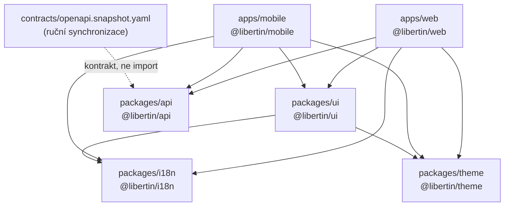

# Architektura Libertin

> **Účel dokumentu**: smluvní požadavek **C7.2** (kompletní architektonická
> dokumentace všech komponent) a **C8** (systém musí být převzatelný externím
> subjektem). Cílový čtenář je **kompetentní inženýr, který k nám nemá přístup**
> — po přečtení musí vědět, co v repozitáři je, proč to tak je, kde co leží a
> čeho se nesmí dotknout, aby něco nerozbil.
>
> **Jazyk**: interní inženýrská dokumentace je česky, stejně jako ostatní
> dokumenty v `docs/`. Identifikátory, cesty a příkazy zůstávají v originále.

## Jak tento dokument číst

Dokument je rozdělený na čtyři části a **hranice mezi stavem dnes a plánem je závazná**:

| Část | Co obsahuje |
|---|---|
| **§1 – §10 — Stav dnes** | Pouze to, co v repozitáři skutečně existuje a je ověřitelné čtením souborů nebo spuštěním příkazu. Každé tvrzení má odkaz na konkrétní soubor a řádek nebo na výstup příkazu v §10. |
| **§11 — Plánováno** | Co ještě neexistuje. Vše je explicitně označené jako plánované a napojené na id z `docs/backlog.yaml`. **Nic z §11 nesmí být čteno jako popis funkce systému.** |
| **§12 — Odchylky** | Místa, kde si existující dokumentace a kód odporují. Nálezy, ne stav. |
| **§13 – §14 — Předání** | Co si přečíst v jakém pořadí, které příkazy musí projít, a průřezová pravidla, která se nesmí porušit (**C8**). |

Záměr popsaný jako realita je nejčastější důvod, proč jsou předávací dokumenty
bezcenné. Pokud v §1–§10 najdete tvrzení, které v kódu neplatí, je to chyba
tohoto dokumentu — nahlaste ji, neopravujte kód podle dokumentu.

**Zdroj pravdy o rozsahu a stavu práce je `docs/backlog.yaml`**, ne tento
dokument. Zdroj pravdy o požadavcích ze smlouvy je
`docs/requirements-traceability.md`. Tento dokument popisuje **jak je postavené
to, co je postavené**.

---

# ČÁST I — STAV DNES

## 1. Co v repozitáři je

Libertin je dnes **klientská vrstva** — webová a mobilní aplikace nad zamrzlým
API kontraktem, která se dá spustit a proklikat **bez jakéhokoli backendu**.
Backend, databáze ani úložiště v repozitáři nejsou; infrastruktura je jen částečná — kontejnerizace webu existuje, ostatní ne (viz §8 a §11.4) (viz §11).

Inventura workspace (bez `node_modules`, build artefaktů a cache):

| Workspace | Balíček | Co to je | Runtime |
|---|---|---|---|
| `apps/web` | `@libertin/web` | Next.js 14, App Router | Node / prohlížeč |
| `apps/mobile` | `@libertin/mobile` | Expo SDK 52, React Native 0.76 | iOS / Android |
| `packages/ui` | `@libertin/ui` | 9 webových komponent + 3 native primitiva + 5 native obrazovek, Storybook | oba |
| `packages/theme` | `@libertin/theme` | návrhové tokeny — CSS custom properties + native mirror | oba |
| `packages/i18n` | `@libertin/i18n` | i18next setup + `locales.json` (cs/en) | oba |
| `packages/api` | `@libertin/api` | typovaný HTTP klient + MSW mocky | oba |
| `contracts/` | — | `openapi.snapshot.yaml`, zamrzlý API kontrakt | — |

Implementované obrazovky:

- **Web**: `/` (landing s hero + 4 kategorie + footer), `/login`, plus
  `robots.txt` a `sitemap.xml` generované routami.
- **Mobile**: lineární auth flow `login → verify → success → onboarding → feed`
  (`apps/mobile/src/AuthFlow.tsx`).

## 2. Proč monorepo (pnpm workspaces + Turborepo)

Rozhodnutí a jeho důvody — ne obecná chvála monorepa:

1. **Web a mobil musí sdílet kontrakt, kopie kontraktu se rozejdou.** Kdyby
   `apps/web` a `apps/mobile` byly samostatné repozitáře, existovaly by dvě
   kopie typů API, dvě kopie překladů a dvě kopie palety. Jediné, co drží
   `packages/api` synchronizované s `contracts/openapi.snapshot.yaml`, je fakt,
   že je to **jeden** balíček, který oba klienti importují.
2. **Překlady jsou smluvní dodávka (B13), ne detail implementace.** Plná CS+EN
   je akceptační kritérium. Jediný `packages/i18n/locales.json` znamená, že
   chybějící klíč spadne v testu (§10), ne v produkci na jedné platformě.
3. **Diskrétnost se dá vynutit centrálně.** Testy nad `locales.json` hledají
   uniklé e-maily, telefony a legacy domény napříč celým produktem
   (`packages/i18n/locales.test.ts`, sekce „discretion and privacy"). V
   rozdělených repozitářích by taková kontrola musela existovat trojmo.
4. **Předatelnost (C8).** Externí subjekt klonuje jeden repozitář, spustí
   `pnpm install`, `pnpm type-check`, `pnpm test` a má celý klient. Žádné
   „a ještě si vyžádejte přístup k druhému repu".

Konkrétní volby nástrojů:

- **pnpm** (`pnpm-workspace.yaml`: `apps/*`, `packages/*`), verze pinovaná v
  root `package.json` polem `packageManager: pnpm@10.33.0`. Workspace závislosti
  se odkazují protokolem `workspace:*` — nikdy verzí z registru.
- **Turborepo** (`turbo.json`) orchestruje tasky `build`, `dev`, `lint`, `test`,
  `type-check`, `storybook`. `test` a `type-check` mají `dependsOn: ["^build"]`,
  tedy nejdřív se postaví závislosti daného balíčku. Cache je zapnutá lokálně,
  remote caching vypnutý.
- **`.npmrc`**: `shamefully-hoist=false`, `strict-peer-dependencies=false`,
  `auto-install-peers=true`. Poslední volba má cenu — viz odchylka §12.4.
- **Root `tsconfig.json`** je jediná definice striktnosti pro všechny balíčky:
  `strict`, `noUncheckedIndexedAccess`, `exactOptionalPropertyTypes`. Poslední
  dvě mají viditelný dopad na styl kódu (proto `foo?: T | undefined` v props
  native komponent).

**Balíčky nejsou předkompilované.** `packages/*` exportují přímo `.ts`/`.tsx`
zdroje (`"main": "./src/index.ts"`). Web je proto musí transpilovat —
`apps/web/next.config.mjs` má `transpilePackages: ['@libertin/ui',
'@libertin/theme', '@libertin/i18n', '@libertin/api']`. **Pokud přidáte nový
`@libertin/*` balíček a zapomenete ho do tohoto seznamu, web build spadne.**

## 3. Graf závislostí balíčků



Ověřeno z manifestů (výstup v §10):

```
apps/web       -> @libertin/api, @libertin/i18n, @libertin/theme, @libertin/ui
apps/mobile    -> @libertin/api, @libertin/i18n, @libertin/theme, @libertin/ui
packages/ui    -> @libertin/i18n, @libertin/theme
packages/i18n  -> (none)
packages/theme -> (none)
packages/api   -> (none)
```

Pravidla, která z grafu plynou a která je třeba držet:

- **Graf je acyklický a má jen tři úrovně**: `theme`/`i18n`/`api` (listy) →
  `ui` → aplikace. Nikdy nesmí vzniknout hrana z `packages/*` do `apps/*`.
- **`packages/api` nezávisí na ničem našem.** Klient se dá vzít a použít
  samostatně; nezná tokeny ani překlady. To je záměr — je to hranice systému.
- **`packages/theme` nezávisí na ničem**, ani na Reactu. Je to čistá data.
- **`packages/ui` nezná `packages/api`.** Komponenty nefetchují. Data i callbacky
  dostávají props od aplikace (viz `LoginForm` vs `LoginPageClient`). Proto se
  dají renderovat v Storybooku bez běžícího mocku.
- Aplikace **komponují**, neduplikují. Když web potřebuje nový vizuální prvek,
  vzniká v `packages/ui`, ne v `apps/web/src`.

## 4. Architektura návrhových tokenů (`packages/theme`)

Problém: web umí CSS custom properties, React Native ne. Jeden zdroj hodnot pro
dvě runtime, které mají jinou představu o tom, co je hodnota.

Řešení jsou **tři soubory se třemi různými rolemi**:

| Soubor | Export | Obsah | Kdo to používá |
|---|---|---|---|
| `tokens.css` | `@libertin/theme/tokens.css` | CSS custom properties se **skutečnými hodnotami** (`--color-primary: #F20B49`) | web (`globals.css`), Storybook preview |
| `theme.ts` | `@libertin/theme` → `theme` | mapa jmen na **`var(...)` odkazy** (`primary: 'var(--color-primary)'`) | webové komponenty, které chtějí tokeny typovaně z TS |
| `native.ts` | `@libertin/theme/native` → `nativeTheme` | **zrcadlo `tokens.css` s konkrétními hodnotami** a čísly místo `px` (`spacing: { 4: 16 }`) | native komponenty (`StyleSheet`) |

Proč to takhle:

- Web nesmí mít hodnoty v JS. Kdyby `theme.ts` obsahoval `#F20B49`, přestal by
  fungovat noční režim — ten je implementovaný jako **override custom properties
  na atributu**, ne přepnutím JS objektu:

  ```css
  [data-theme="private"] {
    --color-bg: #181818;
    --color-surface: #222222;
    /* … */
  }
  ```

  Komponenta, která vypisuje `var(--color-bg)`, se pod tímto atributem přebarví
  sama. Komponenta, která vypisuje `#FAFAF9`, ne. Proto `theme.ts` obsahuje
  výhradně `var()` odkazy.
- Native nemá custom properties, takže `native.ts` **musí** hodnoty duplikovat.
  Je to vědomý kompromis: dvě místa, kde žije `#F20B49`. Cena je, že rozejití
  se dnes nezachytí žádný test (§12.3). Alternativa — generátor, který
  `native.ts` vyrobí z `tokens.css` — je plánovaná, ne postavená.
- `radius.full` je `9999` v native a `9999px` na webu; `fontWeight` je v native
  string (`'600'`), protože to RN vyžaduje. Tvarová parita tokenů tedy **není**
  úplná a nesmí se předpokládat.

Sada tokenů: 12 barev, 8 stupňů odstupů (základ 4 px), 4 rádiusy, 7 velikostí
písma, 4 tučnosti, 2 stíny. Noční téma `[data-theme="private"]` přepisuje 6
barev.

Pravidlo z `CLAUDE.md`, které architektura vyžaduje, ale dnes nevynucuje žádný
test ani linter (viz §12 — `apps/mobile/src/App.tsx` mělo hex, opraveno): **v komponentách žádný
hex.** Raspberry jako text na bílé musí být `--color-primary-text` (`#C40A3C`),
ne `--color-primary` (`#F20B49`) — druhá varianta nesplňuje kontrast AA.

## 5. Architektura i18n (`packages/i18n`) — včetně pravidla pro server komponenty

### 5.1 Zdroj pravdy a tvar dat

`packages/i18n/locales.json` je **jediný** zdroj veškerého textu v produktu:
dva jazyky (`cs`, `en`), 13 skupin nejvyšší úrovně (`common`, `meta`, `ageGate`,
`auth`, `verify`, `success`, `onboarding`, `home`, `feed`, `messages`,
`profile`, `footer`, `categories`), **65 klíčů v každém jazyce**.

Celý slovník žije v **jednom i18next namespace** (`defaultNS = 'common'`,
`packages/i18n/index.ts`). Důvod je uvedený v komentáři u kódu: s více
namespacy by call sites musely psát `t('auth:login.title')`; s jedním
namespacem stačí obyčejná tečková cesta `t('auth.login.title')` napříč všemi
skupinami.

### 5.2 Dva vstupní body a proč

`packages/i18n` exportuje **dva různé moduly** a záměna je runtime chyba:

| Export | Soubor | Co dělá | Kde se smí použít |
|---|---|---|---|
| `@libertin/i18n` | `index.ts` | `initI18n()`, instance `i18n`, `resources`; importuje `react-i18next` | **jen** klientský kód — `'use client'` komponenty, Expo appka, Storybook, testy |
| `@libertin/i18n/dict` | `dict.ts` | `getDict(locale)`, `dicts`, typy `Locale`/`Dict`; **žádný React** | kdekoli, včetně React Server Components |

### 5.3 Pravidlo: server komponenty MUSÍ používat `@libertin/i18n/dict`

**Mechanismus (ověřený, ne domněnka):**

1. `packages/i18n/index.ts` importuje `initReactI18next` z `react-i18next`, což
   je hlavní entry point balíčku.
2. Hlavní entry `react-i18next` re-exportuje svůj kontext —
   `dist/es/index.js:12`:
   `export { I18nContext, composeInitialProps, getInitialProps } from './context.js';`
3. `dist/es/context.js:6` volá `createContext` **na úrovni modulu**:
   `export const I18nContext = createContext();`
4. `createContext` v modulovém grafu React Server Components neexistuje — RSC
   graf se řeší podmínkou `react-server`, která u React 18.3.1 míří na
   `react.shared-subset` (viz výstup v §10.4).

Důsledek: **jakýkoli import `@libertin/i18n` ze server komponenty stáhne
`createContext` do RSC grafu a shodí render.** Nejde o stylovou preferenci.

Proto `packages/i18n/dict.ts` nese v hlavičce explicitní zákaz:

```ts
// Server-safe dictionary access. This module must stay free of react-i18next
// (which calls createContext at module scope and would crash React Server
// Components). Server components import from '@libertin/i18n/dict'.
```

**Do `dict.ts` se nikdy nesmí přidat import Reactu ani react-i18next.** Je to
jediná záruka, že server strana webu půjde vyrenderovat.

### 5.4 Jak to vypadá v praxi na webu

Rozdělení, které dnes v `apps/web` skutečně platí:

| Soubor | Server / klient | i18n přístup |
|---|---|---|
| `src/app/layout.tsx` | server | `getDict('cs')` na úrovni modulu, výsledek jde do `metadata` a jako **props** do `<AgeGate>` |
| `src/app/page.tsx` | server | `getDict('cs')`, texty do props `Hero`, `CategoryCard`, `SiteFooter` |
| `src/app/login/page.tsx` | server | `getDict('cs')` jen pro `metadata.title`, jinak deleguje |
| `src/app/login/LoginPageClient.tsx` | `'use client'` | `useTranslation()` z `react-i18next`, obalené `<I18nProvider>` |
| `src/lib/I18nProvider.tsx` | `'use client'` | `initI18n(locale)` v `useEffect`, do dokončení renderuje `null` |

Odsud plyne konvence, kterou je nutné držet: **komponenty, které mají být
použitelné ze serveru, přijímají texty jako props; komponenty, které si text
tahají samy přes `useTranslation()`, musí být `'use client'`.**

V `packages/ui` to dnes vypadá takto:

- `'use client'` mají: `Button`, `LoginForm`, `AgeGate`.
- `useTranslation()` volají: `Button`, `LoginForm` (a všechna native
  primitiva/obrazovky, kde RSC neexistuje a problém nenastává).
- `AgeGate` je `'use client'` kvůli `useEffect` + `localStorage`, ale texty bere
  z props — proto ho může použít serverový `layout.tsx`.
- Zbytek webových komponent (`Avatar`, `Card`, `CategoryCard`, `Hero`,
  `SiteFooter`, `Input`) je bez direktivy, tedy renderovatelný na serveru, a
  texty dostává props.

`I18nProvider` má jeden důsledek, který je třeba znát: dokud není i18next
inicializovaný, vrací `null`. Login stránka tedy **na první frame nic
nevykreslí**. Je to vědomá volba proti probliknutí surových klíčů, ale je to
cena za klientskou inicializaci.

### 5.5 Jak je i18n hlídané

`packages/i18n/locales.test.ts` — **25 testů**, které nejsou o formátování, ale
o smluvních a privacy vlastnostech:

- strukturální parita cs/en (žádný klíč jen v jednom jazyce, žádný leaf, který je
  v jednom jazyce string a v druhém objekt), žádné prázdné hodnoty, žádné
  `TODO`/`FIXME`/`XXX`;
- parita interpolací (`{{email}}` musí být v obou jazycích stejná sada) a zákaz
  jednoduchých složených závorek, protože `{email}` i18next **neinterpoluje** a
  vypsalo by se surové;
- runtime test, že se interpolace skutečně provede;
- **privacy testy**: žádný reálný e-mail (kromě `@example.*`), žádné telefonní
  číslo, žádná zmínka legacy domény — přímá reakce na to, že stará verify
  obrazovka prozradila skutečný e-mail a telefon;
- test „every key used by the UI resolves in both locales" s ručním seznamem 11
  klíčů natvrdo použitých v `packages/ui`. Přejmenování klíče bez úpravy
  komponenty spadne tady, ne v produkci. **Když do komponenty přidáte nový
  `t('…')`, přidejte klíč i do tohoto seznamu** — jinak není chráněný.

## 6. API klient a MSW mocky (`packages/api`)

### 6.1 Kontrakt jako zamrzlý, nedůvěryhodný vstup

`contracts/openapi.snapshot.yaml` je OpenAPI 3.1.0 snapshot legacy API:
227 řádků, 6 cest (`/auth/login`, `/auth/register`, `/auth/verify`, `/feed`,
`/messages`, `/profile`), `x-snapshot-date: "2026-06-15"`. Servery: produkční
`https://api.libertin.cz/v1` a lokální mock `http://localhost:3001/v1`.

Princip (z `CLAUDE.md`): API se chová jako externí systém, jehož tvar
nekontrolujeme. Snapshot je tedy zamrzlý a jediná legální cesta k API vede skrz
`packages/api`.

### 6.2 Klient — co skutečně je

`packages/api/src/client.ts`, 62 řádků:

- **13 datových typů** odpovídajících schématům snapshotu (`LoginRequest`,
  `RegisterRequest`, `VerifyRequest`, `VerifyResponse`, `User`, `AuthResponse`,
  `Profile`, `UpdateProfileRequest`, `FeedItem`, `FeedResponse`,
  `Conversation`, `MessagesResponse`, `ErrorResponse`) plus rozhraní
  `LibertinClient`.
- Jedna privátní funkce `request<T>(baseURL, path, init, options)` — **jediné
  místo v celém repozitáři, kde se volá `fetch` směrem k API**. Nastavuje
  `Content-Type: application/json`, volitelně `Authorization: Bearer …`,
  a na neúspěch hodí `Error` obohacený o `status` a `code`:

  ```ts
  const err: ErrorResponse = await res.json().catch(() => ({ message: res.statusText }));
  throw Object.assign(new Error(err.message), { status: res.status, code: err.code });
  ```

- `createClient(baseURL): LibertinClient` vrací objekt se čtyřmi doménami:
  `auth.{login,register,verify}`, `feed.get`, `messages.list`,
  `profile.{get,update}`.

Klient je **stateless a bez závislostí** (kromě `msw` pro mocky). Nedrží token —
token drží aplikace a předává ho parametrem. Na mobilu proto token existuje jen
v React state (`apps/mobile/src/AuthFlow.tsx`) a nikde nepersistuje.

> **Důležitá odchylka od `CLAUDE.md`**: `CLAUDE.md` popisuje generování klienta
> nástrojem `openapi-typescript`. **To dnes neexistuje.** V repozitáři není
> `openapi-typescript` ani `openapi-fetch` — ani v manifestech, ani v
> `pnpm-lock.yaml` (ověřeno, §10.3), a `packages/api` nemá žádný codegen skript.
> `client.ts` je **napsaný ručně** a se snapshotem je synchronizovaný **jen
> lidskou disciplínou**. Viz §11.5 a §12.1.

### 6.3 MSW strategie — tři vstupní body, jedna sada handlerů

`packages/api/src/mocks/handlers.ts` definuje handlery pro všech 6 cest se
stabilními, neosobními daty (`user@example.com`, UUID-like id,
`mock-jwt-token-libertin-dev`). Jsou to **jediné** mock definice; tři adaptéry
je jen připojí k jinému interceptoru:

| Adaptér | Soubor | Import z msw | Kdo to používá |
|---|---|---|---|
| prohlížeč (service worker) | `mocks/browser.ts` | `msw/browser` → `setupWorker` | web, dynamicky z `MswProvider` |
| Node | `mocks/server.ts` | `msw/node` → `setupServer` | testy / SSR |
| React Native | `apps/mobile/src/mocks/native.ts` | `msw/native` → `setupServer` | Expo appka |

Mobilní adaptér **záměrně** neleží v `packages/api`, ale v appce, a importuje
handlery podsestupem `@libertin/api/handlers`. Komentář v souboru vysvětluje
proč: kdyby šel přes hlavní `@libertin/api`, stáhl by `msw/node` i
`msw/browser` do Metro bundlu. To je důvod, proč `packages/api/package.json`
exportuje `./handlers`, `./browser` a `./server` jako **oddělené** podcesty.

Zapnutí mocků:

- **Web** — `apps/web/src/lib/MswProvider.tsx`: `'use client'`, v `useEffect`
  se pod podmínkou `process.env.NODE_ENV === 'development'` **dynamicky**
  importuje `@libertin/api/browser` a spustí worker s
  `onUnhandledRequest: 'bypass'`. Dynamický import je podstatný — v produkčním
  buildu se kód nevykoná. Vyžaduje jednorázově
  `pnpm --filter=@libertin/web msw:init`, které vygeneruje
  `apps/web/public/mockServiceWorker.js`; při chybě se vypíše přesně tato rada.
  `apps/web/Dockerfile` ten soubor z produkčního image **maže** — zbloudilý
  service worker by odposlouchával provoz členů.
- **Mobile** — `apps/mobile/src/App.tsx`: `server.listen()` pod `__DEV__`,
  `server.close()` v cleanupu.

Base URL: aplikace vytvářejí klienta konstantou
`API_BASE = 'https://api.libertin.cz/v1'` (`LoginPageClient.tsx`,
`AuthFlow.tsx`) a handlery interceptují **tutéž** produkční URL. Mocky tedy
nefungují přesměrováním na localhost, ale zachycením produkční adresy. Proto je
`http://localhost:3001/v1` ze snapshotu dnes nepoužitá (§12.2).

### 6.4 Contract-check — co to dnes je

`/contract-check` (`.claude/commands/contract-check.md`) je **prompt pro
agenta**, ne skript a ne CI job. Popisuje postup: při nastaveném
`LIBERTIN_API_URL` stáhnout živou specifikaci a diffnout ji proti snapshotu,
jinak staticky ověřit konzistenci `client.ts` se snapshotem, a při breaking
change skončit s kódem 1. **Automatizace neexistuje** — je to E11-T3 (§11.5).

## 7. Rozdělení komponent web / native (`packages/ui`)

Jeden balíček, **dvě oddělené implementace**, dva export subpaths:

```
packages/ui/
  src/                      -> @libertin/ui           (web, DOM)
    AgeGate/ Avatar/ Button/ Card/ CategoryCard/ Hero/ Input/ LoginForm/ SiteFooter/
    index.ts
    native/                 -> @libertin/ui/native    (React Native)
      Button/ Input/ Screen/
      screens/  LoginScreen VerifyEmailScreen SuccessScreen OnboardingScreen FeedScreen
      index.ts
```

`packages/ui/package.json`:

```json
"exports": { ".": "./src/index.ts", "./native": "./src/native/index.ts" }
```

`react-native` je **optional peer dependency** (`peerDependenciesMeta`), takže
webová aplikace balíček nainstaluje bez React Native.

### 7.1 Proč dvě implementace a ne jedna abstrakce

Web a native varianta se neliší jen značkami, ale **celým stylovacím
modelem**:

| | Web (`src/Button`) | Native (`src/native/Button`) |
|---|---|---|
| Element | `<button>`, props dědí `React.ButtonHTMLAttributes` | `Pressable` + `Text` z `react-native` |
| Styly | inline `React.CSSProperties` s `var(--…)` | `StyleSheet` + `nativeTheme` (`@libertin/theme/native`) |
| Tokeny | `var(--radius-md)`, `var(--text-base)` | `t.spacing[3]`, `t.fontSize.base` (čísla) |
| Interakce | `disabled`, nativní `:focus` | `onPress`, `ActivityIndicator` |
| Direktiva | `'use client'` | žádná (RSC v RN neexistuje) |

Sdílené API se drží **na úrovni props, ne implementace**: obě varianty mají
`variant: 'primary' | 'secondary' | 'ghost'`, `size: 'sm' | 'md' | 'lg'`,
`loading`, `i18nKey`. Rozdíly jsou vynucené platformou — web má `children`,
native má `title`; native props jsou explicitně `| undefined` kvůli
`exactOptionalPropertyTypes` v root `tsconfig.json`.

Kompletní obrazovky existují **jen v native větvi** (`src/native/screens/*`).
Web obrazovky žijí v `apps/web/src/app/*` a komponují prvky z `@libertin/ui`.
To je asymetrie, ne nedopatření: mobilní auth flow je jedna React komponenta se
stavovým automatem, web má routovací systém Next.js.

### 7.2 Storybook

`packages/ui/.storybook/main.ts` — Storybook 8 na `@storybook/react-vite`,
addony `essentials` + `a11y`, port 6006. Klíčový trik: `viteFinal` přidává alias
`react-native → react-native-web`, `define: { __DEV__: 'true', global: 'window' }`
a rozšíření `.web.tsx`/`.web.ts` — díky tomu se **native komponenty renderují ve
webovém Storybooku**. Je to jediný způsob, jak dnes vidět mobilní obrazovky bez
simulátoru.

`preview.tsx` volá `initI18n('cs')` a importuje `@libertin/theme/tokens.css`,
takže stories renderují skutečné překlady a skutečné tokeny. Toolbar má
přepínač jazyka cs/en a pozadí light `#FAFAF9` / dark `#222222`.

Pokrytí: **16 story souborů** — 9 webových komponent, 2 native primitiva
(`Button`, `Input`) a 5 native obrazovek. Bez story je dnes jen native `Screen`.

### 7.3 Testy komponent

`packages/ui/vitest.config.ts`: jsdom, `globals: true`, setup
`vitest.setup.ts`, `include: ['src/**/*.test.{ts,tsx}']` a — podstatné —
**`exclude: ['src/native/**']`** s odůvodněním v komentáři: RN primitiva
potřebují native renderer.

`vitest.setup.ts` inicializuje i18next na `cs` **před** testy, resetuje jazyk a
`localStorage` v `beforeEach`. Komponenty se tedy testují proti skutečným
překladům; chybějící klíč spadne jako test, ne jako `common.error` v UI.

Stav: **7 testových souborů, 54 testů** (`AgeGate`, `Avatar`, `Button`, `Hero`,
`Input`, `LoginForm`, `SiteFooter`). Bez testů jsou `Card`, `CategoryCard` a
**celá native větev** (§11.6).

## 8. Webová aplikace (`apps/web`)

Next.js 14.2, App Router, React 18.3.

Routy: `src/app/page.tsx` (`/`), `src/app/login/page.tsx` (`/login`),
`src/app/robots.ts` (`/robots.txt`), `src/app/sitemap.ts` (`/sitemap.xml`).
Obě metadata routy čtou `process.env.NEXT_PUBLIC_SITE_URL` s fallbackem
`https://libertin.cz`.

`src/app/layout.tsx` (server komponenta) staví `metadata` z `getDict('cs')` —
title template `%s | {meta.title}` — a do `<body>` vkládá `<MswProvider />`,
children a `<AgeGate>`. Jazyk je **natvrdo `<html lang="cs">`** a `getDict('cs')`
je zavolané na úrovni modulu; přepínač jazyka na webu tedy neexistuje (§11.2).

`src/app/globals.css` importuje `@libertin/theme/tokens.css` a nastavuje
box-sizing, `--color-bg`, `--color-text`, systémový font stack.

**Bezpečnostní hlavičky** — `apps/web/next.config.mjs`, aplikované na
`/:path*`: `Strict-Transport-Security` (2 roky, includeSubDomains, preload),
`Referrer-Policy: same-origin`, `X-Content-Type-Options: nosniff`,
`X-Frame-Options: DENY`, `Permissions-Policy: camera=(), microphone=(),
geolocation=()`. `Referrer-Policy: same-origin` je komentářem v souboru
označená za **záměrnou** volbu diskrétnosti: cizí stránka se nikdy nesmí
dozvědět, že návštěvník přišel odsud. **Content-Security-Policy chybí**
(§11.2).

**Age gate** (`packages/ui/src/AgeGate`): `'use client'`, ukládá souhlas do
`localStorage` pod klíč `libertin.ageConfirmed`. Je to UX bariéra a právní
prohlášení, **nikoli autorizace** — kdokoli si ji přepne v devtools. Nesmí se
na ni spoléhat jako na kontrolu přístupu.

Kontejnerizace: `apps/web/Dockerfile` (multi-stage, `output: 'standalone'`,
neprivilegovaný uživatel `node`, HEALTHCHECK, `STOPSIGNAL SIGTERM`) a
`docker-compose.yml` v kořeni (read-only rootfs, tmpfs, `cap_drop: ALL`,
lokální rotované logy). Detaily, ověřený výstup a seznam chybějícího jsou
v `docs/deployment.md` — **tento dokument je nezdvojuje**.

## 9. Mobilní aplikace (`apps/mobile`)

Expo SDK 52, React Native 0.76.3, `app.json`: slug `libertin`, portrait,
splash `#F20B49`, platformy ios+android.

`index.js` → `registerRootComponent(App)`. `src/App.tsx` v `useEffect`
(a) pod `__DEV__` spustí MSW server, (b) zavolá `initI18n('cs')` a do dokončení
renderuje `null`; pak `<SafeAreaView>` + `<AuthFlow />` + `<StatusBar>`.

`src/AuthFlow.tsx` je **stavový automat v React state**, ne router:
`Step = 'login' | 'verify' | 'success' | 'onboarding' | 'feed'`, `switch (step)`
vrací příslušnou obrazovku z `@libertin/ui/native`. Volání API jdou přes
`createClient(API_BASE)`. Po loginu se rozskočí podle `res.user.verified`
(`success` vs `verify`), po onboardingu se natáhne feed.

Dvě věci, které je při rozšiřování třeba vědět:

1. **Token nikde nepersistuje** — drží ho `useState`. Restart appky = odhlášení.
   Je to dnes bezpečné a `docs/adr/0001-2fa-architecture.md` na to explicitně
   upozorňuje: naivní přidání `AsyncStorage` by to zkazilo.
2. **Jedna chybová zpráva je natvrdo česky** v `AuthFlow.tsx`
   (`'Přihlášení se nezdařilo. Zkontrolujte údaje.'`). To je porušení pravidla
   „všechny texty přes i18n klíče" a rozbíjí to B13 (§12.5).

`metro.config.js` řeší monorepo: `watchFolders` na root, `nodeModulesPaths` na
app i root, `unstable_enableSymlinks` (pnpm symlinky) a
`unstable_enablePackageExports` (aby fungovaly subpaths jako
`@libertin/ui/native` a `@libertin/api/handlers`). **Bez těch dvou přepínačů se
pnpm workspace v Metru nerozresolvuje.**

## 10. Ověření — skutečný výstup

Prostředí: Node v22.22.2, pnpm 10.33.0, turbo 2.10.4.

### 10.1 Typová kontrola

```
$ pnpm exec turbo run type-check --force
   • Packages in scope: @libertin/api, @libertin/i18n, @libertin/mobile, @libertin/theme, @libertin/ui, @libertin/web
   • Running type-check in 6 packages
@libertin/ui:type-check: > tsc --noEmit
@libertin/mobile:type-check: > tsc --noEmit
@libertin/web:type-check: > tsc --noEmit

 Tasks:    3 successful, 3 total
Cached:    0 cached, 3 total
  Time:    3.87s
```

**Čtěte pozorně: „3 tasks", ne 6.** Skript `type-check` mají jen
`@libertin/web`, `@libertin/mobile` a `@libertin/ui`. `@libertin/api`,
`@libertin/i18n` a `@libertin/theme` **žádnou typovou kontrolu nespouštějí** —
jejich typy se ověří jen nepřímo, když je přeloží konzument. Tvrzení
„`pnpm type-check` je zelené ve všech šesti workspace" (v `CLAUDE.md`) je tedy
nepřesné (§12.6). `--force` je použité proto, aby výstup nebyl přehraný z
Turborepo cache.

### 10.2 Testy

```
$ pnpm test
@libertin/i18n:test:  ✓ |i18n| locales.test.ts (25 tests) 23ms
@libertin/i18n:test:  Test Files  1 passed (1)
@libertin/i18n:test:       Tests  25 passed (25)

@libertin/ui:test:  ✓ |ui| src/Button/Button.test.tsx (11 tests) 192ms
@libertin/ui:test:  ✓ |ui| src/AgeGate/AgeGate.test.tsx (9 tests) 214ms
@libertin/ui:test:  ✓ |ui| src/LoginForm/LoginForm.test.tsx (9 tests) 660ms
@libertin/ui:test:  ✓ |ui| src/Hero/Hero.test.tsx (7 tests) 107ms
@libertin/ui:test:  ✓ |ui| src/Input/Input.test.tsx (9 tests) 140ms
@libertin/ui:test:  ✓ |ui| src/SiteFooter/SiteFooter.test.tsx (4 tests) 103ms
@libertin/ui:test:  ✓ |ui| src/Avatar/Avatar.test.tsx (5 tests) 86ms
@libertin/ui:test:  Test Files  7 passed (7)
@libertin/ui:test:       Tests  54 passed (54)

 Tasks:    2 successful, 2 total
```

Celkem **79 testů ve 2 balíčcích**. `apps/web`, `apps/mobile`, `packages/api` a
`packages/theme` nemají skript `test` — netestují se vůbec (§11.6).

### 10.3 Graf závislostí a absence codegenu

```
$ for p in apps/web apps/mobile packages/ui packages/i18n packages/theme packages/api; do … done
apps/web -> @libertin/api, @libertin/i18n, @libertin/theme, @libertin/ui
apps/mobile -> @libertin/api, @libertin/i18n, @libertin/theme, @libertin/ui
packages/ui -> @libertin/i18n, @libertin/theme
packages/i18n -> (none)
packages/theme -> (none)
packages/api -> (none)

$ grep -rn "openapi-typescript\|openapi-fetch" --include=package.json --include=*.ts --include=*.mjs --include=*.json apps packages contracts
(žádný výsledek)

$ grep -c "openapi-typescript" pnpm-lock.yaml
0
```

### 10.4 Ověření pravidla pro server komponenty (§5.3)

```
$ grep -n "context" …/react-i18next/dist/es/index.js
12:export { I18nContext, composeInitialProps, getInitialProps } from './context.js';

$ grep -n "createContext" …/react-i18next/dist/es/context.js
1:import { createContext } from 'react';
6:export const I18nContext = createContext();

$ node --conditions=react-server -e "import('react').then(r=>console.log(typeof r.createContext))"
…/react/cjs/react.shared-subset.development.js:18
throw new Error('This entry point is not yet supported outside of experimental channels');
```

Poslední výstup ukazuje, že pod podmínkou `react-server` (kterou RSC graf
používá) se React 18.3.1 resolvuje na `react.shared-subset` — jiný build než
klientský. Modulové `createContext()` v `react-i18next` proto do server
komponenty patřit nemůže.

### 10.5 Co jsem NEspouštěl

- **`next build`** — v repozitáři pracují paralelně další role a build zapisuje
  do `apps/web/.next`. Nechtěl jsem jim přepsat výstup. Ověřený běh
  produkčního image včetně HTTP odpovědí a hlaviček je v
  `docs/deployment.md`, sekce „Ověřeno (skutečný výstup)".
- **Storybook, Expo, Docker** — vyžadují dlouho běžící proces nebo simulátor.

---

# ČÁST II — PLÁNOVÁNO (DNES NEEXISTUJE)

> **Vše v této části je stav „není postaveno".** Každý bod má id z
> `docs/backlog.yaml`. Nic z toho se nesmí citovat jako vlastnost systému.
> Autoritativní je backlog, ne tento výčet.

## 11.1 Backend, data a úložiště — neexistuje

V repozitáři **není žádný serverový kód, schéma databáze ani migrace**. Klient
běží výhradně proti MSW mockům. Plánováno v epice **E9**: volba stacku
(E9-T1, `blocked` rozhodnutím **D-003**), datový model (E9-T2), implementace API
podle kontraktu (E9-T3), S3-kompatibilní úložiště médií bez POSIX cesty (E9-T4),
Redis (E9-T5), šifrování at-rest (E9-T6), správa klíčů (E9-T7).

## 11.2 Autentizace a bezpečnost — dnes jen atrapa

- **2FA (SMS + TOTP + passkey) neexistuje** ani v kontraktu, ani v UI. Je to
  tvrdé akceptační kritérium **B4.2**. Návrh se právě píše jako
  `docs/adr/0001-2fa-architecture.md` (E2-T1); implementace je E2-T2 – E2-T5.
- **Role a oprávnění (B1) neexistují** — snapshot ani `client.ts` pojem role
  nezná (E2-T6, E2-T7).
- **Registrace a reset hesla end-to-end** nejsou (E2-T8). `client.auth.register`
  existuje, ale žádná obrazovka ho nepoužívá.
- **Content-Security-Policy** v `next.config.mjs` chybí.
- **Přepínač denního/nočního režimu (B6)** — tokeny `[data-theme="private"]`
  existují, UI přepínač ne.
- **Přepínač jazyka na webu** — `layout.tsx` má `lang="cs"` natvrdo a
  `getDict('cs')` na úrovni modulu. `packages/i18n` umí oba jazyky, web z nich
  dnes servíruje jen češtinu. B13 tedy **není** splněné na webu, jen v knihovně.

## 11.3 Funkční jádro sociální sítě — neexistuje

Profily, příspěvky, fotogalerie, video, chat, hovory, akce, vyhledávání,
obsahové stránky — celá epika **E3**. Dnes existuje jen read-only feed obrazovka
nad mockem.

Konkrétní dnešní důsledek: footer na landing page odkazuje na `/o-nas`,
`/kontakt`, `/soukromi`, `/podminky` — **žádná z těch rout neexistuje**, všechny
vracejí 404 (§12.7).

## 11.4 Infrastruktura a provoz — částečně

Postavené je: `apps/web/Dockerfile`, `docker-compose.yml` se službou `web` a
`docs/deployment.md`. **Neexistuje**: propojení ostatních kontejnerů (E10-T2,
`blocked` na D-003), Ansible IaC (E10-T3, C11.2), HA / load balancer / rolling
restarty (E10-T4), zálohy a verzování (E10-T5, B5), CDN distribuce (E10-T6),
TLS terminace, mailserver (A4), secret management. `docker-compose.yml`
extension pointy záměrně nehádá — každá služba přijde s vlastním taskem.

## 11.5 CI/CD a contract-check — neexistuje

V repozitáři **není žádná CI konfigurace** (`.gitlab-ci.yml` ani workflow).
Plánováno: pipeline contract → lint → test → build (E11-T2), automatizovaný
contract-check proti živému API (E11-T3), k6 zátěžové testy s budgetem
≤ 1,5 s (E11-T4, **C12.1**), Playwright e2e (E11-T5), měření pokrytí (E11-T6).

Sem patří i **generování klienta ze snapshotu**: `CLAUDE.md` ho popisuje,
`packages/api` ho nemá (§6.2). Dokud codegen a contract-check neexistují, je
soulad `client.ts` se snapshotem **ruční a neověřený**.

## 11.6 Testy — velké mezery

Netestuje se: `apps/web` (žádný skript `test`), `apps/mobile` (dtto),
`packages/api` (klient ani mocky), `packages/theme`, celá `packages/ui/src/native`
větev (vyloučená ve `vitest.config.ts`) a webové komponenty `Card` a
`CategoryCard`. E11-T1 má postavit harness, E11-T5 e2e toky.

## 11.7 Design parity — blokováno

Soulad UI s Figma hand-offem (**C1**) nelze dnes ověřit: účet má na souboru jen
seat „View", což blokuje **D-001**. Dokud to trvá, **není známý ani skutečný
počet obrazovek k implementaci**, tedy ani rozsah díla. Epika E1 je celá
`blocked`.

## 11.8 Dokumentace — co ještě chybí (C7, C8)

Tento dokument pokrývá **C7.2** (architektura). Zbývá: provozní a
administrátorská dokumentace (E12-T2, `blocked_by` E10-T3), manuály pro
vývojáře/operátora/administrátora/uživatele (E12-T3), in-app nápověda v CS+EN
(E12-T4), a **ověření předatelnosti čistým onboardingem** (E12-T5) — to je
skutečný akceptační test C8, ne existence dokumentů.

---

# ČÁST III — ODCHYLKY

## 12. Nálezy: dokumentace vs. kód

Věci, které jsem při ověřování našel. **Nejsou v mém ownershipu** (E12-T1 vlastní
jen `docs/architecture.md` a `docs/adr/README.md`), takže je předávám jako
nálezy, ne jako opravy.

1. **`CLAUDE.md` tvrdí, že klient je generovaný `openapi-typescript`.** Není —
   `client.ts` je ruční, codegen v repozitáři neexistuje (§10.3). Buď doplnit
   codegen (E11-T3), nebo `CLAUDE.md` uvést do souladu. *Vlastník: architect.*
2. **`contracts/openapi.snapshot.yaml` uvádí server `http://localhost:3001/v1`,
   který nikdo nepoužívá.** MSW zachytává produkční URL. Zavádějící pro nového
   člověka. *Vlastník: architect.*
3. **`packages/theme/native.ts` je ruční kopie hodnot z `tokens.css` a nic
   nekontroluje jejich shodu.** Rozejití se projeví až vizuálně na mobilu.
   Návrh: test, který porovná parsované custom properties s `nativeTheme`.
   *Vlastník: frontend-mobile nebo qa.*
4. **`.npmrc: auto-install-peers=true`** táhne `react-native` a `jsc-android` i
   do webových instalací (produkční pnpm strom 533 MB vs ~25 MB) — už zmíněno v
   `docs/deployment.md`. *Vlastník: devops (dependency ownership).*
5. **Natvrdo česká chybová zpráva** v `apps/mobile/src/AuthFlow.tsx`
   (`'Přihlášení se nezdařilo. Zkontrolujte údaje.'`) obchází i18n a rozbíjí
   B13. *Vlastník: frontend-mobile.*
6. **`CLAUDE.md`: „`pnpm type-check` je zelené ve všech šesti workspace"** — ve
   skutečnosti běží ve třech (§10.1). `packages/{api,i18n,theme}` skript
   `type-check` nemají. Doplnit skript, nebo formulaci upravit. *Vlastník:
   architect.*
7. **Mrtvé odkazy v patičce** — `/o-nas`, `/kontakt`, `/soukromi`, `/podminky`
   vedou na 404. U `/soukromi` a `/podminky` je to navíc právní problém pro
   adult platformu. Souvisí s E14-T3. *Vlastník: frontend-web.*
8. **`docs/requirements-traceability.md` odkazuje na `docs/dev-orchestration.md`**
   a `CLAUDE.md` navíc na `docs/fix-checklist.md`; **ani jeden soubor v `docs/`
   neexistuje**. *Vlastník: architect / docs (E12-T3).*
9. **Stav backlogu vs. realita**: `E10-T1` (Dockerfile + build pipeline) je
   v `docs/backlog.yaml` `todo`, ale `apps/web/Dockerfile`,
   `docker-compose.yml` a `docs/deployment.md` existují. `E2-T1` je `todo`,
   ale `docs/adr/0001-2fa-architecture.md` se píše. Backlog je jediný zdroj
   pravdy — musí to dohnat. *Vlastník: architect.*
10. **`apps/web/Dockerfile` tvrdí, že root `package.json` nemá pole
    `packageManager`.** Už ho má (`pnpm@10.33.0`), takže `ARG PNPM_VERSION` je
    zbytečný. *Vlastník: devops.*

---

# ČÁST IV — PŘEDÁNÍ (C8)

## 13. Mapa souborů pro nového člověka

Pořadí, ve kterém se v tomhle repozitáři vyznat nejrychleji:

| # | Soubor | Proč právě tenhle |
|---|---|---|
| 1 | `CLAUDE.md` | pracovní dohoda a nepřekročitelná pravidla |
| 2 | `docs/backlog.yaml` | **jediný** zdroj pravdy o rozsahu a stavu |
| 3 | `docs/requirements-traceability.md` | mapování na smluvní kódy A/B/C |
| 4 | `docs/architecture.md` | tento dokument |
| 5 | `docs/adr/README.md` | index rozhodnutí a jak psát nové |
| 6 | `contracts/openapi.snapshot.yaml` | hranice systému |
| 7 | `packages/api/src/client.ts` | jediné místo, kde se sahá na síť |
| 8 | `packages/i18n/dict.ts` + `index.ts` | dva vstupní body, §5.3 |
| 9 | `packages/theme/tokens.css` + `native.ts` | tokeny pro dvě runtime |
| 10 | `apps/web/src/app/layout.tsx` | jak vypadá hranice server/klient |
| 11 | `apps/mobile/src/AuthFlow.tsx` | mobilní tok celý na jedné obrazovce kódu |
| 12 | `docs/deployment.md` | jak se to staví a pouští v kontejneru |
| 13 | `docs/live-audit.md` | co nahrazujeme a proč |

Příkazy, které musí projít, než něco odešlete (viz `CLAUDE.md`, Definition of
done):

```bash
pnpm install
pnpm type-check                        # dnes běží ve 3 z 6 workspace, §10.1
pnpm test                              # 79 testů, §10.2
pnpm --filter=@libertin/web build      # next build
pnpm storybook                         # http://localhost:6006
pnpm --filter=@libertin/web msw:init   # jednorázově, generuje mockServiceWorker.js
pnpm --filter=@libertin/web dev        # http://localhost:3000
pnpm --filter=@libertin/mobile start   # Expo
```

## 14. Průřezová pravidla, která architektura vynucuje

Shrnutí toho, co se v tomhle repozitáři nesmí — každé pravidlo má důvod výše:

1. **Nikdy `fetch` mimo `packages/api/src/client.ts`.** Kontrakt je zamrzlý
   vstup (§6.1).
2. **Nikdy `react-i18next` v server komponentě.** Server používá
   `@libertin/i18n/dict` (§5.3).
3. **Nikdy React ani react-i18next v `packages/i18n/dict.ts`.** Tím padá celý
   server rendering (§5.3).
4. **Nikdy hex v komponentě.** Web `var(--…)`, native `nativeTheme` (§4).
5. **Nikdy text natvrdo.** Vše přes klíč z `locales.json` v obou jazycích (§5.5).
6. **Nikdy nový `@libertin/*` balíček bez zápisu do `transpilePackages`**
   v `apps/web/next.config.mjs` (§2).
7. **Nikdy hrana z `packages/*` do `apps/*`** a nikdy `packages/ui` → `packages/api`
   (§3).
8. **Nikdy PII, reálné e-maily, telefony ani interní hostnames** — ani v
   mockech, ani v testech, ani v dokumentaci. Repozitář je veřejný a členům
   hrozí reálná újma z prozrazení.
