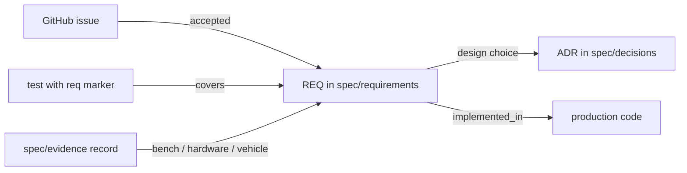

# MIA specification

This directory is the first of the repository's three parts:

| Part | Where | Answers |
|---|---|---|
| 1. Requirements and design | `spec/` | What must MIA do, why is it built this way, and how far is each claim proven? |
| 2. Production code | `apps/`, `orchestration/`, `schemas/`, `infra/`, `web/`, `agents/` | How is it done? |
| 3. Tests and test environment | `tests/` (plus Android/C++ unit tests beside their builds) | Does the code meet the requirements? |

Open work (to-dos, ideas, validation tasks, test gaps) lives in GitHub Issues, not in files
([ADR-0001](decisions/0001-record-decisions-and-keep-the-backlog-in-issues.md)).

## Layout

```
spec/
  requirements/<area>.yaml   the requirements registry, one file per area
  requirements/schema.json   JSON Schema every registry file must satisfy
  decisions/NNNN-*.md        architecture decision records (ADRs)
  architecture/              architecture description and design documents
  interfaces/                wire and interface contracts: MQTT topics, events, BLE GATT, ZeroMQ formats
  evidence/<REQ-ID>/         records of bench, hardware and vehicle validation
```

## How the pieces link



1. An idea or task starts as an **issue**.
2. When accepted, it becomes a **requirement** with an ID (`REQ-<AREA>-NNN`), a one-sentence
   `statement` and, once tested, `acceptance` criteria.
3. A design choice with lasting consequences gets an **ADR**, referenced from `decisions`.
4. The **code** that implements it is listed in `implemented_in`.
5. **Tests** declare what they cover. In Python, use `@pytest.mark.req("REQ-AUTO-010")` or a
   module-level `pytestmark = pytest.mark.req(...)`. In Kotlin, C++ and JavaScript tests, put a
   `@req REQ-AND-012` comment in the file.
6. The requirement's **evidence** state says how far it is proven
   ([ADR-0010](decisions/0010-evidence-based-requirement-status.md)).

## Requirement fields

| Field | Required | Meaning |
|---|---|---|
| `id` | yes | `REQ-<AREA>-NNN`, never reused |
| `title` | yes | Short name |
| `statement` | yes | What the system shall do |
| `evidence` | yes | One of the states below |
| `implemented_in` | yes | Repo-relative files or directories |
| `acceptance` | from `implemented_and_ci_tested` up | Observable criteria the linked tests assert |
| `services` | no | systemd units that ship it |
| `decisions` | no | ADR IDs |
| `not_proven` | no | What the evidence does not cover yet |
| `safety` | no | What cannot transmit or actuate |
| `notes` | no | Anything else a reader needs |

## Evidence states

| State | Needs |
|---|---|
| `planned`, `blocked` | nothing yet |
| `implemented_untested` | code exists, no automated test |
| `implemented_and_ci_tested` | linked automated tests, all passing in CI |
| `simulation_tested` | linked tests that run against a replay or simulator |
| `bench_tested` | the above plus a record in `spec/evidence/<REQ-ID>/` |
| `hardware_tested` | the above, on the target hardware |
| `vehicle_installed` | the above, installed in the vehicle |

CI never promotes anything beyond `simulation_tested`. `tools/ci/traceability.py check` fails
when a requirement claims more than its tests or evidence records support, when a test names
an unknown requirement, or when an `implemented_in` path does not exist.

## Control plane

The work follows the Orchestrator / Evaluator / Executor split defined in `agents/`:

| Role | Owns | Must not touch |
|---|---|---|
| Orchestrator | The registry's evidence states, cycle order, issue grouping, merge decision | Implementation files |
| Evaluator | Safety, schema compatibility, whether a claim is actually tested; has a veto | Feature code, except a failing test that proves a bug |
| Executor | The one approved slice per pull request | Anything outside that slice's paths |

Every pull request ends with five lines: **Claim** (what now works), **Proof** (command,
test name or capture file), **Not proven** (hardware, live service or car), **Safety** (what
cannot transmit or actuate) and **Next owner**. The pull request template asks for them.
